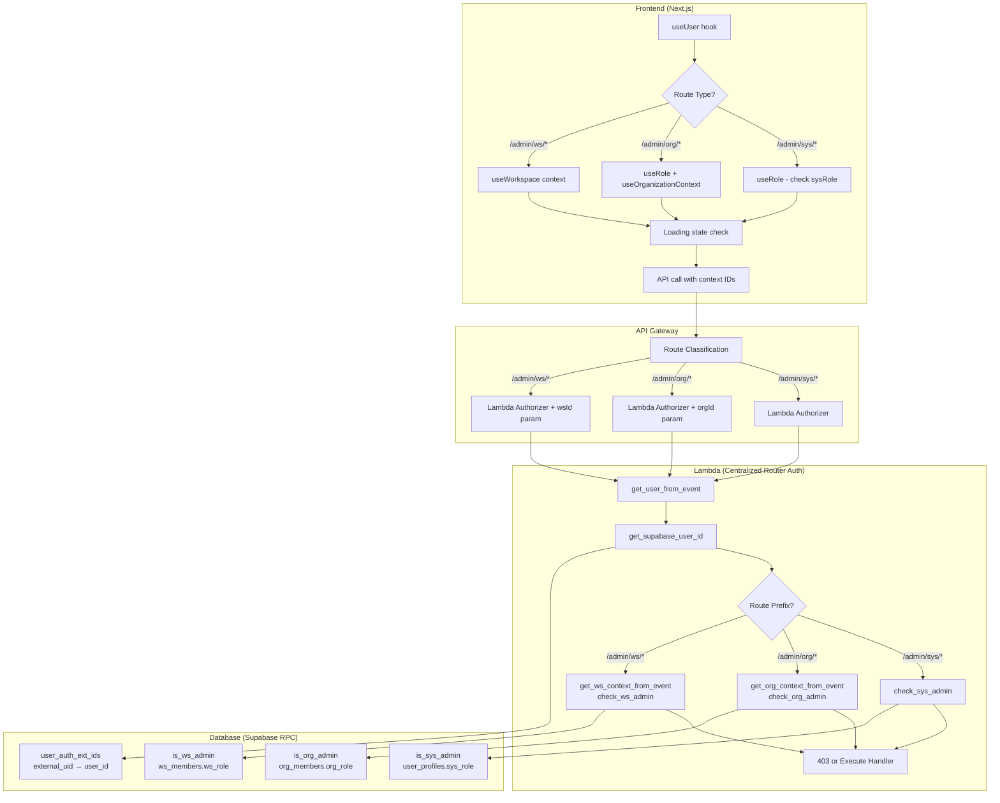

# ADR-019: CORA Authorization Standardization

**Status:** Approved  
**Date:** January 30, 2026 (Updated: January 31, 2026)  
**Decision Makers:** Product Team  
**Impact:** Full-stack authorization across all CORA modules

---

## Overview

This ADR documents the **decision rationale and justification** for CORA authorization standardization. It defines the complete auth lifecycle from frontend to database, covering all three authorization levels: System (sys), Organization (org), and Workspace (ws).

### Documentation Structure

| Type | Purpose | Documents |
|------|---------|-----------|
| **ADR** (this doc) | Decision analysis, justification (WHY) | ADR-019, ADR-019a, ADR-019b |
| **Standards** | Active compliance rules (WHAT) | `03_std_back_AUTH.md`, `01_std_front_ORG-ADMIN-PAGE-AUTH.md` |

**Decision Rationale (ADRs):**
- [ADR-019a: Frontend Authorization](./ADR-019a-AUTH-FRONTEND.md) - React hooks, context, loading states
- [ADR-019b: Backend Authorization](./ADR-019b-AUTH-BACKEND.md) - Lambda patterns, RPC functions, database

**Implementation Standards (for validation compliance):**
- [Backend Auth Standard](../standards/03_std_back_AUTH.md) - Lambda authorization patterns
- [Frontend Org Admin Auth](../standards/01_std_front_ORG-ADMIN-PAGE-AUTH.md) - Org admin page patterns

---

## The Problem

CORA previously lacked consistent authorization patterns across layers, causing:
- **2-8 hours wasted debugging auth issues per module**
- Inconsistent implementations across frontend and backend
- Developer confusion about which pattern to use
- 17x duplicate auth checks in some modules (module-chat)
- Security gaps from mismatched frontend/backend validation

---

## The Solution: Unified Auth Lifecycle

All CORA authorization follows a consistent pattern from frontend to database:



---

## Authorization Matrix

This table defines the **single source of truth** for authorization patterns at each level:

| Route Pattern | Frontend Hook | Lambda Helper | RPC Function | Database Table |
|--------------|---------------|---------------|--------------|----------------|
| `/admin/sys/*` | `useRole()` → check `sysRole` | `check_sys_admin(user_id)` | `is_sys_admin(p_user_id)` | `user_profiles.sys_role` |
| `/admin/org/*` | `useRole()` + `useOrganizationContext()` | `check_org_admin(user_id, org_id)` | `is_org_admin(p_user_id, p_org_id)` | `org_members.org_role` |
| `/admin/ws/*` | `useWorkspace()` | `check_ws_admin(user_id, ws_id)` | `is_ws_admin(p_user_id, p_ws_id)` | `ws_members.ws_role` |

---

## Role Definitions

### System Level (Platform-Wide)

| Role | Column | Description |
|------|--------|-------------|
| `sys_owner` | `user_profiles.sys_role` | Platform owner - full system access |
| `sys_admin` | `user_profiles.sys_role` | System administrator - cross-org management |

**Constants:**
```python
SYS_ADMIN_ROLES = ['sys_owner', 'sys_admin']
```

### Organization Level (Per-Org Membership)

| Role | Column | Description |
|------|--------|-------------|
| `org_owner` | `org_members.org_role` | Organization owner - full org access |
| `org_admin` | `org_members.org_role` | Organization admin - org management |

**Constants:**
```python
ORG_ADMIN_ROLES = ['org_owner', 'org_admin']
```

### Workspace Level (Per-Workspace Membership)

| Role | Column | Description |
|------|--------|-------------|
| `ws_owner` | `ws_members.ws_role` | Workspace owner - full workspace access |
| `ws_admin` | `ws_members.ws_role` | Workspace admin - workspace management |
| `ws_user` | `ws_members.ws_role` | Workspace user - standard access |

**Constants:**
```python
WS_ADMIN_ROLES = ['ws_owner', 'ws_admin']
```

---

## Key Principles

### 1. Two-Tier Identity Architecture

```
┌─────────────────────────────────────────────────────────────┐
│                   CORA Identity Architecture                 │
├─────────────────────────────────────────────────────────────┤
│                                                              │
│  Tier 1: External Identity (Okta/Clerk)                     │
│  ├─ JWT Token contains: external_uid (e.g., Okta user ID)   │
│  ├─ Available in: user_info from get_user_from_event()      │
│  └─ Does NOT contain: roles, permissions, profile data      │
│                                                              │
│  Tier 2: Internal Identity (Supabase)                       │
│  ├─ Database stores: user_id (Supabase auth.users ID)       │
│  ├─ Role tables: user_profiles, org_members, ws_members     │
│  └─ Must query database to get authorization data           │
│                                                              │
└─────────────────────────────────────────────────────────────┘
```

**Critical:** JWT tokens do NOT contain role information. Roles are always in the database.

### 2. Context Extraction (org_id, ws_id)

Users can belong to multiple organizations and workspaces with different roles. The frontend provides context:

- **Frontend** selects org/workspace and passes ID in request
- **Lambda** extracts context using helper functions
- **Database** validates membership and role

### 3. Centralized Router Auth Pattern

Admin Lambdas use centralized authorization at the router level:

```python
def lambda_handler(event, context):
    # Single auth check at router
    if path.startswith('/admin/sys/'):
        if not common.check_sys_admin(user_id):
            return common.forbidden_response('System admin required')
    
    elif path.startswith('/admin/org/'):
        org_id = common.get_org_context_from_event(event)
        if not common.check_org_admin(user_id, org_id):
            return common.forbidden_response('Org admin required')
    
    # Handlers contain business logic only - no auth checks
    return handle_route(...)
```

### 4. Unified Auth Functions

The **same RPC functions** are used in:
- Lambda authorization checks
- Row Level Security (RLS) policies
- Database triggers

This guarantees consistency across all access paths.

---

## Implementation Details

### Frontend Implementation

See: [ADR-019a: Frontend Authorization](./ADR-019a-AUTH-FRONTEND.md)

**Covers:**
- useUser() hook requirements
- useRole() hook for admin pages
- useOrganizationContext() for org routes
- Loading state patterns
- API client configuration

### Backend Implementation

See: [ADR-019b: Backend Authorization](./ADR-019b-AUTH-BACKEND.md)

**Covers:**
- Lambda centralized router pattern
- org-common helper functions
- External UID → Supabase UUID mapping
- Database RPC functions
- RLS policy patterns

---

## Validation

Authorization patterns are validated by the comprehensive api-tracer validator:

```bash
# Run full auth lifecycle validation
python validation/api-tracer/tracer.py --auth-check
```

**Checks:**
- Frontend: Hook usage, context extraction, loading states
- Lambda: Helper function usage, centralized router pattern
- Database: RPC function existence, parameter order

---

## Migration Notes

### Breaking Changes from Pre-ADR-019

1. **RPC function renames:**
   - `is_ws_admin_or_owner()` → `is_ws_admin()`
   
2. **Parameter order standardized:**
   - All functions: `(p_user_id UUID, p_context_id UUID?)`
   
3. **JWT-claims-based functions removed:**
   - Old `is_sys_admin()` (no parameters) removed
   - Old `is_org_admin()` (no parameters) removed

---

## References

### Decision Documents (ADRs)
- [ADR-019a: Frontend Authorization](./ADR-019a-AUTH-FRONTEND.md)
- [ADR-019b: Backend Authorization](./ADR-019b-AUTH-BACKEND.md)
- [ADR-019 Appendix A: Options Comparison](./ADR-019-AUTH-STANDARDIZATION-APPENDIX-A-COMPARISON.md)

### Implementation Standards (Active Compliance Rules)
- [Backend Auth Standard](../standards/03_std_back_AUTH.md) - Lambda authorization patterns
- [Frontend Org Admin Auth](../standards/01_std_front_ORG-ADMIN-PAGE-AUTH.md) - Org admin page patterns

### Related Plans
- [Sprint Plan: S2 Auth Standardization](../plans/plan_s2-auth-standardization.md)

---

**Status:** ✅ Approved  
**Next Step:** Fix remaining auth errors across modules (S2)  
**Tracking:** Sprint S2 of Auth Standardization Initiative - Phase 1 Complete
