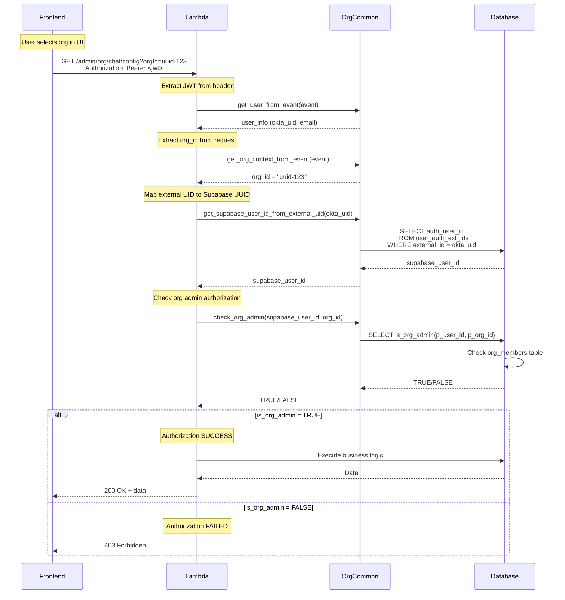

# ADR-019b: Backend Authorization

**Status:** Approved  
**Date:** January 31, 2026  
**Parent ADR:** [ADR-019: CORA Authorization Standardization](./ADR-019-AUTH-STANDARDIZATION.md)

---

## Overview

This document defines the backend authorization patterns for CORA Lambda functions. It covers the centralized router auth pattern, org-common helper functions, external UID mapping, database RPC functions, and RLS policy patterns.

---

## Two-Tier Identity System

CORA uses a two-tier identity architecture that is critical for proper authorization:

```
┌─────────────────────────────────────────────────────────────┐
│                   CORA Identity Architecture                 │
├─────────────────────────────────────────────────────────────┤
│                                                              │
│  Tier 1: External Identity (Okta/Clerk)                     │
│  ├─ JWT Token contains: external_uid (e.g., Okta user ID)   │
│  ├─ Available in: user_info from get_user_from_event()      │
│  └─ Does NOT contain: roles, permissions, profile data      │
│                                                              │
│  Tier 2: Internal Identity (Supabase)                       │
│  ├─ Database stores: user_id (Supabase auth.users ID)       │
│  ├─ Role tables: user_profiles, org_members, ws_members     │
│  └─ Must query database to get authorization data           │
│                                                              │
└─────────────────────────────────────────────────────────────┘
```

**Critical Points:**
1. JWT tokens contain ONLY the external identity provider's user ID
2. Roles and permissions are stored in the DATABASE
3. You MUST map external UID → Supabase user_id before authorization checks
4. NEVER assume role information is in the JWT

---

## Centralized Router Auth Pattern

Admin Lambdas MUST use centralized authorization at the router level. This eliminates code duplication and ensures consistent security.

### Pattern Structure

```python
"""
Module Admin Lambda - Centralized Router Auth

Routes - System Admin:
- GET /admin/sys/mgmt/modules - List all modules
- PUT /admin/sys/mgmt/modules/{name} - Update module

Routes - Org Admin:
- GET /admin/org/mgmt/modules - List org modules
- GET /admin/org/mgmt/usage - View org usage
"""

import json
import logging
import os
from typing import Any, Dict

import org_common as common

logger = logging.getLogger()
logger.setLevel(os.environ.get('LOG_LEVEL', 'INFO'))


def lambda_handler(event: Dict[str, Any], context: object) -> Dict[str, Any]:
    """
    Main Lambda handler with CENTRALIZED authorization.
    
    All admin routes are protected at the router level.
    Individual handlers do NOT need to check authorization.
    """
    try:
        # 1. Extract route information
        http_method = event.get('httpMethod', '')
        path = event.get('path', '')
        
        # 2. Standard CORA auth extraction (ONCE)
        user_info = common.get_user_from_event(event)
        okta_uid = user_info['user_id']
        supabase_user_id = common.get_supabase_user_id_from_external_uid(okta_uid)
        
        # 3. Route-level authorization (ONCE per route type)
        if path.startswith('/admin/sys/'):
            if not common.check_sys_admin(supabase_user_id):
                return common.forbidden_response('System admin role required')
        
        elif path.startswith('/admin/org/'):
            org_id = common.get_org_context_from_event(event)
            if not org_id:
                return common.bad_request_response('Organization ID required')
            if not common.check_org_admin(supabase_user_id, org_id):
                return common.forbidden_response('Organization admin role required')
        
        elif path.startswith('/admin/ws/'):
            ws_id = common.get_ws_context_from_event(event)
            if not ws_id:
                return common.bad_request_response('Workspace ID required')
            if not common.check_ws_admin(supabase_user_id, ws_id):
                return common.forbidden_response('Workspace admin role required')
        
        # 4. Route dispatcher - handlers receive pre-validated context
        if path == '/admin/sys/mgmt/modules' and http_method == 'GET':
            return handle_list_modules(event)  # No auth params needed!
        
        elif path.endswith('/admin/org/mgmt/usage') and http_method == 'GET':
            return handle_org_module_usage(org_id)  # Pre-validated org_id
        
        else:
            return common.not_found_response(f'Route not found: {http_method} {path}')
    
    except common.ForbiddenError as e:
        return common.forbidden_response(str(e))
    
    except Exception as e:
        logger.exception(f'Internal error: {str(e)}')
        return common.internal_error_response('Internal server error')


def handle_list_modules(event: Dict[str, Any]) -> Dict[str, Any]:
    """
    GET /admin/sys/mgmt/modules
    
    NOTE: No authorization check needed - already validated at router level!
    """
    # Business logic only - no auth checks!
    modules = common.find_many(
        table='mgmt_cfg_sys_modules',
        filters={'deleted_at': None}
    )
    return common.success_response({'modules': modules})


def handle_org_module_usage(org_id: str) -> Dict[str, Any]:
    """
    GET /admin/org/mgmt/usage
    
    NOTE: org_id already validated at router level!
    """
    # Business logic only - no auth checks!
    usage_stats = common.find_many(
        table='mgmt_usage_modules',
        filters={'org_id': org_id}
    )
    return common.success_response({'usage': usage_stats})
```

---

## org-common Helper Functions

### Authorization Functions

```python
# Role constants
SYS_ADMIN_ROLES = ['sys_owner', 'sys_admin']
ORG_ADMIN_ROLES = ['org_owner', 'org_admin']
WS_ADMIN_ROLES = ['ws_owner', 'ws_admin']


def check_sys_admin(user_id: str) -> bool:
    """
    Check if user has system admin privileges.
    
    Checks if user has sys_owner OR sys_admin role.
    
    Args:
        user_id: Supabase user UUID
        
    Returns:
        True if user has system admin access
    """
    return rpc('is_sys_admin', {'p_user_id': user_id}) is True


def check_org_admin(user_id: str, org_id: str) -> bool:
    """
    Check if user has organization admin privileges.
    
    Checks if user has org_owner OR org_admin role in the specified org.
    
    Args:
        user_id: Supabase user UUID
        org_id: Organization UUID
        
    Returns:
        True if user has org admin access
    """
    return rpc('is_org_admin', {'p_user_id': user_id, 'p_org_id': org_id}) is True


def check_ws_admin(user_id: str, ws_id: str) -> bool:
    """
    Check if user has workspace admin privileges.
    
    Checks if user has ws_owner OR ws_admin role in the specified workspace.
    
    Args:
        user_id: Supabase user UUID
        ws_id: Workspace UUID
        
    Returns:
        True if user has workspace admin access
    """
    return rpc('is_ws_admin', {'p_user_id': user_id, 'p_ws_id': ws_id}) is True
```

### Context Extraction Functions

```python
def get_org_context_from_event(event: Dict[str, Any]) -> Optional[str]:
    """
    Extract organization ID from API Gateway event.
    
    Checks in order:
    1. Path parameters (orgId)
    2. Query parameters (orgId)
    3. Request body (orgId or org_id)
    
    Returns:
        org_id (str) or None if not found
    """
    # Check path parameters
    path_params = event.get('pathParameters') or {}
    if org_id := path_params.get('orgId'):
        return org_id
    
    # Check query parameters
    query_params = event.get('queryStringParameters') or {}
    if org_id := query_params.get('orgId'):
        return org_id
    
    # Check request body
    try:
        body = json.loads(event.get('body', '{}') or '{}')
        return body.get('orgId') or body.get('org_id')
    except json.JSONDecodeError:
        return None


def get_ws_context_from_event(event: Dict[str, Any]) -> Optional[str]:
    """
    Extract workspace ID from API Gateway event.
    
    Checks in order:
    1. Path parameters (wsId or id)
    2. Query parameters (wsId)
    3. Request body (wsId or ws_id)
    
    Returns:
        ws_id (str) or None if not found
    """
    # Check path parameters
    path_params = event.get('pathParameters') or {}
    if ws_id := path_params.get('wsId') or path_params.get('id'):
        return ws_id
    
    # Check query parameters
    query_params = event.get('queryStringParameters') or {}
    if ws_id := query_params.get('wsId'):
        return ws_id
    
    # Check request body
    try:
        body = json.loads(event.get('body', '{}') or '{}')
        return body.get('wsId') or body.get('ws_id')
    except json.JSONDecodeError:
        return None
```

### External UID Mapping

```python
def get_supabase_user_id_from_external_uid(external_uid: str) -> str:
    """
    Map external identity provider UID to Supabase user_id.
    
    Queries user_auth_ext_ids table to find the mapping.
    
    Args:
        external_uid: External identity provider user ID (Okta UID, Clerk ID)
        
    Returns:
        Supabase user_id (UUID string)
        
    Raises:
        NotFoundError: If no mapping exists for the external UID
    """
    result = find_one(
        table='user_auth_ext_ids',
        filters={'external_id': external_uid}
    )
    
    if not result:
        raise NotFoundError(f'No user mapping found for external UID: {external_uid}')
    
    return result['auth_user_id']
```

---

## Database RPC Functions

### Standard RPC Functions

```sql
-- System admin check
CREATE OR REPLACE FUNCTION is_sys_admin(p_user_id UUID)
RETURNS BOOLEAN AS $$
BEGIN
    RETURN EXISTS (
        SELECT 1 FROM user_profiles
        WHERE user_id = p_user_id
        AND sys_role IN ('sys_owner', 'sys_admin')
    );
END;
$$ LANGUAGE plpgsql SECURITY DEFINER;

-- Organization admin check
CREATE OR REPLACE FUNCTION is_org_admin(p_user_id UUID, p_org_id UUID)
RETURNS BOOLEAN AS $$
BEGIN
    RETURN EXISTS (
        SELECT 1 FROM org_members
        WHERE user_id = p_user_id
        AND org_id = p_org_id
        AND org_role IN ('org_owner', 'org_admin')
    );
END;
$$ LANGUAGE plpgsql SECURITY DEFINER;

-- Workspace admin check
CREATE OR REPLACE FUNCTION is_ws_admin(p_user_id UUID, p_ws_id UUID)
RETURNS BOOLEAN AS $$
BEGIN
    RETURN EXISTS (
        SELECT 1 FROM ws_members
        WHERE user_id = p_user_id
        AND ws_id = p_ws_id
        AND ws_role IN ('ws_owner', 'ws_admin')
    );
END;
$$ LANGUAGE plpgsql SECURITY DEFINER;
```

### Parameter Order Standard

All RPC functions follow: `(p_user_id UUID, p_context_id UUID?)`

Where `p_context_id` is:
- `p_org_id` for organization checks
- `p_ws_id` for workspace checks
- Omitted for system checks (global)

---

## RLS Policy Patterns

The same RPC functions are used in Row Level Security policies:

```sql
-- System admin can manage all orgs
CREATE POLICY "sys_admins_can_manage_orgs" ON organizations
    FOR ALL
    USING (is_sys_admin(auth.uid()));

-- Org admins can manage their org's settings
CREATE POLICY "org_admins_can_manage_settings" ON org_settings
    FOR ALL
    USING (is_org_admin(auth.uid(), org_id));

-- Workspace admins can manage workspace members
CREATE POLICY "ws_admins_can_manage_members" ON ws_members
    FOR ALL
    USING (is_ws_admin(auth.uid(), ws_id));
```

**Key Benefit:** The SAME auth functions are used in both Lambda code AND RLS policies, guaranteeing consistency.

---

## Authorization Flow Diagram



---

## Validation Requirements

The api-tracer validator checks Lambda files for:

1. **External UID conversion** - `get_supabase_user_id_from_external_uid()` called
2. **Centralized router pattern** - Auth checks at router level, not in handlers
3. **Correct helper usage** by route type:
   - `/admin/sys/*` → `check_sys_admin()`
   - `/admin/org/*` → `get_org_context_from_event()` + `check_org_admin()`
   - `/admin/ws/*` → `get_ws_context_from_event()` + `check_ws_admin()`
4. **No direct JWT role access** - Never access `user_info.get('role')`
5. **No duplicate auth checks** - Handlers should not re-check auth

### Common Validation Errors

| Error | Fix |
|-------|-----|
| `Missing external UID conversion` | Call `get_supabase_user_id_from_external_uid()` |
| `Auth check in handler (should be in router)` | Move auth check to `lambda_handler` |
| `Missing org_id extraction for /admin/org/* route` | Call `get_org_context_from_event()` |
| `Direct JWT role access` | Use `check_*_admin()` helpers instead |

---

## Anti-Patterns

### ❌ Checking Role in JWT

```python
# ❌ WRONG: JWT does not contain role
user_role = user_info.get('role', '').lower()  # role is not in JWT!
if user_role not in ['sys_admin', 'sys_owner']:
    raise common.ForbiddenError('...')
```

### ❌ Using Okta UID Directly

```python
# ❌ WRONG: Okta UID is not the Supabase user_id
okta_uid = user_info['user_id']
profile = common.find_one('user_profiles', {'user_id': okta_uid})  # Wrong ID!
```

### ❌ Per-Handler Auth Checks

```python
# ❌ WRONG: Duplicate auth in every handler
def handle_get_config(user_id: str) -> Dict:
    profile = common.find_one('user_profiles', {'user_id': user_id})
    if profile.get('sys_role') not in ['sys_owner', 'sys_admin']:  # Duplicated!
        raise common.ForbiddenError('...')
    # ...

def handle_update_config(user_id: str) -> Dict:
    profile = common.find_one('user_profiles', {'user_id': user_id})
    if profile.get('sys_role') not in ['sys_owner', 'sys_admin']:  # Duplicated!
        raise common.ForbiddenError('...')
    # ...
```

### ❌ Missing Context Extraction

```python
# ❌ WRONG: Not extracting org_id for org admin route
elif path.startswith('/admin/org/'):
    if not common.check_org_admin(user_id, ???):  # Where's org_id?
        return common.forbidden_response('...')
```

---

## Lambda Handler Checklist

When implementing a new Lambda:

- [ ] Use `get_user_from_event()` to extract JWT user info
- [ ] Use `get_supabase_user_id_from_external_uid()` to map to Supabase UUID
- [ ] Implement centralized router auth pattern
- [ ] Use correct helper for route type:
  - [ ] `check_sys_admin()` for `/admin/sys/*`
  - [ ] `get_org_context_from_event()` + `check_org_admin()` for `/admin/org/*`
  - [ ] `get_ws_context_from_event()` + `check_ws_admin()` for `/admin/ws/*`
- [ ] Handlers contain business logic only (no auth checks)
- [ ] Document routes in module docstring
- [ ] Add appropriate error handling

---

## References

- [ADR-019: CORA Authorization Standardization](./ADR-019-AUTH-STANDARDIZATION.md) - Parent ADR
- [ADR-019a: Frontend Authorization](./ADR-019a-AUTH-FRONTEND.md) - Frontend patterns
- [Lambda Authorization Guide](../standards/standard_LAMBDA-AUTHORIZATION.md) - How-to guide with examples
- [ADR-019 Appendix A: Options Comparison](./ADR-019-AUTH-STANDARDIZATION-APPENDIX-A-COMPARISON.md) - Decision analysis

---

**Status:** ✅ Approved  
**Parent:** ADR-019  
**Tracking:** Sprint S1 of Auth Standardization Initiative