# ADR-022: Evaluation Optimization Parallel Processing Strategy

**Status:** Accepted  
**Date:** February 10, 2026  
**Context:** Sprint 5 - Evaluation Optimization (module-eval-studio)  
**Deciders:** Aaron Kilinski, AI Assistant (Cline)

---

## Context

The evaluation optimization pipeline (Phase 4: Evaluation Loop) processes multiple prompt variations against truth sets to measure accuracy. Initial implementation used sequential processing, resulting in unacceptably long execution times.

### Performance Problem

**Current Sequential Processing:**
- 7 prompt variations
- ~10 evaluation criteria per variation
- ~25 seconds per criterion (AI API call latency)
- **Total time: 7 × 10 × 25s = ~29 minutes**

**User Experience Impact:**
- Business Analysts must wait 20-30 minutes for optimization results
- Exceeds Lambda timeout thresholds (15 min)
- Poor UX for iterative optimization workflow
- Not competitive with industry tools

### Blocking Issue Discovered

CloudWatch logs revealed a duplicate key constraint violation:
```
Database error: duplicate key value violates unique constraint 
"eval_opt_run_phases_run_id_phase_number_key"
```

**Root Cause:** The `start_phase()` function is not idempotent. When Lambda retries due to timeout, it attempts to insert Phase 1 again, causing failure.

---

## Decision

**Implement Option 1: Parallel Variation Processing with Idempotent Phase Tracking**

### Solution Components

#### Part A: Idempotent Phase Tracking (BLOCKING FIX)

Make `start_phase()`, `start_variation()`, and `complete_phase()` functions idempotent using check-before-insert pattern:

```python
def start_phase(run_id, phase_number, phase_name):
    # Check if phase already exists
    existing = common.find_one('eval_opt_run_phases', {
        'run_id': run_id,
        'phase_number': phase_number
    })
    
    if existing:
        logger.info(f"Phase {phase_number} already exists, updating status")
        common.update_one('eval_opt_run_phases', 
            {'id': existing['id']},
            {'status': 'in_progress'}
        )
    else:
        common.insert_one('eval_opt_run_phases', {
            'run_id': run_id,
            'phase_number': phase_number,
            'phase_name': phase_name,
            'status': 'in_progress',
            'started_at': datetime.utcnow().isoformat()
        })
```

#### Part B: Parallel Variation Processing

Use Python's `concurrent.futures.ThreadPoolExecutor` to process variations in parallel:

```python
from concurrent.futures import ThreadPoolExecutor, as_completed

def run_evaluation_loop(run_id, variations, criteria, truth_keys):
    """Evaluate all variations in parallel"""
    
    def evaluate_single_variation(variation):
        """Process one variation completely (all criteria sequentially)"""
        # Implementation details...
    
    # Process all variations in parallel
    max_workers = min(5, len(variations))
    with ThreadPoolExecutor(max_workers=max_workers) as executor:
        futures = {executor.submit(evaluate_single_variation, v): v 
                   for v in variations}
        for future in as_completed(futures):
            result = future.result()
```

### Architecture Details: Single Lambda + ThreadPoolExecutor

**Compute Resources:**
- **Lambdas:** 1 (`opt-orchestrator` - handles entire optimization run)
- **Queues:** 0 (no SQS, no async workers)
- **Concurrency:** In-process threading (Python ThreadPoolExecutor)
- **Max Workers:** 5 threads (configurable: `min(5, len(variations))`)

**Execution Flow:**

```mermaid
graph TD
    A[User triggers optimization] --> B[API Gateway]
    B --> C[opt-orchestrator Lambda]
    C --> D[Phase 1-3: Sequential Setup]
    D --> E[Phase 4: ThreadPoolExecutor.max_workers=5]
    
    E --> F1[Thread 1: Variation 1<br/>10 criteria × 25s = 4.2 min]
    E --> F2[Thread 2: Variation 2<br/>10 criteria × 25s = 4.2 min]
    E --> F3[Thread 3: Variation 3<br/>10 criteria × 25s = 4.2 min]
    E --> F4[Thread 4: Variation 4<br/>10 criteria × 25s = 4.2 min]
    E --> F5[Thread 5: Variation 5<br/>10 criteria × 25s = 4.2 min]
    
    F1 --> G1[Thread 1 picks up Variation 6<br/>10 criteria × 25s = 4.2 min]
    F2 --> G2[Thread 2 picks up Variation 7<br/>10 criteria × 25s = 4.2 min]
    
    G1 --> H[All variations complete]
    G2 --> H
    F3 --> H
    F4 --> H
    F5 --> H
    
    H --> I[Phase 5: Analysis]
    I --> J[Return results]
    
    style E fill:#e1f5ff
    style F1 fill:#fff4e1
    style F2 fill:#fff4e1
    style F3 fill:#fff4e1
    style F4 fill:#fff4e1
    style F5 fill:#fff4e1
    style G1 fill:#ffe1e1
    style G2 fill:#ffe1e1
```



**Key Characteristics:**
- **Single Lambda Invocation:** Entire optimization run happens in one Lambda call
- **Synchronous Processing:** Lambda doesn't return until all variations complete
- **In-Process Parallelism:** ThreadPoolExecutor manages 5 worker threads within Lambda
- **Lambda Timeout:** Must complete within 15 minutes (currently ~6 minutes)
- **Memory:** Single Lambda memory pool (~250 MB total)
- **AI API Calls:** 5 concurrent (from 5 threads)

**Limitations:**
- **Lambda Timeout Risk:** If variations take longer than expected, could hit 15-minute limit
- **Memory Constraints:** All threads share single Lambda memory allocation
- **No Fault Isolation:** Lambda failure = entire optimization run fails
- **Scalability Ceiling:** Limited to 5 concurrent variations (ThreadPoolExecutor max_workers)

---

## Alternatives Considered

### Option 2: Parallel Criteria Processing (10x speedup)
- **Pros:** 2x faster than Option 1, better resource utilization
- **Cons:** Complex partial failure handling, AI API rate limit risks, 45 min implementation
- **Rejected:** Complexity not justified for incremental speed improvement

### Option 3: Nested Parallel Processing (58x speedup)
- **Pros:** Maximum performance (30 seconds), production-quality speed
- **Cons:** Very high complexity, race conditions, rate limit concerns, 2 hour implementation
- **Rejected:** High risk, requires extensive testing, over-engineered for current needs

### Sequential Processing (Status Quo)
- **Pros:** Simple, well-understood
- **Cons:** 29 minutes unacceptable, causes Lambda timeouts
- **Rejected:** Does not meet UX requirements

---

## Rationale: Why Option 1?

### 1. Performance vs Complexity Trade-off

| Metric | Sequential | Option 1 | Option 2 | Option 3 |
|--------|-----------|----------|----------|----------|
| **Execution Time** | 29 min | 6 min | 3 min | 30 sec |
| **Speedup** | 1x | 5x | 10x | 58x |
| **Code Complexity** | Low | Low (+20 lines) | Med (+40) | High (+60) |
| **Implementation Time** | 0 | 20 min | 45 min | 2 hours |
| **Error Handling** | Simple | Simple | Complex | Very Complex |
| **Memory Usage** | 165 MB | 250 MB | 400 MB | 600 MB |

**Decision:** 6 minutes is acceptable UX for BA workflow (they review results, not just wait). 5x speedup is significant with minimal risk.

### 2. User Experience Analysis

**Business Analyst Workflow:**
1. Upload documents (1-2 minutes)
2. Create truth set (5-10 minutes)
3. Run optimization (6 minutes) ← **Our scope**
4. Review results (10-15 minutes)
5. Iterate if needed

**Conclusion:** 6-minute optimization fits naturally into workflow. BAs are not idle waiting—they're reviewing intermediate results, checking emails, etc.

### 3. Technical Risk Assessment

| Risk Category | Option 1 | Option 2 | Option 3 |
|---------------|----------|----------|----------|
| Technical Bugs | ⭐ Low | ⭐⭐ Med | ⭐⭐⭐⭐ Very High |
| Production Issues | ⭐ Low | ⭐⭐ Med | ⭐⭐⭐⭐ Very High |
| Maintenance Burden | ⭐ Low | ⭐⭐ Med | ⭐⭐⭐⭐ Very High |

**Decision:** Minimize technical risk for initial launch. Can optimize later with usage data.

### 4. Iterative Improvement Strategy

**Now (Option 1):**
- Ship today (40 min total)
- 5x performance improvement
- Unblock users immediately
- Low technical debt

**Later (If Needed):**
- Monitor actual usage patterns
- If 6 minutes proves problematic, upgrade to Option 2
- If large truth sets (50+ samples) become common, upgrade to Option 3
- Make decision based on real data, not speculation

### 5. Cost Analysis

Lambda costs are negligible ($0.30-$2.50/month across all options). AI API calls dominate costs (~$700/month). Option 3 might increase AI API tier costs due to rate limits.

**Decision:** Optimize for simplicity and maintainability, not Lambda cost savings.

---

## Consequences

### Positive

✅ **Unblocks Production:** Fixes duplicate key error preventing optimization runs from completing  
✅ **Performance Win:** 5x speedup (29 min → 6 min) with minimal code changes  
✅ **Low Risk:** Simple architecture, well-understood concurrency patterns  
✅ **Fast Delivery:** 40 minutes to implement, test, and deploy  
✅ **Maintainable:** Future developers understand code immediately  
✅ **Room to Grow:** Can add Option 2/3 later if needed (no rework required)  
✅ **Isolated Failures:** Error in one variation doesn't affect others  
✅ **Lambda Timeout:** 6 minutes well within 15-minute Lambda limit  

### Negative

⚠️ **Not Fastest:** 6 minutes vs 30 seconds (Option 3) - may not impress in demos  
⚠️ **Sequential Criteria:** Each variation still processes criteria sequentially  
⚠️ **Large Truth Sets:** 50+ sample truth sets might still be slow (12+ minutes)  
⚠️ **Future Optimization:** Will need Option 2/3 if usage patterns change  

### Neutral

🔷 **Memory Usage:** 250 MB (safe, well under 1024 MB limit)  
🔷 **AI API Calls:** 5 concurrent (well under rate limits)  
🔷 **Database Connections:** 5 concurrent (Supabase handles easily)  

---

## Implementation Plan

### Part A: Idempotent Phase Tracking (5 minutes)
1. Update `start_phase()` - check before insert
2. Update `start_variation()` - check before insert  
3. Update `complete_phase()` - handle already-completed
4. Add logging for debugging

### Part B: Parallel Variation Processing (20 minutes)
1. Import `concurrent.futures.ThreadPoolExecutor`
2. Create `evaluate_single_variation()` function
3. Wrap evaluation loop with ThreadPoolExecutor
4. Handle exceptions per variation
5. Maintain progress tracking per variation

### Part C: Testing & Deployment (10 minutes)
1. Sync to test project
2. Build Lambda + layer
3. Deploy via Terraform
4. Test with real optimization run
5. Monitor CloudWatch logs

**Total Time:** 35 minutes

---

## When to Consider More Advanced Architectures

### Current Limitations (Option 1)

The single-Lambda + ThreadPoolExecutor approach has inherent constraints:

1. **Lambda Timeout:** 15-minute hard limit (current: 6 minutes, buffer: 9 minutes)
2. **Memory:** Single Lambda memory pool (current: 250 MB, limit: 10 GB)
3. **Concurrency:** Fixed at 5 threads (could increase but still bounded)
4. **Fault Tolerance:** Single point of failure (Lambda crash = run failure)

### Triggers for Architecture Upgrade

**Upgrade to Option 4: Step Functions + Multiple Lambdas**

*When:*
- Average run time > 10 minutes (approaching Lambda timeout)
- Truth set size > 50 samples (requires more parallelism)
- Need fault tolerance (retry individual variations without restarting entire run)
- Need audit trail (Step Functions provides execution history)

*Architecture:*
```
Step Functions State Machine
├─ Phase 1-3: Setup (single Lambda)
├─ Phase 4: Parallel State
│  ├─ Lambda: Evaluate Variation 1
│  ├─ Lambda: Evaluate Variation 2
│  ├─ Lambda: Evaluate Variation 3
│  ├─ Lambda: Evaluate Variation 4
│  ├─ Lambda: Evaluate Variation 5
│  ├─ Lambda: Evaluate Variation 6
│  └─ Lambda: Evaluate Variation 7
└─ Phase 5: Analysis (single Lambda)
```

*Pros:*
- Fault isolation (one variation failure doesn't kill entire run)
- No Lambda timeout concerns (each variation < 5 minutes)
- Better observability (Step Functions execution history)
- Can scale to 100+ variations

*Cons:*
- More infrastructure complexity (Step Functions + multiple Lambdas)
- Higher cost (~$25/month Step Functions + Lambda invocations)
- Longer implementation time (~2 hours)

**Upgrade to Option 5: SQS Queue + Lambda Workers**

*When:*
- Need to decouple optimization triggering from processing
- Want to queue multiple optimization runs
- Need backpressure handling (queue fills up, Lambdas process as capacity allows)
- Want to scale workers dynamically based on queue depth

*Architecture:*
```
opt-orchestrator (coordinator)
  ↓
SQS Queue (variation tasks)
  ↓
Lambda Workers (10+ concurrent instances)
  ↓
Database (results + progress tracking)
```

*Pros:*
- Massive parallelism (100+ concurrent Lambda workers)
- Natural backpressure (queue depth controls Lambda concurrency)
- Fault tolerance (SQS retries, DLQ for failures)
- Cost-efficient (pay only for messages processed)

*Cons:*
- Most complex architecture (~3 hours implementation)
- Requires careful state management (coordinator tracks worker progress)
- Higher operational overhead (monitor queue, DLQ, worker failures)

### Recommendation

**Stay with Option 1 until:**
1. Average run time exceeds 10 minutes (observed in production)
2. User feedback indicates 6 minutes is too slow
3. Truth set sizes exceed 50 samples (extrapolate from usage data)

**Then upgrade to:**
- **Option 4 (Step Functions)** if fault tolerance is the priority
- **Option 5 (SQS)** if massive parallelism (100+ variations) is needed

**Decision Principle:** Don't over-engineer. Ship Option 1, collect data, optimize based on real usage patterns.

---

## Monitoring & Success Criteria

### Metrics to Track
- Average optimization run duration (target: < 8 minutes)
- Lambda memory usage (target: < 400 MB)
- Variation success rate (target: > 95%)
- AI API error rate (target: < 1%)

### Success Criteria
✅ Duplicate key errors eliminated (0 occurrences)  
✅ Average run time < 10 minutes (5x improvement)  
✅ No Lambda timeout errors  
✅ Variation failures isolated (don't cascade)  

### Future Optimization Triggers
- If 20% of runs exceed 10 minutes → Upgrade to Option 2
- If average truth set size > 50 samples → Upgrade to Option 3
- If users request faster performance → Reassess

---

## References

- **Sprint 5 Plan:** `docs/plans/plan_eval-optimization-s5.md`
- **Context:** `memory-bank/context-eval-optimization.md`
- **CloudWatch Logs:** `ai-mod-dev-eval-opt-orchestrator` (Feb 10, 2026)
- **Related ADRs:**
  - ADR-021: Eval Optimizer Deployment
  - ADR-019b: Auth Backend (scoring architecture)

---

## Notes

**Date Implemented:** February 10, 2026  
**Implemented By:** AI Assistant (Cline) with approval from Aaron Kilinski  
**Test Environment:** `/Users/aaron/code/bodhix/testing/eval-studio/` (ai-mod-stack + ai-mod-infra)  
**Production Rollout:** TBD (pending Sprint 5 completion)

**Key Learning:** Start simple, optimize based on real usage data. Don't over-engineer for hypothetical performance problems.