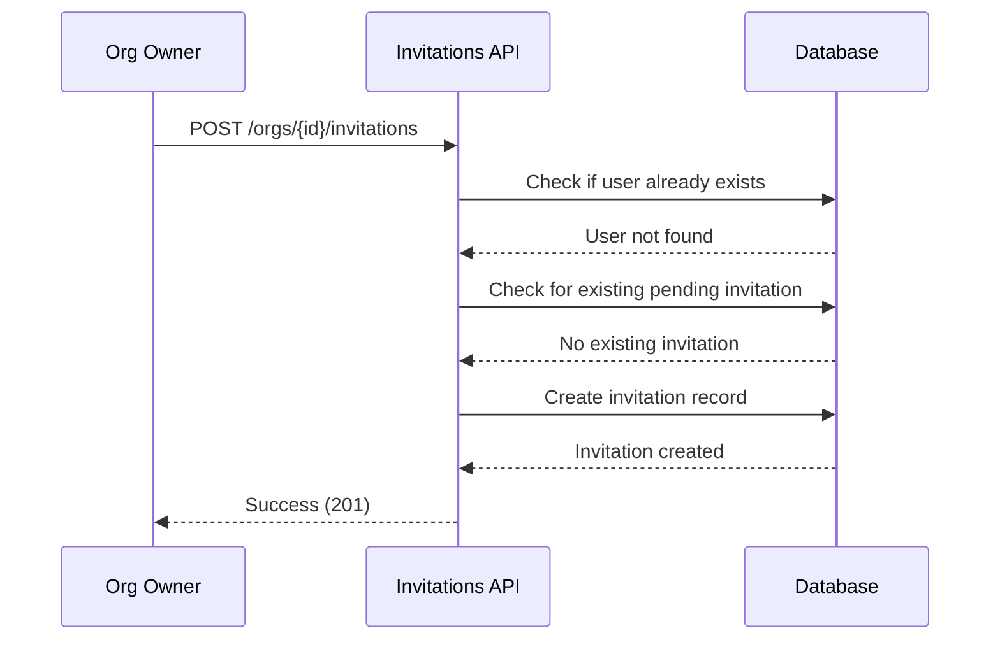
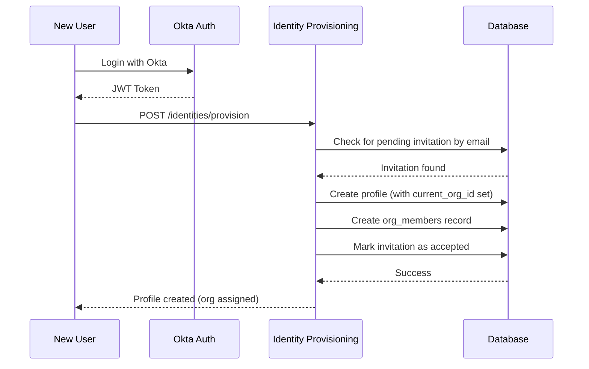
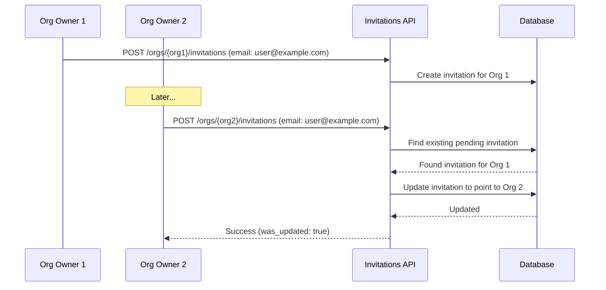

# User Invitation Flow

## Overview

This document describes the user invitation system that allows organization owners to pre-assign users to their organization before the user logs in for the first time.

## Key Features

1. **Pre-assigned Organization Membership**: Org owners can invite users by email before they create an account
2. **Automatic Organization Assignment**: When an invited user logs in for the first time, they are automatically added to the organization
3. **Single Pending Invitation**: Each email can only have one pending invitation at a time (across all organizations)
4. **Configurable Expiry**: Invitations expire after a configurable number of days (default: 7 days)
5. **Audit Trail**: Full audit tracking with `created_by`, `updated_by`, and `accepted_by` fields

## Database Schema

### `org_invites` Table

| Column | Type | Description |
|--------|------|-------------|
| `id` | UUID | Primary key |
| `org_id` | UUID | Organization the user is being invited to |
| `invited_email` | TEXT | Email address of the invited user |
| `role` | VARCHAR(50) | Role to assign: `org_user`, `org_admin`, or `org_owner` |
| `invited_by` | UUID | User ID who sent the invitation |
| `token` | TEXT | Secure token (not exposed in API responses) |
| `expires_at` | TIMESTAMPTZ | When the invitation expires |
| `accepted_at` | TIMESTAMPTZ | When invitation was accepted (NULL if pending) |
| `accepted_by` | UUID | User ID who accepted (set during provisioning) |
| `created_at` | TIMESTAMPTZ | Record creation timestamp |
| `updated_at` | TIMESTAMPTZ | Last update timestamp |
| `created_by` | UUID | Audit: who created the invitation |
| `updated_by` | UUID | Audit: who last updated the invitation |

### Constraints

- **Single Pending Invitation**: Partial unique index ensures only ONE pending invitation per email across all organizations
- **Role Validation**: Check constraint limits roles to `org_user`, `org_admin`, `org_owner`

## API Endpoints

### 1. List Invitations (GET)

**Endpoint**: `GET /orgs/{org_id}/invitations`

**Access**: Any org member can view

**Query Parameters**:
- `status`: Filter by status (`pending`, `accepted`, `expired`, `all`) - default: `pending`
- `limit`: Number of results (1-1000) - default: 100
- `offset`: Pagination offset - default: 0

**Response**:
```json
{
  "data": [
    {
      "id": "uuid",
      "org_id": "uuid",
      "invited_email": "user@example.com",
      "role": "org_user",
      "invited_by": "uuid",
      "expires_at": "2025-12-15T00:00:00Z",
      "accepted_at": null,
      "status": "pending",
      "created_at": "2025-12-08T00:00:00Z"
    }
  ]
}
```

### 2. Create/Update Invitation (POST)

**Endpoint**: `POST /orgs/{org_id}/invitations`

**Access**: Org owners only

**Request Body**:
```json
{
  "email": "user@example.com",
  "role": "org_user",
  "expires_in_days": 7
}
```

**Behavior**:
- If a pending invitation already exists for the email (in ANY org), it will be **updated** to point to the new organization
- This prevents invitation spam and ensures users only have one pending invitation

**Response**:
```json
{
  "data": {
    "id": "uuid",
    "org_id": "uuid",
    "invited_email": "user@example.com",
    "role": "org_user",
    "status": "pending",
    "was_updated": false
  }
}
```

### 3. Cancel Invitation (DELETE)

**Endpoint**: `DELETE /orgs/{org_id}/invitations/{invitation_id}`

**Access**: Org owners only

**Response**:
```json
{
  "data": {
    "message": "Invitation cancelled successfully",
    "id": "uuid"
  }
}
```

### 4. Get Pending Invitation (GET)

**Endpoint**: `GET /invitations/pending`

**Access**: Authenticated users (checks their email)

**Response**:
```json
{
  "data": {
    "invitation": {
      "id": "uuid",
      "org_id": "uuid",
      "invited_email": "user@example.com",
      "role": "org_user",
      "status": "pending",
      "organization": {
        "id": "uuid",
        "name": "Acme Corp",
        "slug": "acme"
      }
    }
  }
}
```

## User Flows

### Flow 1: Inviting a New User



### Flow 2: Invited User First Login



### Flow 3: Updating an Existing Invitation



## Row Level Security (RLS) Policies

| Policy | Action | Who Can Access |
|--------|--------|----------------|
| `org_members_can_view_org_invites` | SELECT | Any org member can view their org's invitations |
| `users_can_view_own_pending_invite` | SELECT | Users can view their own pending invitation (by email) |
| `org_owners_can_create_invites` | INSERT | Only org owners |
| `org_owners_can_update_org_invites` | UPDATE | Only org owners |
| `org_owners_can_delete_org_invites` | DELETE | Only org owners |
| `service_role_full_access` | ALL | Service role (Lambda functions) |

## Implementation Files

### Backend Lambda Functions

1. **Invitations Lambda**: `packages/org-module/backend/lambdas/invitations/lambda_function.py`
   - Handles CRUD operations for invitations
   - Validates org ownership for modifications

2. **Identity Provisioning Lambda**: `packages/org-module/backend/lambdas/identities-management/lambda_function.py`
   - Enhanced to check for pending invitations during user provisioning
   - Auto-creates org membership when invitation found

### Database Migration

- **Migration 009**: `sql/migrations/009_create_org_invites.sql`
  - Creates `org_invites` table
  - Sets up indexes, constraints, triggers
  - Configures RLS policies
  - Creates helper functions

## Error Handling

| Error | HTTP Status | Message |
|-------|-------------|---------|
| User already member | 400 | "User is already a member of this organization" |
| Not org owner | 403 | "Only org owners can manage invitations" |
| Invitation not found | 404 | "Invitation not found" |
| Invalid email | 400 | Validation error message |
| Expired invitation | Skipped | Invitation silently ignored during provisioning |

## Future Enhancements

1. **Email Notifications**: Send email to invited users (deferred - out of current scope)
2. **Bulk Invitations**: Support inviting multiple users at once
3. **Invitation Resend**: Allow resending expired invitations
4. **Custom Expiry per Org**: Organization-level default expiry settings

## Security Considerations

1. **Token Security**: The `token` field is never exposed in API responses
2. **Email Matching**: Invitations are matched by exact email address (case-insensitive matching could be added)
3. **Expiry Enforcement**: Expired invitations are not accepted during provisioning
4. **RLS Enforcement**: All database access goes through RLS policies
5. **Service Role**: Lambda functions use service role to bypass RLS for cross-org operations
