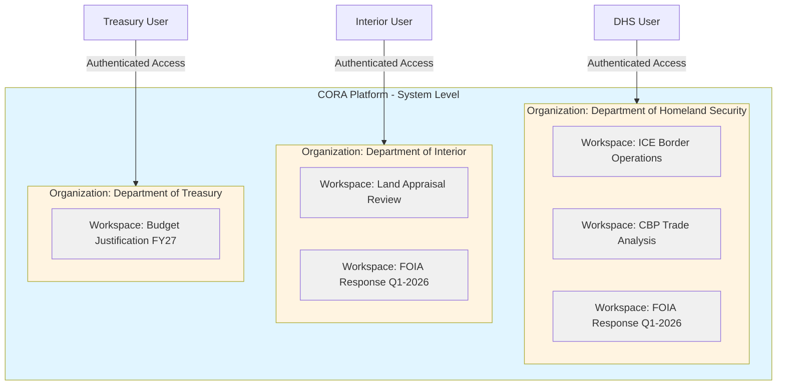
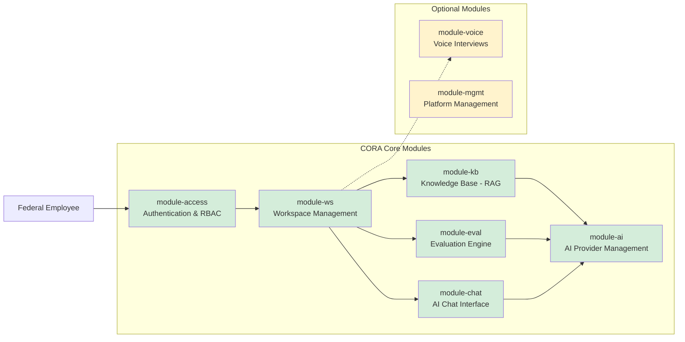

# Accelerating Government Efficiency Through AI: The CORA Platform

**Executive Summary**  
**Federal Government Use Case Portfolio**  
**January 2026**

---

## 1. The Government Efficiency Imperative

Federal agencies face mounting pressure to deliver better outcomes with constrained resources. The imperative for government efficiency is not new, but today's challenges demand transformative solutions:

- **Workforce constraints**: Retirement wave and hiring freezes reduce available expertise
- **Compliance burden**: Ever-expanding regulatory requirements demand increasing resources
- **Citizen expectations**: Digital-native expectations clash with legacy processes
- **Budget pressure**: Flat or declining budgets require doing more with less
- **Knowledge retention**: Institutional knowledge walks out the door with retiring employees

Traditional approaches—incremental process improvements, additional training, workforce reallocation—have reached their limits. **The productivity gap demands a force multiplier.**

Artificial Intelligence represents that force multiplier, but only if deployed responsibly within the constraints of federal security, compliance, and operational requirements.

---

## 2. The CORA Platform: AI for Government Operations

### What is CORA?

**CORA (Context Oriented Resource Architecture)** is an enterprise AI application framework specifically designed for complex organizational environments requiring:

- **Multi-tenancy**: Context-based security with org, workspace, and resource (chat, voice interview, evaluation, etc.) protection
- **Role-based access control**: Granular permissions aligned to federal role structures
- **Security-first design**: FedRAMP Moderate-ready architecture on AWS
- **Flexible deployment**: SaaS (primary) or private deployment in agency AWS environment
- **Modular architecture**: Deploy only what you need, when you need it
- **AI capabilities**: Knowledge base (RAG), Chat, Evaluation, Voice modules

### Why CORA Fits Federal Requirements

| Federal Requirement | CORA Solution |
|-------------------|---------------|
| **FedRAMP Moderate Compliance** | AWS-based infrastructure compatible with GovCloud, designed for federal ATO |
| **Deployment Flexibility** | SaaS (multi-agency) or private deployment (single agency with organizational units) |
| **Multi-Agency/Bureau Structure** | sys → org → ws hierarchy maps to agency/bureau/office/project |
| **Context-Based Security** | Secure access and data protection based on org, workspace, and resource context |
| **Role-Based Access Control** | module-access provides granular RBAC aligned to federal roles |
| **Project-Based Work** | Workspace (ws) module enables scoped collaboration with timelines |
| **Audit Trail Requirements** | Comprehensive logging and evaluation tracking built-in |
| **Data Sovereignty** | Tenant isolation ensures data segregation by org/workspace |

### Core Architecture: Three-Tier Security Context

**CORA Core Modules Architecture:**

**Key Benefit**: Federal users authenticate once, access multiple workspaces within their agency, with permissions scoped by role and workspace membership.

---

## 3. Security Posture: FedRAMP Moderate Ready

### Current Status

- **Cloud Infrastructure**: AWS (GovCloud-compatible architecture)
- **Authentication**: Cognito with MFA support, CAC/PIV integration ready
- **Authorization**: RBAC with module-level permissions
- **Data Encryption**: At-rest (S3, RDS) and in-transit (TLS 1.2+)
- **Audit Logging**: CloudWatch with retention policies
- **Compliance Framework**: NIST 800-53 controls implemented

### Path to ATO

| Phase | Timeline | Activities |
|-------|----------|------------|
| **Phase 1: Assessment** | Month 1-2 | Gap analysis, control mapping, security documentation |
| **Phase 2: Remediation** | Month 3-4 | Control implementation, security hardening |
| **Phase 3: Testing** | Month 5-6 | Penetration testing, vulnerability scanning |
| **Phase 4: ATO Package** | Month 7-8 | Documentation compilation, 3PAO assessment |
| **Phase 5: Authorization** | Month 9-12 | Agency review, ATO decision |

**Estimated Time to ATO**: 9-12 months (standard for FedRAMP Moderate)

### Security Advantages for Federal Agencies

1. **Context-Based Protection**: Secure access and data protection based on org, workspace, and resource context
2. **Tenant Isolation**: Each agency's data is logically segregated (SaaS) or fully isolated (private deployment)
3. **Workspace Scoping**: Projects contain sensitive data within defined boundaries
4. **Audit Trail**: Every AI interaction logged for compliance review
5. **Data Residency**: SaaS in FedRAMP-authorized environment OR private deployment in agency-controlled AWS
6. **No Training on Federal Data**: Uses retrieval-augmented generation (RAG) instead of fine-tuning

### Deployment Options

**Option 1: SaaS Multi-Tenant (Primary Recommendation)**
- Multiple federal agencies on shared infrastructure
- FedRAMP Moderate authorized environment
- Context-based security ensures complete data segregation
- Lower total cost of ownership
- Faster time to deployment
- Automatic platform updates

**Option 2: Private Agency Deployment**
- Dedicated CORA instance in agency's own AWS environment
- Organizations = organizational units within the agency (bureaus, offices, divisions)
- Full control over infrastructure and data
- Suitable for agencies with specific compliance requirements
- Higher initial investment, agency-managed operations

---

## 4. Use Case Portfolio: Top 10 Federal Applications

### Portfolio Overview

The following 10 use cases represent high-impact opportunities for improving federal workforce productivity and reducing operational costs. They are prioritized by:

1. **Development effort** (zero development preferred)
2. **Mission impact** (agency effectiveness)
3. **Universal applicability** (relevant to multiple agencies)
4. **ROI potential** (cost savings + productivity gains)

### Priority Tier 1: Active Development / Client Interest

| # | Use Case | Agencies | Dev Effort | Annual Savings/FTE |
|---|----------|----------|------------|-------------------|
| **1** | **IT Security Audit Compliance** | All Federal | In Dev | $180K-$240K |
| **2** | **FOIA Document Redaction** | All Federal | Zero | $120K-$180K |
| **3** | **Federal Land Appraisal Evaluator** | Interior, GSA | Zero | $90K-$150K |

**Rationale**: These three use cases are already familiar to the executive team, have validated demand, and address universal federal requirements.

### Priority Tier 2: Universal Needs (Zero Additional Development)

| # | Use Case | Agencies | Dev Effort | Annual Savings/FTE |
|---|----------|----------|------------|-------------------|
| **4** | **Policy & Procedures Knowledge Assistant** | All Federal | Zero | $75K-$120K |
| **5** | **Acquisition Specialist Support** | DHS, DoD, GSA | Zero | $90K-$150K |
| **6** | **Training & Onboarding Assistant** | All Federal | Zero | $60K-$90K |
| **7** | **Report Writing & Review Assistant** | All Federal | Zero | $75K-$120K |

**Rationale**: These leverage existing CORA modules (kb, chat, eval, ws) with only configuration and prompt tuning required.

### Priority Tier 3: Strategic Expansion (Light Development)

| # | Use Case | Agencies | Dev Effort | Annual Savings/FTE |
|---|----------|----------|------------|-------------------|
| **8** | **Investigation Research Assistant** | DHS, FBI, IRS-CI | Light | $120K-$180K |
| **9** | **Budget Justification Assistant** | All Federal | Light | $60K-$90K |
| **10** | **Voice-Enabled Field Operations** | CBP, ICE, USSS | Config | $45K-$75K |

**Rationale**: These require lightweight module extensions but address high-value specialized use cases.

---

## 5. Impact Analysis Framework

### Measuring Success: Three Dimensions

For each use case, we assess impact across three dimensions:

#### 5.1 Efficiency Gains

**Time Savings**: Reduction in time required to complete tasks
- Target: 40-70% time reduction for knowledge-intensive tasks
- Example: FOIA redaction reduced from 8 hours to 2.5 hours per case

**Throughput Increase**: More work completed with same resources
- Target: 50-100% throughput increase
- Example: Security audits increased from 2/month to 4/month per auditor

#### 5.2 Effectiveness Improvements

**Quality Increase**: Higher accuracy, fewer errors, better compliance
- Target: 30-50% reduction in error rates
- Example: Appraisal reviews catch 45% more standards violations

**Consistency**: Reduced variability in outcomes across staff
- Target: 80%+ consistency in decision-making processes
- Example: FOIA redactions achieve 90% consistency vs. 65% manual baseline

#### 5.3 Cost Reduction

**Direct Labor Savings**: Reduced FTE hours for routine tasks
- Target: $50K-$200K per FTE annually
- Calculation: (Hours saved × Burden rate) - Platform cost

**Indirect Savings**: Reduced rework, faster onboarding, knowledge retention
- Target: 20-30% of direct savings
- Example: Reduced training time for new acquisition specialists

### Aggregate Portfolio Impact (Fully Deployed)

**Assuming deployment across a mid-sized federal agency (1,000 knowledge workers):**

| Metric | Conservative | Optimistic |
|--------|--------------|------------|
| **Annual Cost Savings** | $8.5M | $15.2M |
| **Productivity Gain (FTE Equivalent)** | 85 FTE | 152 FTE |
| **Time to Positive ROI** | 18 months | 12 months |
| **5-Year NPV** | $32M | $68M |

**Assumptions**:
- 30% adoption rate in Year 1, scaling to 80% by Year 3
- Average burden rate: $150K/FTE
- Platform cost: $500K/year (licensing + infrastructure)
- Implementation cost: $1.2M (one-time)

---

## 6. Implementation Approach: Phased Rollout

### Phase 1: Foundation (Months 1-6)

**Objective**: Establish platform, achieve ATO, deploy first use case

**Activities**:
- Infrastructure setup (AWS, Cognito, Supabase)
- FedRAMP Moderate ATO process
- Deploy Use Case #1: IT Security Audit Compliance
- Train pilot user group (15-25 users)

**Success Criteria**:
- Platform operational with <99% uptime
- ATO decision (provisional or full)
- 80% user satisfaction score
- Measurable productivity gain in security audits

**Budget**: $850K (infrastructure + ATO + implementation)

### Phase 2: Expansion (Months 7-12)

**Objective**: Scale to additional use cases and user base

**Activities**:
- Deploy Use Cases #2-4 (FOIA, Land Appraisal, Policy Assistant)
- Expand to 100-150 users across 3-4 workspaces
- Integrate with agency authentication (CAC/PIV)
- Establish governance framework

**Success Criteria**:
- 4 active use cases in production
- 150+ active users
- $1M+ annual savings realized
- 85% user satisfaction score

**Budget**: $450K (additional use cases + expansion)

### Phase 3: Maturity (Months 13-24)

**Objective**: Full deployment, optimize, and measure ROI

**Activities**:
- Deploy remaining use cases (#5-10)
- Scale to 500+ users agency-wide
- Implement advanced analytics and reporting
- Continuous improvement based on usage data

**Success Criteria**:
- 10 active use cases
- 500+ active users (50% of target population)
- $5M+ annual savings realized
- 90% user satisfaction score
- Positive ROI achieved

**Budget**: $600K (full deployment + optimization)

### Total Investment Summary

| Phase | Timeline | Investment | Expected Savings | Cumulative ROI |
|-------|----------|------------|------------------|----------------|
| Phase 1 | Months 1-6 | $850K | $0 | -$850K |
| Phase 2 | Months 7-12 | $450K | $1.2M | -$100K |
| Phase 3 | Months 13-24 | $600K | $8.5M | +$7.9M |
| **Total** | **24 months** | **$1.9M** | **$9.7M** | **+$7.8M** |

---

## 7. Risk Mitigation

### Key Risks and Mitigation Strategies

| Risk | Impact | Probability | Mitigation |
|------|--------|-------------|------------|
| **ATO Delays** | High | Medium | Start ATO process early, engage 3PAO proactively, parallel track with pilot |
| **User Adoption** | High | Medium | Executive sponsorship, change management, early wins with champions |
| **AI Accuracy Issues** | Medium | Low | Human-in-the-loop design, evaluation scoring, continuous prompt tuning |
| **Integration Challenges** | Medium | Medium | Standard APIs, modular architecture, phased integration approach |
| **Budget Constraints** | High | Medium | Phased approach allows pause/pivot, demonstrate ROI early |

### Success Factors

1. **Executive Sponsorship**: Active support from agency CIO and mission leadership
2. **User Champions**: Identify and empower early adopters in each use case
3. **Change Management**: Comprehensive training and support program
4. **Governance**: Clear policies for AI usage, data handling, and escalation
5. **Measurement**: Rigorous tracking of adoption, satisfaction, and ROI metrics

---

## 8. Competitive Advantages

### Why CORA vs. Commercial AI Tools?

| Factor | CORA Platform | Commercial AI (e.g., ChatGPT Enterprise) |
|--------|---------------|------------------------------------------|
| **Federal Compliance** | FedRAMP Moderate ready | Varies, often inadequate |
| **Data Sovereignty** | Agency-controlled AWS account | Vendor infrastructure |
| **Multi-Tenancy** | Built-in sys→org→ws hierarchy | Bolted-on, if available |
| **Customization** | Modular, extensible architecture | Limited to vendor roadmap |
| **Workspace Collaboration** | Project-based with timelines, scoping | Generic team features |
| **Evaluation Framework** | Built-in scoring and auditing | External tools required |
| **Cost Predictability** | Self-hosted, transparent costs | Per-user SaaS, escalating |

### Why CORA vs. Custom Development?

| Factor | CORA Platform | Custom Development |
|--------|---------------|--------------------|
| **Time to Deploy** | 6-12 months | 18-36 months |
| **Upfront Cost** | $1.9M (24 months) | $5-10M |
| **Risk** | Proven architecture | Greenfield risk |
| **Maintenance** | Framework updates included | Ongoing dev team required |
| **Multi-Use Case** | Reusable platform (10 use cases) | Single-purpose solution |

---

## 9. Call to Action: Recommended Next Steps

### Immediate Actions (Next 30 Days)

1. **Executive Briefing**: Present this portfolio to agency CIO and mission leadership
2. **Stakeholder Engagement**: Identify pilot users for Use Case #1 (IT Security Audit)
3. **Budget Alignment**: Secure Phase 1 funding ($850K)
4. **ATO Planning**: Engage 3PAO, initiate gap analysis
5. **Partnership Kickoff**: Contract with implementation services company

### 90-Day Milestone Goals

- **ATO Process**: Complete gap analysis, initiate remediation
- **Infrastructure**: AWS environment established, CORA platform deployed
- **Pilot Launch**: 15-25 users actively using IT Security Audit compliance system
- **Metrics Baseline**: Document current-state productivity for comparison

### 12-Month Vision

- **ATO Decision**: Provisional or full ATO achieved
- **Production Use Cases**: 4 use cases live (IT Security, FOIA, Land Appraisal, Policy Assistant)
- **User Base**: 150+ federal employees and contractors using the platform daily
- **Measurable ROI**: $1M+ in documented annual savings
- **Expansion Plan**: Roadmap for remaining 6 use cases and agency-wide scaling

---

## 10. Conclusion: The Urgency of Action

Federal agencies cannot wait for the "perfect" AI solution. The workforce challenges are here now. The compliance burden is growing. The budget pressure is intensifying.

**The CORA platform offers a pragmatic path forward:**

✅ **Proven Architecture**: Modular, security-first design ready for federal deployment  
✅ **Rapid Time-to-Value**: Deploy first use case in 6 months, not 3 years  
✅ **Risk-Managed Approach**: Phased rollout, human-in-the-loop, continuous evaluation  
✅ **Measurable Impact**: Clear metrics for efficiency, effectiveness, and cost reduction  
✅ **Scalable Foundation**: One platform, 10 use cases, unlimited future applications  

### The Choice is Clear

Federal agencies face a choice:

1. **Continue status quo**: Accept workforce constraints, rising costs, declining service levels
2. **Pursue moonshot custom development**: Risk 3-year timelines, cost overruns, uncertain outcomes
3. **Adopt CORA platform**: Leverage proven technology, deploy in phases, demonstrate ROI within 18 months

**We recommend Option 3.**

The use cases detailed in the following volumes represent not just operational improvements, but a fundamental transformation in how federal agencies leverage their most valuable asset: the expertise of their people.

By augmenting federal employees with AI-powered tools—not replacing them—we unlock productivity gains that translate directly to better mission outcomes, reduced costs, and improved government efficiency.

**The time to act is now.**

---

## About This Portfolio

This executive summary introduces 10 detailed use case volumes:

1. **IT Security Audit Compliance System** (Priority: In Development)
2. **FOIA Document Redaction Assistant** (Priority: Universal Need)
3. **Federal Land Appraisal Standards Evaluator** (Priority: Client Interest)
4. Policy & Procedures Knowledge Assistant
5. Acquisition Specialist Support System
6. Training & Onboarding Assistant
7. Report Writing & Review Assistant
8. Investigation Research Assistant
9. Budget Justification Assistant
10. Voice-Enabled Field Operations

Each volume provides:
- Detailed current-state pain points
- CORA solution architecture
- Workspace utilization patterns
- Comprehensive impact assessment
- Development requirements and timeline
- Success metrics and ROI projections

**For more information or to schedule a pilot program discussion, contact the implementation services team with federal agency experience, particularly with DHS.**

---

**Document Version**: 1.0  
**Last Updated**: January 30, 2026  
**Classification**: Unclassified / For Official Use Only
