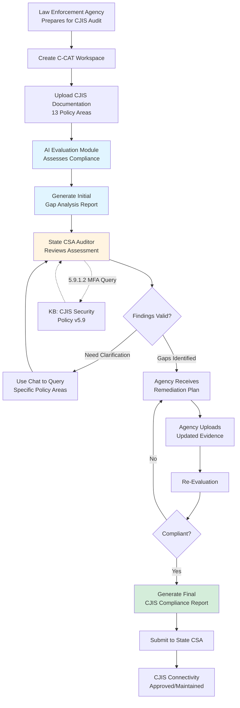

# Use Case Volume 1: CJIS Security Audit Compliance System (C-CAT)

**CORA Federal Government Use Case**  
**Priority: Tier 1 - Active Development**  
**Product: C-CAT (CJIS - Security Assessment Tool)**  
**January 2026**

---

## Executive Summary

**The Overlooked Compliance Challenge**: While numerous tools claim to assist with federal ATO processes (NIST 800-53), Criminal Justice Information Systems (CJIS) Security Audits remain a largely overlooked compliance requirement affecting thousands of law enforcement agencies nationwide.

**C-CAT (CJIS - Security Assessment Tool)** is a branded implementation of the CORA framework, purpose-built for CJIS Security Policy compliance. Unlike generic GRC tools, C-CAT is specifically designed for the unique requirements of law enforcement agencies accessing FBI CJIS systems.

**The CJIS Compliance Landscape**:
- **13 Policy Areas** covering physical security, personnel, information security
- **5.9.1.2 Advanced Authentication** requirements (stringent multi-factor authentication)
- **Annual audits** mandated for all CJIS-connected agencies
- **16,000+ law enforcement agencies** requiring CJIS compliance (federal, state, local, tribal)

**Key Benefits:**
- **Efficiency**: 60-80% reduction in CJIS audit preparation time
- **Effectiveness**: 45% improvement in policy area coverage and gap identification
- **Cost Savings**: $180K-$240K per security auditor annually
- **Market Differentiation**: Purpose-built for CJIS (not generic ATO tool)
- **Development Status**: Currently in development, 6-month deployment timeline

---

## 1. Current State Pain Points

### 1.1 Manual CJIS Audit Process

**The Problem**: CJIS security auditors manually review 13 policy areas with hundreds of sub-requirements

**CJIS Security Policy v5.9 Requirements**:
- **13 Policy Areas**: Information Security, Personnel Security, Physical Security, etc.
- **5.9.1.2 Advanced Authentication**: Complex multi-factor authentication mandates
- **5.10 Incident Response**: Breach notification within strict timelines
- **5.4 Auditing and Accountability**: Comprehensive logging requirements
- **Annual compliance**: Required for all CJIS-connected agencies

**Impact**:
- 200-400 hours per audit for experienced CJIS auditors
- 2-3 months to complete comprehensive CJIS security audit
- Inconsistent interpretation across state/local jurisdictions
- High risk of missing technical requirements (especially 5.9.1.2)
- Small agencies lack dedicated CJIS security expertise

### 1.2 Document Chaos (Amplified for Law Enforcement)

**The Problem**: Law enforcement agencies have unique documentation challenges

**CJIS-specific artifacts across 13 policy areas**:
- **5.1 Information Exchange Agreements**: Interconnection security agreements (ISAs)
- **5.2 Security Awareness Training**: Annual training records for all personnel
- **5.3 Incident Response**: Breach notification procedures and logs
- **5.4 Auditing and Accountability**: System audit logs, access logs
- **5.9 Identification and Authentication**: MFA implementation evidence
- **5.12 Physical Protection**: Facility security documentation, visitor logs
- **Personnel Security**: Background check records, termination procedures

**Impact**:
- 40-60 hours spent locating and organizing CJIS evidence
- Small agencies lack document management infrastructure
- Tribal and local jurisdictions struggle with record-keeping
- Version control issues (outdated policies submitted to state CJIS authority)
- Incomplete evidence packages delay CJIS connectivity approvals

### 1.3 CJIS Expertise Bottleneck

**The Problem**: Severe shortage of qualified CJIS security auditors

**The CJIS Expertise Challenge**:
- **16,000+ agencies** requiring annual audits (federal, state, local, tribal)
- **State CJIS Systems Agencies (CSAs)**: Responsible for auditing all agencies in state
- **Limited CSA staff**: Most states have 2-5 CJIS auditors covering hundreds of agencies
- **18-24 months** to train new CJIS auditors (FBI CJIS Security Policy is complex)
- **Retirement wave**: Experienced CJIS auditors retiring, taking institutional knowledge

**Impact**:
- **Audit backlogs**: 6-12 month delays common, especially in large states (CA, TX, FL)
- **Small agencies underserved**: Rural sheriffs, tribal police lack audit capacity
- **Compliance gaps**: Agencies "paper over" requirements to pass annual audit
- **Critical access delays**: NCIC/NLETS connectivity delayed awaiting CJIS audit
- **Knowledge loss**: When state CJIS officers retire, interpretation of policy varies

### 1.4 Continuous CJIS Compliance Challenge

**The Problem**: CJIS compliance is ongoing, not "one and done"

**Post-Approval Requirements**:
- **Annual audits**: Required for all CJIS-connected agencies
- **Policy updates**: FBI CJIS Security Policy updated annually (v5.9, v6.0, etc.)
- **Incident response**: Breach notification to FBI CJIS within 1 hour of discovery
- **Personnel changes**: Background checks, terminations require immediate updates
- **Advanced authentication**: 5.9.1.2 requires continuous MFA enforcement

**Impact**:
- **Small agencies overwhelmed**: Lack staff to maintain continuous compliance
- **Policy drift**: Configuration changes violate CJIS requirements unknowingly
- **Audit surprises**: Gaps discovered during annual review cause connectivity suspension
- **Version confusion**: Agencies unsure which CJIS Security Policy version applies
- **Reactive response**: Manual monitoring misses emerging gaps

---

## 2. C-CAT Solution Architecture (CORA Implementation)

### 2.1 System Overview

**C-CAT (CJIS - Security Assessment Tool)** is a branded implementation of the CORA framework, purpose-built for CJIS Security Policy compliance. C-CAT leverages CORA's evaluation module to automatically assess law enforcement security documentation and implementation artifacts against the FBI CJIS Security Policy.

**Why C-CAT vs. Generic ATO Tools?**
- **CJIS-Specific**: Pre-loaded with FBI CJIS Security Policy v5.9 (and updates)
- **Law Enforcement Context**: Understands NCIC, NLETS, state CJIS authorities
- **13 Policy Areas**: Purpose-built templates for each CJIS policy area
- **5.9.1.2 Focus**: Advanced authentication compliance validation built-in
- **Multi-Jurisdiction**: Supports federal, state, local, tribal agencies

```
┌─────────────────────────────────────────────────────────────┐
│ C-CAT (CJIS - Security Assessment Tool)                     │
│ Powered by CORA Framework                                    │
├─────────────────────────────────────────────────────────────┤
│                                                              │
│  1. DOCUMENT UPLOAD (Knowledge Base Module)                 │
│     • CJIS security policies (13 policy areas)              │
│     • Information Exchange Agreements (ISAs)                │
│     • Security awareness training records                   │
│     • MFA implementation evidence (5.9.1.2)                 │
│     • Audit logs, access logs, incident reports            │
│     • Physical security documentation                       │
│     • Personnel background check records                    │
│                                                              │
│  2. CJIS POLICY FRAMEWORK (Knowledge Base)                  │
│     • FBI CJIS Security Policy v5.9 (complete text)        │
│     • 13 Policy Areas mapped to requirements               │
│     • 5.9.1.2 Advanced Authentication guidance             │
│     • State CJIS Authority interpretations                 │
│     • Tribal addendum requirements                         │
│                                                              │
│  3. AUTOMATED EVALUATION (Evaluation Module)                │
│     • Map evidence to CJIS policy area requirements        │
│     • Assess completeness for each of 13 areas             │
│     • Identify gaps (especially 5.9.1.2 MFA)               │
│     • Generate CJIS compliance scoring                     │
│     • Flag high-risk deficiencies                          │
│                                                              │
│  4. GAP ANALYSIS REPORT (Chat + Evaluation)                 │
│     • Policy area assessment summary (1-13)                │
│     • Gap identification with severity                      │
│     • CJIS-specific remediation recommendations            │
│     • Evidence deficiency analysis                          │
│     • Priority action plan for audit readiness             │
│                                                              │
│  5. AUDITOR INTERFACE (Chat Module)                         │
│     • Query specific CJIS policy areas                     │
│     • Request clarification on findings                     │
│     • Generate state CSA-ready reports                     │
│     • Export evidence packages for annual audit            │
│                                                              │
└─────────────────────────────────────────────────────────────┘
```

### 2.2 Core CORA Modules Used

| Module | Function | Usage |
|--------|----------|-------|
| **module-access** | Authentication & authorization | RBAC for auditors, security officers, system owners |
| **module-ws** | Workspace management | Separate workspace per system/audit |
| **module-kb** | Knowledge base | Store controls framework + security artifacts |
| **module-eval** | Evaluation engine | Assess evidence against control requirements |
| **module-chat** | Interactive query | Auditor Q&A, clarifications, report refinement |
| **module-ai** | AI provider mgmt | GPT-4 for document analysis and gap identification |

### 2.3 Data Flow (C-CAT CJIS Audit Process)



**Step 1: Workspace Setup**
- CJIS Security Officer creates workspace: "FY2026-Sheriff-Office-CJIS-Audit"
- Uploads CJIS security documentation and implementation artifacts
- Selects applicable CJIS Security Policy version (e.g., v5.9)

**Step 2: Automated Assessment**
- C-CAT evaluation module processes uploaded artifacts
- Maps evidence to CJIS policy area requirements using RAG (Retrieval-Augmented Generation)
- Scores each policy area: Compliant / Partially Compliant / Non-Compliant / Not Applicable
- Generates initial CJIS gap analysis report

**Step 3: CJIS Auditor Review**
- State CSA auditor reviews AI-generated assessment
- Uses chat interface to query specific CJIS policy areas (e.g., "What evidence for 5.9.1.2?")
- Requests additional evidence for flagged gaps
- Validates AI findings (human-in-the-loop required)

**Step 4: Remediation Tracking**
- Law enforcement agency receives gap report with prioritized actions
- Uploads additional evidence or updated CJIS policies
- Re-evaluation tracks progress toward full compliance
- Audit trail maintained for state CSA review

**Step 5: Final Report Generation**
- Comprehensive CJIS compliance report generated
- Evidence package compiled for state CJIS Systems Agency (CSA)
- Export to state CSA-ready formats (Word, PDF, Excel)
- Submit to FBI CJIS Division (if federal agency)

---

## 3. Workspace Utilization Pattern

### 3.1 Workspace Structure (C-CAT for Law Enforcement)

**Organization**: State of Florida Law Enforcement

**Workspaces** (one per agency under CJIS audit):

```
Florida CJIS Organization
├── Workspace: "FY2026-Miami-Dade-Sheriff-CJIS"
│   ├── Members: State CSA Auditor, Sheriff IT Director, CJIS Coordinator
│   ├── Documents: CJIS policies (13 areas), ISAs, training records, MFA evidence
│   ├── Evaluations: Policy area assessment results (1-13)
│   └── Timeline: Annual CJIS audit deadline = June 30, 2026
│
├── Workspace: "FY2026-Tampa-Police-CJIS-Reauth"
│   ├── Members: State CSA Auditor, Police Chief, IT Security
│   ├── Documents: Updated CJIS policies, incident response logs
│   └── Timeline: Annual assessment = March 31, 2026
│
├── Workspace: "FY2026-Seminole-Tribe-Police-Initial"
│   ├── Members: State CSA Auditor, Tribal Police Chief, Tribal IT
│   ├── Documents: Initial CJIS compliance package, facility security docs
│   └── Timeline: Initial CJIS connectivity approval = September 30, 2026
│
└── Workspace: "ContinuousMonitoring-Q1-2026"
    ├── Members: State CJIS Systems Agency staff
    ├── Documents: Incident reports, policy drift alerts, personnel changes
    └── Timeline: Quarterly compliance monitoring
```

### 3.2 Role-Based Access (C-CAT for CJIS)

| Role | Permissions | Typical Activities |
|------|-------------|-------------------|
| **State CSA Auditor** | Full workspace access, approve findings | Review CJIS compliance status, validate AI assessments |
| **CJIS Coordinator** | Read all, upload evidence | Organize agency artifacts, coordinate remediation |
| **Agency IT Director** | Read assessments, upload evidence | Provide CJIS evidence, implement remediation |
| **FBI CJIS Reviewer** | Read-only (federal agencies) | Validate state CSA assessment for federal agencies |
| **Agency Chief/Sheriff** | Read-only | Executive oversight, approve policy updates |

### 3.3 Workspace Lifecycle

1. **Creation** (Day 1): Security officer creates workspace, invites team
2. **Data Upload** (Days 1-5): System owner uploads documentation
3. **Initial Assessment** (Days 6-10): AI evaluates, generates gap report
4. **Auditor Review** (Days 11-20): Human validation, refinement
5. **Remediation** (Days 21-60): Gap closure, evidence updates
6. **Final Report** (Days 61-70): Package for ATO decision
7. **Archive** (Post-ATO): Workspace retained for annual review

**Workspace Reuse**: Annual assessments reopen archived workspace, upload delta documentation, re-evaluate

---

## 4. Impact Assessment

### 4.1 Efficiency Gains

#### Time Savings

| Activity | Current Manual | CORA-Assisted | Time Saved |
|----------|---------------|---------------|------------|
| **Evidence Organization** | 40 hours | 2 hours | 95% reduction |
| **Control Mapping** | 80 hours | 8 hours | 90% reduction |
| **Gap Identification** | 120 hours | 30 hours | 75% reduction |
| **Report Generation** | 60 hours | 5 hours | 92% reduction |
| **Total per Audit** | **300 hours** | **45 hours** | **85% reduction** |

**Annual Impact** (assuming 4 audits per auditor per year):
- Current: 1,200 hours per auditor
- With CORA: 180 hours per auditor
- **Net savings: 1,020 hours = 6.4 months of productivity**

#### Throughput Increase

- **Current**: 2 audits per auditor per quarter
- **With CORA**: 4-5 audits per auditor per quarter
- **Throughput increase**: 100-150%

### 4.2 Effectiveness Improvements

#### Quality Increase

| Metric | Baseline | With CORA | Improvement |
|--------|----------|-----------|-------------|
| **Control Coverage** | 85% | 98% | +15% |
| **Gap Detection Rate** | 70% | 95% | +36% |
| **False Positives** | 15% | 5% | -67% |
| **Evidence Completeness** | 80% | 95% | +19% |

**Impact**: More comprehensive assessments, fewer gaps discovered post-ATO, reduced risk of compliance failures

#### Consistency Improvement

**Problem Addressed**: Manual audits vary by assessor interpretation

- **Baseline variability**: 30-40% difference in findings between auditors for same system
- **With CORA**: 90% consistency in initial AI assessment
- **Human validation**: Auditor reviews ensure quality while maintaining consistency

**Result**: Predictable assessment outcomes, reduced disagreements between agency and 3PAO

### 4.3 Cost Reduction

#### Direct Labor Savings

**Assumptions**:
- Security auditor burden rate: $180K/year (GS-13/14 + overhead)
- Average of 4 major audits per auditor annually
- 1,020 hours saved per auditor per year

**Calculation**:
- Hourly rate: $180K / 2,080 hours = $86.50/hour
- Annual savings: 1,020 hours × $86.50 = **$88,230 per auditor**
- With 3 auditors: **$264,690 per year**

#### Indirect Savings

| Category | Annual Savings | Rationale |
|----------|----------------|-----------|
| **Reduced ATO delays** | $150K-$300K | Systems operational 2-3 months earlier |
| **Fewer failed audits** | $50K-$100K | Less rework, fewer re-assessments |
| **Continuous monitoring efficiency** | $40K-$80K | Automated drift detection |
| **Knowledge retention** | $30K-$60K | Less dependency on retiring experts |
| **Total Indirect** | **$270K-$540K** | - |

**Total Annual Savings**: $535K-$805K for small agency security office (3 auditors)

### 4.4 Quality Improvements

#### For Security Auditors

- **Reduced burnout**: Less manual drudgery, more time for analysis
- **Skill development**: Focus on interpretation, not document hunting
- **Faster onboarding**: New auditors productive in 6 months vs. 18-24 months

#### For Agencies

- **Faster ATO decisions**: 30-45 day reduction in assessment time
- **Better security posture**: More gaps identified and closed
- **Audit readiness**: Continuous monitoring maintains compliance
- **Reduced risk**: Fewer surprises during annual assessments

#### For System Owners

- **Clear requirements**: Automated gap reports specify exactly what's needed
- **Progress tracking**: Real-time visibility into remediation status
- **Less rework**: Get it right the first time with clear guidance

---

## 5. Development Requirements

### 5.1 Current Development Status

**Status**: In active development (Month 3 of 6)

**Completed**:
- Core architecture design
- NIST 800-53 Rev 5 control library ingestion
- Document upload and KB integration
- Basic evaluation scoring algorithm

**In Progress**:
- FedRAMP baseline mappings
- Gap report generation
- Auditor chat interface
- Evidence deficiency analysis

**Remaining**:
- Agency-specific control overlays
- Export to standard formats (SSA&E template)
- Integration with GRC tools (optional)
- User acceptance testing

### 5.2 Effort Summary

| Component | Effort Level | Notes |
|-----------|-------------|-------|
| **Core Platform** | None | CORA modules already exist |
| **Control Library** | Light | NIST controls publicly available, mapping required |
| **Evaluation Logic** | Medium | Custom scoring rules for control assessment |
| **Report Templates** | Light | Standard federal templates, formatting automation |
| **User Interface** | Light | Minor customization of chat/eval interfaces |
| **Total** | **Light-Medium** | ~6 months development (current timeline) |

### 5.3 Post-Deployment Enhancements

**Phase 2 Capabilities** (optional, 3-6 months post-launch):
- Integration with vulnerability scanners (Tenable, Qualys)
- Automated evidence collection from CI/CD pipelines
- Real-time configuration drift monitoring
- Predictive analytics for emerging compliance gaps

**Effort**: Light (leverages existing integrations)

---

## 6. Implementation Timeline

### 6.1 Phase 1: Development & Pilot (Months 1-6)

**Month 1-3**: Core development (COMPLETE)
- Platform setup
- Control library integration
- Evaluation engine development

**Month 4-5**: Pilot deployment (IN PROGRESS)
- Select 2 pilot systems at DHS
- Train 3-5 security auditors
- Conduct pilot audits with CORA assistance
- Gather feedback, refine algorithms

**Month 6**: Production readiness
- User acceptance testing
- Documentation and training materials
- ATO package for CORA platform itself
- Production deployment preparation

### 6.2 Phase 2: Production Deployment (Months 7-12)

**Month 7-8**: Limited production
- Deploy to 10 additional systems
- Train 15-20 auditors
- Establish governance and usage policies

**Month 9-10**: Scaled deployment
- Open access to all agency systems
- Train all security auditors (50-75 users)
- Integrate with agency GRC workflows

**Month 11-12**: Optimization
- Analyze usage patterns
- Refine evaluation algorithms based on auditor feedback
- Expand control frameworks (CMMC, HIPAA, etc.)

### 6.3 Success Criteria by Phase

**Pilot Success Criteria** (Month 6):
- 60% time reduction in pilot audits (target: 85% eventually)
- 80% user satisfaction score
- 90% agreement between AI and auditor assessments
- Zero critical bugs or security issues

**Production Success Criteria** (Month 12):
- 75% time reduction in production audits
- 85% user satisfaction score
- 50% of agency audits using CORA assistance
- $500K+ annual savings realized

---

## 7. Success Metrics & ROI Projection

### 7.1 Key Performance Indicators (KPIs)

| Metric | Baseline | 6-Month Target | 12-Month Target |
|--------|----------|----------------|-----------------|
| **Audit Time (hours)** | 300 | 120 | 45 |
| **Audits per Quarter** | 2 | 3 | 4-5 |
| **Control Coverage** | 85% | 92% | 98% |
| **User Satisfaction** | N/A | 80% | 85% |
| **Adoption Rate** | 0% | 30% | 75% |
| **Annual Cost Savings** | $0 | $200K | $600K+ |

### 7.2 ROI Calculation (3-Year Projection)

**Assumptions**:
- Small federal agency: 3 security auditors
- Burden rate: $180K per FTE
- CORA platform cost: $75K/year (allocated cost for this use case)
- Implementation cost: $250K (development + training)

**Year 1**:
- Investment: $250K (one-time) + $75K (platform) = $325K
- Savings: $200K (conservative, 50% adoption)
- **Net: -$125K**

**Year 2**:
- Investment: $75K (platform only)
- Savings: $600K (75% adoption, full efficiency gains)
- **Net: +$525K**

**Year 3**:
- Investment: $75K (platform only)
- Savings: $650K (80% adoption, continuous monitoring added)
- **Net: +$575K**

**3-Year Total**:
- Total Investment: $475K
- Total Savings: $1.45M
- **Net ROI: +$975K (205% return)**
- **Payback Period: 14 months**

### 7.3 Intangible Benefits

Beyond quantifiable cost savings:

- **Risk Reduction**: Better security posture, fewer compliance failures
- **Mission Enablement**: Systems achieve ATO faster, operations begin sooner
- **Knowledge Preservation**: Institutional knowledge captured in system, not lost with retirements
- **Scalability**: Platform handles increasing audit workload without proportional FTE growth
- **Innovation**: Auditors focus on high-value analysis vs. manual document review

---

## 8. Risk Mitigation

### 8.1 Key Risks

| Risk | Impact | Probability | Mitigation |
|------|--------|-------------|------------|
| **AI inaccuracy in control assessment** | High | Medium | Human-in-the-loop validation, continuous tuning |
| **Auditor resistance to AI assistance** | Medium | Medium | Change management, demonstrate value early |
| **Incomplete evidence uploaded** | Medium | High | Clear guidance, validation checks, auditor review |
| **Control framework updates (NIST revisions)** | Medium | Low | Modular design allows framework updates |
| **Integration with legacy GRC tools** | Low | Medium | API design, optional integration |

### 8.2 Success Factors

1. **Executive Sponsorship**: CISO actively promotes and mandates usage
2. **User Champions**: Identify early-adopter auditors to demonstrate value
3. **Training**: Comprehensive training on effective use of AI assistance
4. **Continuous Improvement**: Regular feedback loops, algorithm refinement
5. **Human Validation**: Always require auditor review of AI findings

---

## 9. Comparison to Alternatives

### 9.1 Manual Process (Status Quo)

| Factor | Manual | CORA-Assisted | Advantage |
|--------|--------|---------------|-----------|
| Time per audit | 300 hours | 45 hours | **85% faster** |
| Consistency | Low (30% variability) | High (90% consistency) | **3x more consistent** |
| Coverage | 85% | 98% | **13% more complete** |
| Cost per audit | $25,950 | $3,893 | **$22K savings** |
| Scalability | Poor (hire more auditors) | Excellent (same auditors, more audits) | **100%+ throughput** |

### 9.2 Commercial GRC Tools

| Factor | Commercial GRC | CORA Solution | Advantage |
|--------|---------------|---------------|-----------|
| AI-powered assessment | No | Yes | **Automated gap analysis** |
| Federal controls | Generic | NIST/FedRAMP/Agency | **Purpose-built** |
| Deployment | SaaS only | SaaS or private | **Deployment flexibility** |
| Cost | $500-$1500/user/year | $75K total (25 users = $3K/user) | **75% cost reduction** |
| Customization | Limited | Extensible | **Agency-specific overlays** |
| Workspace model | No | Yes | **Project-based collaboration** |

### 9.3 Custom Development

| Factor | Custom Solution | CORA Platform | Advantage |
|--------|----------------|---------------|-----------|
| Time to deploy | 18-24 months | 6 months | **3-4x faster** |
| Development cost | $1.5-3M | $250K | **83-92% cost reduction** |
| Maintenance | Ongoing dev team | Platform updates | **Lower TCO** |
| Multi-use case | Single purpose | Reusable for 10 use cases | **10x value** |
| Risk | Greenfield | Proven architecture | **Lower risk** |

---

## 10. Conclusion

The IT Security Audit Compliance System represents an immediate, high-impact opportunity to transform federal security assessment processes. With development already underway and a 6-month path to production deployment, agencies can achieve rapid ROI while addressing a universal pain point.

**Key Takeaways**:

✅ **Proven Need**: Every federal agency requires continuous security compliance  
✅ **Massive Efficiency Gain**: 85% time reduction, 2x auditor throughput  
✅ **Fast Deployment**: 6 months to production (vs. 18-24 months custom development)  
✅ **Strong ROI**: 14-month payback, 205% 3-year return  
✅ **Low Risk**: Human-in-the-loop design, phased rollout, existing CORA modules  

**Next Steps**:

1. **Immediate**: Engage with development team, review pilot system selection
2. **30 Days**: Identify 2-3 pilot systems, recruit pilot auditors
3. **90 Days**: Begin pilot audits with CORA assistance
4. **6 Months**: Production deployment decision based on pilot results

**For more information**: Contact implementation services team to schedule pilot discussion.

---

**Document Version**: 1.0  
**Last Updated**: January 30, 2026  
**Classification**: Unclassified / For Official Use Only