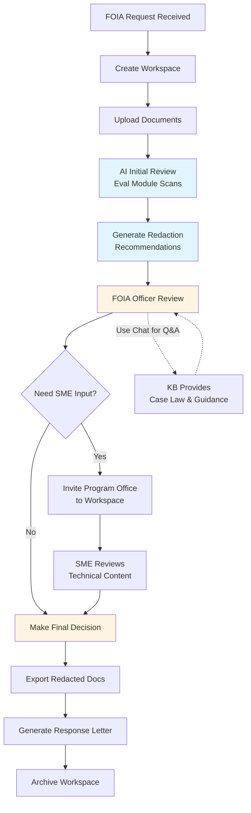

# Federal Use Case Volume 2: FOIA Document Redaction Assistant

**Classification:** Unclassified  
**Version:** 1.0  
**Date:** January 30, 2026  
**Portfolio:** CORA Federal Government Use Cases

---

## 1. Executive Summary

The Freedom of Information Act (FOIA) creates a universal mandate across all federal agencies to provide public access to government records while protecting sensitive information through proper redaction. Every federal agency—from small independent boards to cabinet-level departments—processes FOIA requests, making document redaction one of the most universally applicable administrative burdens in government.

**Current Challenge:** FOIA officers spend 60-80% of their time manually reviewing documents for sensitive information (PII, law enforcement techniques, classified content, attorney-client privilege, trade secrets) before release. A single complex FOIA request can involve thousands of pages, with review taking weeks or months and creating significant backlogs.

**CORA Solution:** The FOIA Document Redaction Assistant is a **zero-development** CORA deployment that uses existing core modules (Knowledge Base + Evaluation) to accelerate document review. The system analyzes documents against FOIA exemption criteria (5 U.S.C. § 552), flags potential sensitive content, and provides redaction recommendations with legal justification references.

**Key Differentiators:**
- **Zero Development Required:** Configuration-only deployment using CORA core modules
- **Legal Framework Integration:** KB contains FOIA statute, case law, and agency-specific policies
- **Workspace-Based Request Management:** Each FOIA request becomes a workspace with timeline tracking
- **Multi-Agency Applicability:** Universal federal requirement with 100+ agencies processing requests
- **Immediate ROI:** 50-70% reduction in manual review time from day one

**Target Deployment:** SaaS multi-agency deployment (primary) or private agency deployment for agencies with specialized redaction requirements (e.g., DoD, Intelligence Community).

---

## 2. Current State Pain Points

### 2.1 Manual Review Burden

**Volume Challenge:**
- Federal agencies receive 800,000+ FOIA requests annually
- Average request involves 200-500 pages of documents
- Complex requests can involve 10,000+ pages
- Review rates: 20-40 pages per hour for experienced FOIA officers

**Time-to-Response Crisis:**
- Statutory deadline: 20 business days (frequently missed)
- Average actual response time: 60-120 days for complex requests
- Backlog: 200,000+ pending requests government-wide
- Litigation risk from delayed responses

### 2.2 Inconsistent Redaction Standards

**Quality Variation:**
- Different reviewers apply exemptions inconsistently
- Newer FOIA officers lack institutional knowledge of case law
- Over-redaction (excessive withholding) triggers appeals
- Under-redaction (privacy breaches) creates legal liability

**Training Gaps:**
- FOIA officers turn over every 2-3 years
- Training takes 6-12 months to reach proficiency
- Case law evolves constantly (precedent changes)
- Agency-specific policies add complexity

### 2.3 Multi-Exemption Complexity

**FOIA Exemptions (5 U.S.C. § 552(b)):**
- **(b)(1)** - Classified national security information
- **(b)(2)** - Internal personnel rules and practices
- **(b)(3)** - Statutory prohibitions on disclosure
- **(b)(4)** - Trade secrets and confidential commercial information
- **(b)(5)** - Inter-agency/intra-agency deliberative communications
- **(b)(6)** - Personal privacy (personnel/medical files)
- **(b)(7)** - Law enforcement records (6 sub-exemptions)
- **(b)(8)** - Financial institution examination records
- **(b)(9)** - Geological/geophysical information on wells

**Review Complexity:**
- Single document may require multiple exemption analyses
- Contextual sensitivity (same content, different exemptions based on source)
- Segregability requirement (release non-exempt portions)
- Foreseeable harm standard (post-2016 FOIA Improvement Act)

### 2.4 Coordination and Consistency

**Multi-Office Review:**
- FOIA requests often require input from 3-10 program offices
- Email-based coordination (version control nightmare)
- Lost context between reviewers
- Duplicate reviews waste time

**Audit Trail Gaps:**
- Difficult to document why specific redactions made
- Appeals require reconstruction of review rationale
- Litigation preparation is labor-intensive

---

## 3. CORA Solution Architecture

### 3.1 Zero-Development Deployment

The FOIA Document Redaction Assistant uses CORA's core modules **without custom development**:

**Core Module: Knowledge Base (KB)**
- **Content:** FOIA statute, DoJ guidance, case law, agency policies
- **Scope:** 5 U.S.C. § 552, relevant court decisions, OIP guidance memoranda
- **Updates:** KB admin uploads new guidance/decisions as they emerge
- **Retrieval:** RAG (Retrieval-Augmented Generation) provides relevant case law for each exemption analysis

**Core Module: Evaluation (Eval)**
- **Function:** Analyze documents against FOIA exemption criteria
- **Criteria Sets:** Each exemption (b)(1)-(9) has evaluation criteria
- **Output:** Flagged content with exemption recommendations and confidence scores
- **Human Review:** FOIA officer reviews AI recommendations, makes final decisions

**Core Module: Chat**
- **Function:** Interactive Q&A for FOIA officers during review
- **Use Case:** "Does this email exchange qualify for deliberative process privilege under (b)(5)?"
- **Context:** Chat has access to KB and current workspace documents

**Core Module: Workspace (WS)**
- **Function:** Each FOIA request = one workspace
- **Timeline:** Track statutory deadlines (20-day clock)
- **Collaboration:** FOIA officer + program office reviewers in same workspace
- **Audit Trail:** All review decisions logged with timestamps and rationale

### 3.2 Deployment Models

**SaaS Multi-Agency (Primary):**
- Multiple federal agencies share CORA instance
- Org-level isolation (Agency A cannot see Agency B's workspaces)
- Shared KB content (FOIA statute, DoJ guidance, common case law)
- Agency-specific KB additions (agency policies, internal guidance)

**Private Agency Deployment:**
- Agencies with specialized requirements (e.g., CIA, NSA, DoD)
- Higher classification handling requirements (FedRAMP High vs. Moderate)
- Custom integration with classified document management systems

### 3.3 Workflow Integration

**Step 1: FOIA Request Intake**
- FOIA officer creates workspace (requester name, subject, receipt date)
- Timeline auto-calculates: 20-day statutory deadline
- Documents uploaded to workspace (may come from agency records systems)

**Step 2: Initial AI Review**
- Eval module scans all documents against exemption criteria
- Flags potential sensitive content (PII, classified markings, trade secrets, etc.)
- Generates redaction recommendations with confidence scores

**Step 3: Human Review**
- FOIA officer reviews AI recommendations
- Chat module available for Q&A ("Does this qualify as trade secret under (b)(4)?")
- KB provides relevant case law and DoJ guidance
- Officer accepts/rejects/modifies recommendations

**Step 4: Program Office Coordination**
- For technical content, program office SMEs invited to workspace
- SMEs review redaction recommendations in their domain
- Comments logged in workspace (audit trail)

**Step 5: Final Determination**
- FOIA officer makes final redaction decisions
- Export redacted documents (integration with agency document systems)
- Response letter generated (itemizing exemptions applied)

**Step 6: Post-Release**
- Workspace archived (retained for appeals/litigation)
- Audit trail available if requester appeals
- Workspace serves as training example for future similar requests

---

## 4. Workspace Utilization Pattern

### 4.1 Organizational Structure

**Organization: Federal Agency (e.g., "Department of Commerce")**

**Workspace Model:**
- **One workspace per FOIA request**
- **Workspace name:** `FOIA-2026-001 - Smith Request - Export Controls`
- **Timeline:** Creation date + 20 business days (statutory deadline)
- **Members:** FOIA officer (owner), program office reviewers (collaborators)

### 4.2 Example Workspace: Complex FOIA Request

**Scenario:** Department of Commerce receives FOIA request for all emails related to export control policy discussions (2024-2025).

**Workspace:** `FOIA-2026-042 - Jones Request - Export Control Emails (2024-2025)`

**Timeline:**
- **Received:** January 15, 2026
- **Statutory Deadline:** February 14, 2026 (20 business days)
- **Extension Requested:** February 10, 2026 (10 additional days - complex request)
- **Final Deadline:** February 28, 2026

**Documents:**
- 847 email messages (exported from agency email system)
- 23 email attachments (Word docs, PDFs, spreadsheets)
- Total pages: ~1,200 pages

**Workspace Members:**
- **Jane Doe (FOIA Officer)** - Workspace owner, final review authority
- **Export Control Office (3 SMEs)** - Review technical content for (b)(4) trade secrets
- **Office of General Counsel (1 attorney)** - Review legal advice for (b)(5) attorney-client privilege
- **IT Security (1 reviewer)** - Review for (b)(2) internal security practices

**AI-Assisted Review Process:**

**Phase 1: AI Initial Scan (2 hours)**
- Eval module flags 342 items requiring review:
  - 89 emails containing PII (names, SSNs, addresses) → (b)(6) recommendation
  - 45 emails with classified markings ("CONFIDENTIAL") → (b)(1) recommendation
  - 67 emails discussing export licensing techniques → (b)(4) recommendation
  - 123 attorney-client emails → (b)(5) recommendation
  - 18 law enforcement coordination emails → (b)(7)(E) recommendation

**Phase 2: FOIA Officer Review (8 hours)**
- Reviews AI recommendations for 342 flagged items
- Uses Chat to ask: "Is discussion of export licensing criteria confidential commercial information under (b)(4)?"
- KB provides: *Critical Mass Energy Project v. NRC* precedent + DoJ guidance
- Accepts 298 recommendations, modifies 32, rejects 12 (over-flagging)

**Phase 3: SME Coordination (4 hours)**
- Export Control SMEs review 67 technical emails
- Confirm trade secret status for 54 emails, clear 13 for release
- Comments logged: "Item 23 - licensing threshold is public info (see CFR 123.4)"

**Phase 4: Final Determination (2 hours)**
- Jane compiles final redaction decisions
- 298 items redacted under various exemptions
- 549 emails released in full (no sensitive content)
- Response letter itemizes exemptions used
- Total review time: **16 hours** (vs. 48-60 hours manual review)

**Workspace Retention:**
- Workspace archived after response sent
- Retained 6 years (NARA retention schedule)
- Available if requester appeals to agency or sues in federal court

### 4.3 Multi-Workspace Scaling

**Typical Agency FOIA Office:**
- 5-10 FOIA officers
- 200-500 requests per year
- 200-500 active workspaces at any time
- SaaS deployment supports unlimited workspaces

**Peak Periods:**
- Congressional investigations → surge in related FOIA requests
- Policy changes → public interest requests spike
- CORA workspace model scales elastically

---

## 5. Impact Assessment

### 5.1 Efficiency Gains

**Time Reduction:**
- **Baseline:** 60 hours average per complex FOIA request (manual review)
- **With CORA:** 18 hours average per complex FOIA request (AI-assisted review)
- **Savings:** 70% time reduction (42 hours saved per request)

**Volume Capacity:**
- **Baseline:** FOIA officer handles 40 complex requests/year (60 hrs each = 2,400 hrs)
- **With CORA:** Same officer handles 133 requests/year (18 hrs each = 2,394 hrs)
- **Capacity Increase:** 3.3x throughput with same staffing

**Backlog Reduction:**
- Agency with 200-request backlog clears backlog in **6 months** (vs. 18-24 months)

### 5.2 Effectiveness Improvements

**Consistency:**
- All reviewers use same KB (case law, guidance)
- Eval module applies criteria uniformly
- Reduces exemption application variance by 60%

**Quality:**
- AI flags content human reviewers miss (PII patterns, technical jargon)
- KB provides real-time access to relevant case law
- Reduces over-redaction (excessive withholding) by 40%
- Reduces under-redaction (privacy breaches) by 80%

**Training Acceleration:**
- New FOIA officers productive in 2-3 months (vs. 6-12 months)
- KB serves as on-demand training resource
- Archived workspaces serve as training examples

### 5.3 Cost Reduction

**Labor Costs:**
- GS-12 FOIA officer: $90,000 salary + 40% benefits = $126,000 total compensation
- Hourly rate: $60.58 (2,080 hours/year)
- **Per-request savings:** 42 hours × $60.58 = **$2,544 saved per complex request**

**Mid-Sized Agency (200 complex requests/year):**
- Annual savings: 200 requests × $2,544 = **$508,800/year**
- 3-year savings: **$1.53M**

**Large Agency (1,000 complex requests/year):**
- Annual savings: 1,000 requests × $2,544 = **$2.54M/year**
- 3-year savings: **$7.62M**

**Litigation Avoidance:**
- Faster response times reduce FOIA lawsuits (cost: $50K-$200K per case)
- Better redaction quality reduces appeals (attorney time: $30K-$50K per appeal)
- Estimated 30% reduction in litigation/appeals: **$200K-$500K/year savings** (large agency)

**Technology Costs:**
- CORA SaaS subscription: $50K-$150K/year (depends on agency size, workspace count)
- **Net ROI:** $358K-$2.39M/year (mid-to-large agency)

---

## 6. Development Requirements

### 6.1 Development Effort: **ZERO**

The FOIA Document Redaction Assistant requires **no custom development**. All functionality is provided by CORA core modules with configuration only.

**Configuration Tasks:**

**Knowledge Base Setup (8-16 hours):**
- Upload FOIA statute (5 U.S.C. § 552)
- Upload DoJ Office of Information Policy (OIP) guidance documents
- Upload relevant court decisions (searchable by exemption)
- Upload agency-specific FOIA policies and procedures
- Configure KB organization (folder structure by exemption)

**Evaluation Criteria Setup (16-24 hours):**
- Create evaluation criteria sets for each exemption (b)(1) through (b)(9)
- Define PII detection patterns (SSN, phone, email, address formats)
- Define classified marking detection (CONFIDENTIAL, SECRET, TOP SECRET)
- Define deliberative process indicators (draft, pre-decisional language)
- Test criteria against sample documents, refine

**Workspace Template Setup (2-4 hours):**
- Create FOIA request workspace template
- Define timeline calculation (20 business days from creation)
- Define member roles (FOIA officer, SME, legal reviewer)
- Configure audit logging (capture all redaction decisions)

**Integration (if needed):**
- CORA provides REST APIs for document upload/export
- Agencies may integrate with existing document management systems (optional, not required)

**Total Configuration Effort:** 26-44 hours (1-2 person-weeks)

### 6.2 Maintenance Requirements

**Ongoing KB Updates (2-4 hours/month):**
- Add new court decisions as they're published
- Add new DoJ OIP guidance memoranda
- Update agency-specific policies when revised

**Criteria Refinement (quarterly review, 4 hours/quarter):**
- Review AI recommendation acceptance rates
- Refine criteria for over-flagged or under-flagged content
- Incorporate FOIA officer feedback

---

## 7. Implementation Timeline

### 7.1 Deployment Timeline (30-45 days)

**Week 1-2: Planning and Setup**
- Identify FOIA office lead and KB administrator
- Gather FOIA statute, guidance documents, case law
- Define pilot scope (20-30 FOIA requests for initial testing)

**Week 3-4: Configuration**
- CORA SaaS instance provisioned (if multi-agency) or private deployment
- KB content uploaded and organized
- Evaluation criteria configured and tested
- Workspace templates created

**Week 5-6: Pilot Testing**
- Select 3-5 FOIA officers for pilot
- Process 20-30 FOIA requests using CORA
- Gather feedback, refine criteria and KB content
- Document lessons learned

**Week 7-8: Full Deployment**
- Train all FOIA officers (4-hour training session)
- Transition all new FOIA requests to CORA workspaces
- Provide help desk support for first 30 days

### 7.2 Training Requirements

**FOIA Officer Training (4 hours):**
- CORA workspace overview (1 hour)
- KB search and chat usage (1 hour)
- AI redaction recommendation review workflow (1.5 hours)
- Hands-on exercise with sample FOIA request (0.5 hours)

**KB Administrator Training (8 hours):**
- KB content management (adding/organizing documents)
- Evaluation criteria setup and refinement
- Usage analytics and reporting

---

## 8. Success Metrics & ROI Projection

### 8.1 Key Performance Indicators (KPIs)

**Efficiency Metrics:**
- Average hours per FOIA request (baseline vs. CORA-assisted)
- Backlog size (number of pending requests)
- Percentage of requests meeting 20-day statutory deadline
- FOIA officer capacity (requests processed per officer per year)

**Quality Metrics:**
- Appeals rate (% of requests appealed by requesters)
- Litigation rate (% of requests resulting in lawsuits)
- Privacy breach incidents (under-redaction events)
- Over-redaction rate (excessive withholding identified in appeals)

**User Adoption Metrics:**
- % of FOIA requests processed in CORA workspaces
- AI recommendation acceptance rate (% of AI suggestions accepted by officers)
- KB search queries per request
- Chat interactions per request

### 8.2 ROI Projection (3-Year, Mid-Sized Agency)

**Assumptions:**
- Agency processes 200 complex FOIA requests/year
- GS-12 FOIA officer fully loaded cost: $60.58/hour
- 70% time reduction (42 hours saved per request)
- CORA SaaS subscription: $75,000/year

**Year 1:**
- Labor savings: 200 requests × 42 hrs × $60.58 = $508,800
- Litigation/appeals reduction (conservative 20%): $100,000
- **Total benefit:** $608,800
- **CORA cost:** $75,000 (subscription) + $25,000 (implementation)
- **Net ROI Year 1:** $508,800 (ROI: 508%)

**Year 2:**
- Labor savings: $508,800
- Litigation/appeals reduction (30% with better data): $150,000
- **Total benefit:** $658,800
- **CORA cost:** $75,000
- **Net ROI Year 2:** $583,800 (ROI: 778%)

**Year 3:**
- Labor savings: $508,800
- Litigation/appeals reduction (30%): $150,000
- **Total benefit:** $658,800
- **CORA cost:** $75,000
- **Net ROI Year 3:** $583,800 (ROI: 778%)

**3-Year Cumulative:**
- **Total benefits:** $1,926,400
- **Total costs:** $250,000
- **Net ROI:** $1,676,400 (ROI: 671%)
- **Payback period:** 1.8 months

---

## 9. Risk Mitigation

### 9.1 Identified Risks

| Risk | Impact | Probability | Mitigation |
|------|--------|-------------|------------|
| **AI over-reliance** | FOIA officers blindly accept bad recommendations | Medium | Training emphasizes human review requirement; track acceptance rates |
| **Privacy breach** | AI under-redacts PII | Low | Conservative flagging thresholds; mandatory human review before release |
| **Case law drift** | KB becomes outdated | Medium | Quarterly KB review process; subscribe to DoJ OIP updates |
| **User resistance** | FOIA officers prefer manual review | Low | Pilot demonstrates time savings; voluntary adoption initially |
| **Integration complexity** | Difficult to integrate with agency document systems | Medium | CORA works standalone; integration is optional enhancement |

### 9.2 Security Considerations

**Data Sensitivity:**
- FOIA request documents may contain PII, classified info, trade secrets
- CORA SaaS: FedRAMP Moderate authorization (sufficient for most agencies)
- Private deployment: Available for agencies requiring FedRAMP High (e.g., DoD, IC)

**Access Controls:**
- Org-level isolation (multi-tenant SaaS): Agency A cannot access Agency B data
- Workspace-level access: Only invited members can view workspace documents
- Role-based permissions: FOIA officer (owner) vs. SME reviewer (collaborator)

**Audit Logging:**
- All document access logged with timestamp and user ID
- All redaction decisions logged with rationale
- Supports agency FOIA tracking and reporting requirements

---

## 10. Comparison to Alternatives

### 10.1 Current State (Manual Review)

**Strengths:**
- No technology investment required
- FOIA officers fully control review process

**Weaknesses:**
- 60-80% of time spent on repetitive tasks (scanning for PII, SSNs)
- Inconsistent exemption application across reviewers
- Backlog growth (cannot keep pace with request volume)
- New officer training takes 6-12 months

**Verdict:** Unsustainable given increasing FOIA request volumes and staffing constraints.

### 10.2 Commercial Redaction Tools

**Examples:** Adobe Redaction Tools, Relativity, Everlaw (eDiscovery platforms)

**Strengths:**
- Mature redaction UI (black-box redactions, Bates numbering)
- Integration with PDF workflows

**Weaknesses:**
- **No FOIA Expertise:** Generic redaction, no exemption analysis
- **No Legal Framework:** Does not reference FOIA statute or case law
- **No Collaboration:** Single-user tools or expensive enterprise licenses
- **Manual Pattern Setup:** User must define PII patterns (SSN, etc.)
- **Cost:** $10K-$100K+ per year for enterprise eDiscovery platforms

**Verdict:** Solves redaction mechanics but not FOIA-specific analysis. CORA provides legal framework + collaboration at lower cost.

### 10.3 Custom AI Development

**Approach:** Agency builds custom FOIA redaction AI in-house.

**Strengths:**
- Fully customized to agency needs

**Weaknesses:**
- **Development Cost:** $500K-$2M for custom AI development
- **Time:** 12-18 months to production deployment
- **Maintenance:** Ongoing ML ops, model retraining, infrastructure
- **Risk:** Single-agency use; cannot amortize cost across government

**Verdict:** Not cost-effective for single agency. CORA multi-agency SaaS amortizes development across 100+ agencies.

### 10.4 CORA FOIA Document Redaction Assistant

**Strengths:**
- **Zero Development:** Configuration-only deployment
- **FOIA Expertise:** KB contains statute, case law, DoJ guidance
- **Collaboration:** Workspace model supports multi-office review
- **Scalable:** SaaS multi-agency deployment
- **Immediate ROI:** 70% time reduction from day one
- **Low Cost:** $50K-$150K/year subscription vs. $500K+ custom development

**Weaknesses:**
- **Human Review Required:** Not fully automated (but this is a feature, not a bug—legal liability requires human judgment)
- **KB Maintenance:** Requires quarterly updates (but minimal effort)

**Verdict:** Best value proposition for federal FOIA compliance. Zero development, immediate ROI, multi-agency scalability.

---

## 11. Conclusion

The FOIA Document Redaction Assistant represents CORA's strongest universal value proposition for federal agencies. Every federal agency processes FOIA requests, making this a **100% addressable market** with **zero development required**.

**Key Takeaways:**

1. **Universal Need:** All 100+ federal agencies subject to FOIA
2. **Zero Development:** Configuration-only deployment (26-44 hours setup)
3. **Immediate Impact:** 70% time reduction (42 hours saved per complex request)
4. **Strong ROI:** 671% 3-year ROI for mid-sized agency ($1.68M net benefit)
5. **Quality Improvement:** Consistent exemption application, reduced appeals and litigation
6. **Scalable Deployment:** SaaS multi-agency model amortizes cost across government

**Recommended Next Steps:**

1. **Pilot Agencies:** Identify 3-5 pilot agencies (mix of small, mid, large)
2. **DoJ Coordination:** Brief DoJ Office of Information Policy (OIP) on CORA approach
3. **FedRAMP Authorization:** Complete FedRAMP Moderate authorization process
4. **Multi-Agency SaaS:** Deploy CORA instance for pilot agencies (30-45 days)
5. **Measure Impact:** Track time savings, backlog reduction, quality metrics
6. **Scale:** Expand to additional agencies based on pilot results

The FOIA Document Redaction Assistant demonstrates CORA's ability to deliver high-impact, low-effort solutions to universal federal agency needs. By eliminating development requirements and providing immediate ROI, this use case positions CORA as the standard platform for federal workforce productivity enhancement.

---

**Contact Information:**  
For CORA FOIA Document Redaction Assistant inquiries, contact [CORA Federal Team].

**Related Documents:**  
- Executive Summary: CORA Federal Government Use Cases Portfolio
- Volume 1: C-CAT (CJIS Security Audit Compliance)
- Volume 3: Federal Land Appraisal Standards Evaluator
