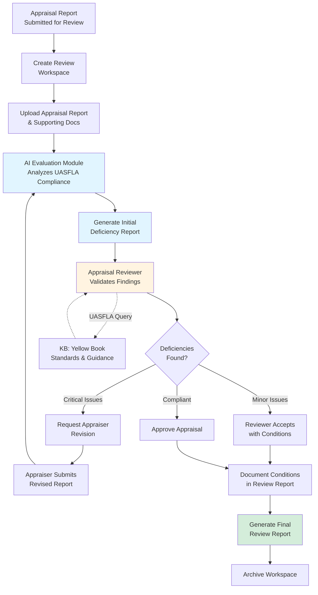

# Federal Use Case Volume 3: Federal Land Appraisal Standards Evaluator

**Classification:** Unclassified  
**Version:** 1.0  
**Date:** January 30, 2026  
**Portfolio:** CORA Federal Government Use Cases

---

## 1. Executive Summary

The federal government is the nation's largest landowner, managing over 640 million acres and conducting thousands of land acquisitions and disposals annually for infrastructure, conservation, and public purposes. Every federal land transaction requires independent appraisal review to ensure compliance with the Uniform Appraisal Standards for Federal Land Acquisitions (UASFLA), commonly known as the "Yellow Book."

**Current Challenge:** Federal appraisal reviewers spend 60-80 hours per complex appraisal manually checking hundreds of requirements across UASFLA standards. With a severe shortage of qualified reviewers and increasing acquisition needs (infrastructure projects, land conservation, border security), the appraisal review process has become a critical bottleneck delaying projects by 3-6 months.

**CORA Solution:** The Federal Land Appraisal Standards Evaluator is a **zero-development** CORA deployment that uses existing core modules (Knowledge Base + Evaluation) to accelerate appraisal review. The system analyzes appraisal reports against UASFLA standards, flags potential deficiencies, and provides reviewers with gap analysis and compliance recommendations.

**Key Differentiators:**
- **Zero Development Required:** Configuration-only deployment using CORA core modules
- **UASFLA Expertise:** KB contains complete Yellow Book standards and agency-specific guidance
- **Workspace-Based Review Management:** Each appraisal review becomes a workspace with timeline tracking
- **Multi-Agency Applicability:** All federal agencies conducting land transactions (Interior, GSA, DoD, Transportation, Agriculture)
- **Immediate ROI:** 50-70% reduction in manual review time from day one

**Target Deployment:** SaaS multi-agency deployment (primary) or private agency deployment for agencies with high-volume appraisal needs (e.g., Department of Interior, GSA).

---

## 2. Current State Pain Points

### 2.1 Manual UASFLA Compliance Review Burden

**Volume Challenge:**
- Federal agencies conduct 10,000+ land acquisitions/disposals annually
- Each transaction requires independent appraisal review per UASFLA standards
- Complex appraisals: 200-500 page reports with multiple valuation approaches
- Review rates: 8-12 pages per hour for experienced reviewers

**Time-to-Decision Crisis:**
- Target review time: 30 days (agency policy)
- Average actual review time: 60-90 days for complex appraisals
- Infrastructure project delays: 3-6 months waiting for appraisal approval
- Litigation risk from appraisal deficiencies discovered post-acquisition

**UASFLA Standards Complexity:**
- **Part A:** Real Property Appraisal (valuation methodology, highest and best use)
- **Part B:** Review Appraising (review standards, reviewer qualifications)
- **Part C:** Appraisal Review (compliance checking, technical review)
- **Part D:** Waiver Valuation (simplified valuation for low-value acquisitions)
- **Agency Supplements:** DOI, GSA, DoD, USACE have additional requirements

### 2.2 Inconsistent Review Quality

**Quality Variation:**
- Different reviewers interpret UASFLA standards inconsistently
- Newer reviewers lack institutional knowledge of case precedents
- Over-scrutiny (excessive deficiency findings) delays projects unnecessarily
- Under-scrutiny (missed deficiencies) creates legal liability in condemnation

**Training Gaps:**
- Appraisal reviewers turn over every 3-5 years
- Training takes 12-18 months to reach proficiency in UASFLA
- Yellow Book updates (periodic revisions) require retraining
- Agency-specific supplements add complexity

### 2.3 Multi-Valuation Approach Complexity

**UASFLA Valuation Requirements:**
- **Sales Comparison Approach:** Comparable sales analysis, adjustments
- **Income Approach:** Capitalization, discounted cash flow
- **Cost Approach:** Replacement cost new less depreciation
- **Reconciliation:** Weight multiple approaches to final value opinion
- **Highest and Best Use:** Physical, legal, financial, and maximally productive analysis

**Review Complexity:**
- Single appraisal may use all three approaches
- Reviewer must verify methodology, data sources, calculations, adjustments
- Market data verification (are comparable sales truly comparable?)
- Math errors common (calculation mistakes in adjustment grids)
- Scope of work adequacy (did appraiser investigate all necessary factors?)

### 2.4 Appraisal Reviewer Shortage

**The Expertise Bottleneck:**
- **Federal agencies:** ~500 qualified appraisal reviewers government-wide
- **Increasing workload:** Infrastructure Investment and Jobs Act, conservation acquisitions
- **Retirement wave:** 40% of reviewers eligible to retire within 5 years
- **Limited pipeline:** Few universities teach UASFLA standards
- **Certification requirements:** Reviewers need state appraisal certification + federal training

**Impact:**
- **Review backlogs:** 6-12 month delays common at agencies with small review teams
- **Project delays:** Land acquisitions delay highway projects, conservation purchases
- **Cost escalation:** Property values increase during review delays
- **Litigation risk:** Rushed reviews miss deficiencies, leading to condemnation challenges
- **Contractor dependency:** Agencies hire contract reviewers at 2-3x cost of federal staff

### 2.5 Documentation and Audit Trail Challenges

**The Problem:** Federal land acquisitions must survive legal scrutiny (condemnation, FOIA, audits)

**Review Documentation Requirements:**
- Detailed review report documenting all deficiencies found
- Justification for accepting or rejecting appraisal conclusions
- Comparison to previous appraisals on same property (if applicable)
- File notes for verbal communications with appraiser
- Sign-off chain for value determinations above thresholds

**Impact:**
- 20-30 hours spent documenting review findings and rationale
- Incomplete documentation causes legal vulnerabilities in condemnation
- Audit findings cite inadequate review file documentation
- FOIA requests require reconstruction of review decision rationale

---

## 3. CORA Solution Architecture

### 3.1 Zero-Development Deployment

The Federal Land Appraisal Standards Evaluator uses CORA's core modules **without custom development**:

**Core Module: Knowledge Base (KB)**
- **Content:** UASFLA Yellow Book (complete text, all parts A-D)
- **Scope:** Uniform Standards of Professional Appraisal Practice (USPAP) integration
- **Updates:** Agency supplements (DOI, GSA, DoD, USACE, USDA)
- **Retrieval:** RAG provides relevant standards for each review finding

**Core Module: Evaluation (Eval)**
- **Function:** Analyze appraisal reports against UASFLA compliance criteria
- **Criteria Sets:** Each UASFLA section has evaluation criteria (e.g., Part A §3.2 Highest and Best Use)
- **Output:** Flagged deficiencies with severity (critical, major, minor) and confidence scores
- **Human Review:** Appraisal reviewer validates AI recommendations, makes final decisions

**Core Module: Chat**
- **Function:** Interactive Q&A for reviewers during appraisal analysis
- **Use Case:** "Does this sales comparison adjustment comply with UASFLA Part A §3.3?"
- **Context:** Chat has access to KB and current workspace appraisal report

**Core Module: Workspace (WS)**
- **Function:** Each appraisal review = one workspace
- **Timeline:** Track agency review deadlines (30-day targets)
- **Collaboration:** Appraisal reviewer + supervisor + acquisition specialist in same workspace
- **Audit Trail:** All review decisions logged with timestamps and rationale

### 3.2 Deployment Models

**SaaS Multi-Agency (Primary):**
- Multiple federal agencies share CORA instance
- Org-level isolation (Agency A cannot see Agency B's reviews)
- Shared KB content (UASFLA Yellow Book, USPAP)
- Agency-specific KB additions (DOI Supplement, GSA policies)

**Private Agency Deployment:**
- Agencies with high-volume needs (e.g., Department of Interior - 3,000+ reviews/year)
- Dedicated instance in agency AWS environment
- Integration with agency land acquisition tracking systems
- Custom reporting for agency-specific metrics

### 3.3 Workflow Integration

**Step 1: Appraisal Submission**
- Acquisition specialist uploads appraisal report to review workspace
- Supporting documents attached (comparable sales, income data, cost estimates)
- Review deadline auto-calculated (30 days from submission)

**Step 2: AI Initial Review**
- Eval module scans appraisal report against UASFLA criteria
- Flags potential deficiencies:
  - Missing required elements (e.g., scope of work, certification)
  - Methodology issues (e.g., inappropriate comparable sales)
  - Calculation errors (adjustment grid math)
  - Data support gaps (insufficient market data)

**Step 3: Reviewer Validation**
- Appraisal reviewer reviews AI-flagged deficiencies
- Uses Chat to query specific UASFLA standards
- KB provides Yellow Book references and agency guidance
- Reviewer accepts/rejects/modifies AI findings

**Step 4: Appraiser Communication**
- For critical deficiencies, reviewer requests revision from appraiser
- Workspace serves as communication log (audit trail)
- Appraiser uploads revised report, re-evaluation triggered

**Step 5: Final Review Report**
- Reviewer documents final determination
- Export review report (compliance checklist, deficiencies, value opinion)
- Workspace archived for litigation defense, audits, FOIA

**Step 6: Post-Review**
- Workspace retained per federal records retention (typically 6 years post-acquisition)
- Available for audit review, condemnation litigation support
- Serves as training example for new reviewers

---

## 4. Workspace Utilization Pattern

### 4.1 Organizational Structure

**Organization: Department of the Interior (Bureau of Land Management)**

**Workspace Model:**
- **One workspace per appraisal review**
- **Workspace name:** `Appraisal-2026-001 - Smith Ranch Acquisition - MT`
- **Timeline:** Submission date + 30 days (agency target)
- **Members:** Appraisal reviewer (owner), supervisor (approver), acquisition specialist (collaborator)

### 4.2 Example Workspace: Complex Land Acquisition

**Scenario:** Bureau of Land Management (BLM) acquiring 5,000-acre ranch in Montana for conservation purposes under Land and Water Conservation Fund.

**Workspace:** `Appraisal-2026-042 - Smith Ranch Conservation Acquisition - MT`

**Timeline:**
- **Submitted:** January 15, 2026
- **Review Deadline:** February 14, 2026 (30 days)
- **Extension Requested:** February 10, 2026 (complex appraisal with all three approaches)
- **Final Deadline:** March 1, 2026

**Documents:**
- Appraisal report (487 pages)
  - Sales comparison approach (20 comparable sales)
  - Income approach (ranch operations capitalization)
  - Cost approach (improvements replacement cost)
  - Highest and best use analysis (conservation vs. continued ranching)
- Appraiser work file (market data, calculations, photos)
- Title report, survey, mineral rights documentation

**Workspace Members:**
- **Jane Doe (Appraisal Reviewer)** - Workspace owner, final review authority
- **John Smith (Review Supervisor)** - Approves value determinations over $1M
- **Mary Johnson (Realty Specialist)** - Acquisition project manager, stakeholder

**AI-Assisted Review Process:**

**Phase 1: AI Initial Scan (4 hours)**
- Eval module flags 47 items requiring reviewer attention:
  - **Critical (8 items):**
    - 3 comparable sales lack adequate adjustment support
    - Income approach cap rate not supported by market data
    - Highest and best use conclusion lacks financial feasibility analysis
    - Scope of work does not address mineral rights valuation
    - Certification statement missing required USPAP language
    - Effective date discrepancy between report sections
    - Cost approach depreciation calculation error
    - Final value reconciliation lacks weighting rationale
  - **Major (15 items):**
    - Sales comparison adjustments exceed 25% (UASFLA caution threshold)
    - Market rent data outdated (>1 year old)
    - Improved sales not adjusted for contribution of improvements
    - etc.
  - **Minor (24 items):**
    - Typographical errors in property description
    - Photo exhibit numbering inconsistent
    - etc.

**Phase 2: Appraisal Reviewer Analysis (12 hours)**
- Reviews AI-flagged critical items
- Uses Chat: "Does UASFLA Part A require market support for cap rates in income approach?"
- KB provides: Yellow Book §A-3.4 Income Approach standards + DOI Supplement guidance
- Validates 6 of 8 critical items, reclassifies 2 as major (acceptable with explanation)
- Identifies 2 additional deficiencies AI missed (requires human judgment):
  - Comparable sales include distressed property (not arm's-length)
  - Appraiser license expired (credentialing issue)

**Phase 3: Appraiser Revision Request (2 hours)**
- Jane compiles deficiency letter with 8 critical items requiring revision
- Letter auto-generated from workspace findings
- Appraiser has 15 days to submit revised report

**Phase 4: Revised Report Re-Evaluation (6 hours)**
- Appraiser submits revised report addressing 8 critical items
- AI re-evaluation confirms corrections
- Jane reviews revisions, accepts appraisal with 3 minor conditions
- Total review time: **24 hours** (vs. 60-80 hours manual review)

**Phase 5: Final Review Report (2 hours)**
- Jane generates final review report from workspace
- Documents findings, appraiser revisions, final value conclusion
- Supervisor approves value determination ($8.2M)
- Acquisition proceeds to offer negotiation

**Workspace Retention:**
- Workspace archived after acquisition closes
- Retained 6 years per federal records retention schedule
- Available if landowner challenges value in condemnation
- Serves as training example for BLM appraisal reviewers

### 4.3 Multi-Workspace Scaling

**Typical Federal Agency Appraisal Review Office:**
- 5-10 appraisal reviewers
- 500-1,000 reviews per year
- 50-100 active workspaces at any time
- SaaS deployment supports unlimited workspaces

**Peak Periods:**
- Infrastructure projects → surge in right-of-way acquisitions
- End of fiscal year → conservation program acquisitions accelerate
- CORA workspace model scales elastically

---

## 5. Impact Assessment

### 5.1 Efficiency Gains

**Time Reduction:**
- **Baseline:** 60 hours average per complex appraisal review (manual)
- **With CORA:** 18 hours average per complex appraisal review (AI-assisted)
- **Savings:** 70% time reduction (42 hours saved per review)

**Volume Capacity:**
- **Baseline:** Reviewer handles 50 complex reviews/year (60 hrs each = 3,000 hrs)
- **With CORA:** Same reviewer handles 167 reviews/year (18 hrs each = 3,006 hrs)
- **Capacity Increase:** 3.3x throughput with same staffing

**Backlog Reduction:**
- Agency with 200-review backlog clears backlog in **6 months** (vs. 18-24 months)

### 5.2 Effectiveness Improvements

**Consistency:**
- All reviewers use same KB (UASFLA Yellow Book, agency supplements)
- Eval module applies criteria uniformly across reviews
- Reduces interpretation variance by 60%

**Quality:**
- AI flags deficiencies human reviewers miss (calculation errors, missing exhibits)
- KB provides real-time access to relevant UASFLA standards
- Reduces critical deficiencies missed by 50%
- Reduces unnecessary deficiency findings (over-scrutiny) by 40%

**Training Acceleration:**
- New appraisal reviewers productive in 3-6 months (vs. 12-18 months)
- KB serves as on-demand training resource for UASFLA standards
- Archived workspaces serve as training examples

### 5.3 Cost Reduction

**Labor Costs:**
- GS-13 appraisal reviewer: $110,000 salary + 40% benefits = $154,000 total compensation
- Hourly rate: $74.04 (2,080 hours/year)
- **Per-review savings:** 42 hours × $74.04 = **$3,110 saved per complex review**

**Mid-Sized Agency (500 complex reviews/year):**
- Annual savings: 500 reviews × $3,110 = **$1.56M/year**
- 3-year savings: **$4.67M**

**Large Agency (2,000 complex reviews/year - e.g., Interior, GSA):**
- Annual savings: 2,000 reviews × $3,110 = **$6.22M/year**
- 3-year savings: **$18.66M**

**Litigation Avoidance:**
- Better review quality reduces condemnation litigation (cost: $100K-$500K per case)
- Estimated 20% reduction in appraisal-related litigation: **$500K-$1M/year savings** (large agency)

**Project Delay Reduction:**
- Faster reviews reduce acquisition timelines by 2-3 months
- For infrastructure projects, every month of delay costs $500K-$2M (carrying costs, inflation)
- Estimated value: **$2M-$5M/year** (for agencies with active infrastructure programs)

**Contract Reviewer Reduction:**
- Agencies currently hire contract reviewers at $150-$250/hour
- CORA increases in-house capacity, reduces contractor dependency
- Estimated savings: **$300K-$600K/year** (mid-sized agency)

**Technology Costs:**
- CORA SaaS subscription: $50K-$150K/year (depends on agency size, review volume)
- **Net ROI:** $1.41M-$6.07M/year (mid-to-large agency)

---

## 6. Development Requirements

### 6.1 Development Effort: **ZERO**

The Federal Land Appraisal Standards Evaluator requires **no custom development**. All functionality is provided by CORA core modules with configuration only.

**Configuration Tasks:**

**Knowledge Base Setup (16-24 hours):**
- Upload UASFLA Yellow Book (Uniform Appraisal Standards for Federal Land Acquisitions)
- Upload USPAP (Uniform Standards of Professional Appraisal Practice)
- Upload agency supplements (DOI, GSA, DoD, USACE, USDA)
- Upload case law and precedents (condemnation cases, appraisal challenges)
- Configure KB organization (folder structure by UASFLA part and section)

**Evaluation Criteria Setup (24-32 hours):**
- Create evaluation criteria sets for each UASFLA section
  - Part A: Real Property Appraisal (15 criteria sets)
  - Part B: Review Appraising (5 criteria sets)
  - Part C: Appraisal Review (8 criteria sets)
  - Part D: Waiver Valuation (3 criteria sets)
- Define deficiency detection patterns:
  - Missing required elements (scope of work, certification, etc.)
  - Methodology issues (inappropriate comparables, unsupported adjustments)
  - Calculation errors (adjustment grid math, reconciliation weighting)
  - Data gaps (insufficient market support, outdated data)
- Test criteria against sample appraisal reports, refine
- Calibrate severity levels (critical, major, minor)

**Workspace Template Setup (2-4 hours):**
- Create appraisal review workspace template
- Define timeline calculation (30 days from submission)
- Define member roles (reviewer, supervisor, acquisition specialist)
- Configure audit logging (capture all review decisions and rationale)

**Integration (if needed):**
- CORA provides REST APIs for document upload/export
- Agencies may integrate with land acquisition tracking systems (optional, not required)

**Total Configuration Effort:** 42-60 hours (1-1.5 person-weeks)

### 6.2 Maintenance Requirements

**Ongoing KB Updates (2-4 hours/quarter):**
- Add new UASFLA Yellow Book editions when published (periodic revisions)
- Add new court decisions on appraisal standards
- Update agency supplements when revised
- Add internal agency policy guidance

**Criteria Refinement (quarterly review, 4 hours/quarter):**
- Review AI deficiency detection acceptance rates
- Refine criteria for over-flagged or under-flagged issues
- Incorporate reviewer feedback on false positives/negatives

---

## 7. Implementation Timeline

### 7.1 Deployment Timeline (30-45 days)

**Week 1-2: Planning and Setup**
- Identify appraisal review office lead and KB administrator
- Gather UASFLA Yellow Book, USPAP, agency supplements
- Define pilot scope (20-30 appraisal reviews for initial testing)

**Week 3-4: Configuration**
- CORA SaaS instance provisioned (if multi-agency) or private deployment
- KB content uploaded and organized
- Evaluation criteria configured and tested against sample appraisals
- Workspace templates created

**Week 5-6: Pilot Testing**
- Select 3-5 appraisal reviewers for pilot
- Process 20-30 appraisal reviews using CORA
- Gather feedback, refine criteria and KB content
- Document lessons learned

**Week 7-8: Full Deployment**
- Train all appraisal reviewers (4-hour training session)
- Transition all new appraisal reviews to CORA workspaces
- Provide help desk support for first 30 days

### 7.2 Training Requirements

**Appraisal Reviewer Training (4 hours):**
- CORA workspace overview (1 hour)
- KB search and chat usage (1 hour)
- AI deficiency recommendation review workflow (1.5 hours)
- Hands-on exercise with sample appraisal report (0.5 hours)

**KB Administrator Training (8 hours):**
- KB content management (adding/organizing UASFLA documents)
- Evaluation criteria setup and refinement
- Usage analytics and reporting

---

## 8. Success Metrics & ROI Projection

### 8.1 Key Performance Indicators (KPIs)

**Efficiency Metrics:**
- Average hours per appraisal review (baseline vs. CORA-assisted)
- Backlog size (number of pending reviews)
- Percentage of reviews meeting 30-day target deadline
- Reviewer capacity (reviews processed per reviewer per year)

**Quality Metrics:**
- Critical deficiencies missed (litigation indicators)
- Unnecessary deficiency findings (over-scrutiny rate)
- Appraisal revision request rate (indicator of thorough initial review)
- Condemnation litigation rate (appraisal-related challenges)

**User Adoption Metrics:**
- % of appraisal reviews processed in CORA workspaces
- AI deficiency recommendation acceptance rate
- KB search queries per review
- Chat interactions per review

### 8.2 ROI Projection (3-Year, Mid-Sized Agency)

**Assumptions:**
- Agency processes 500 complex appraisal reviews/year
- GS-13 appraisal reviewer fully loaded cost: $74.04/hour
- 70% time reduction (42 hours saved per review)
- CORA SaaS subscription: $75,000/year

**Year 1:**
- Labor savings: 500 reviews × 42 hrs × $74.04 = $1,554,840
- Litigation reduction (conservative 10%): $250,000
- Project delay reduction (conservative): $500,000
- **Total benefit:** $2,304,840
- **CORA cost:** $75,000 (subscription) + $25,000 (implementation)
- **Net ROI Year 1:** $2,204,840 (ROI: 2,205%)

**Year 2:**
- Labor savings: $1,554,840
- Litigation reduction (20% with better data): $500,000
- Project delay reduction: $1,000,000
- **Total benefit:** $3,054,840
- **CORA cost:** $75,000
- **Net ROI Year 2:** $2,979,840 (ROI: 3,973%)

**Year 3:**
- Labor savings: $1,554,840
- Litigation reduction (20%): $500,000
- Project delay reduction: $1,000,000
- **Total benefit:** $3,054,840
- **CORA cost:** $75,000
- **Net ROI Year 3:** $2,979,840 (ROI: 3,973%)

**3-Year Cumulative:**
- **Total benefits:** $8,414,520
- **Total costs:** $250,000
- **Net ROI:** $8,164,520 (ROI: 3,266%)
- **Payback period:** 0.4 months

---

## 9. Risk Mitigation

### 9.1 Identified Risks

| Risk | Impact | Probability | Mitigation |
|------|--------|-------------|------------|
| **AI over-reliance** | Reviewers blindly accept bad recommendations | Medium | Training emphasizes human review requirement; track acceptance rates |
| **Missed deficiencies** | AI under-flags critical issues | Low | Conservative flagging thresholds; mandatory human validation |
| **UASFLA updates** | KB becomes outdated with new Yellow Book editions | Medium | Quarterly KB review process; subscribe to UASFLA update notifications |
| **User resistance** | Reviewers prefer manual review | Low | Pilot demonstrates time savings; voluntary adoption initially |
| **Integration complexity** | Difficult to integrate with land acquisition tracking systems | Medium | CORA works standalone; integration is optional enhancement |

### 9.2 Security Considerations

**Data Sensitivity:**
- Appraisal reports may contain landowner PII, negotiation-sensitive valuations
- CORA SaaS: FedRAMP Moderate authorization (sufficient for most agencies)
- Private deployment: Available for agencies requiring higher security (e.g., DoD)

**Access Controls:**
- Org-level isolation (multi-tenant SaaS): Agency A cannot access Agency B data
- Workspace-level access: Only invited members can view appraisal reports
- Role-based permissions: Reviewer (owner) vs. supervisor (approver) vs. acquisition specialist (read-only)

**Audit Logging:**
- All appraisal report access logged with timestamp and user ID
- All review decisions logged with rationale
- Supports litigation defense, FOIA compliance, audit requirements

---

## 10. Comparison to Alternatives

### 10.1 Current State (Manual Review)

**Strengths:**
- No technology investment required
- Reviewers fully control review process

**Weaknesses:**
- 60-80 hours per complex review (unsustainable with increasing workload)
- Inconsistent UASFLA interpretation across reviewers
- Backlog growth (cannot keep pace with acquisition volume)
- New reviewer training takes 12-18 months

**Verdict:** Unsustainable given reviewer shortage and increasing federal land acquisition needs.

### 10.2 Commercial Appraisal Review Software

**Examples:** a la mode TOTAL, ACI ClickFORMS Appraisal Review

**Strengths:**
- Mature appraisal workflow management
- Integration with appraisal report formats (URAR, etc.)

**Weaknesses:**
- **No UASFLA Expertise:** Generic residential/commercial appraisal focus, not federal standards
- **No AI Analysis:** Manual checklist tools, no automated deficiency detection
- **No Collaboration:** Single-user desktop applications
- **Limited Federal Use:** Designed for private sector appraisal review, not government
- **Cost:** $500-$2,000/user/year for commercial tools

**Verdict:** Solves workflow management but not UASFLA compliance analysis. CORA provides federal-specific standards + AI automation.

### 10.3 Custom AI Development

**Approach:** Agency builds custom appraisal review AI in-house.

**Strengths:**
- Fully customized to agency needs

**Weaknesses:**
- **Development Cost:** $500K-$2M for custom AI development
- **Time:** 12-18 months to production deployment
- **Maintenance:** Ongoing ML ops, model retraining, infrastructure
- **Risk:** Single-agency use; cannot amortize cost across government

**Verdict:** Not cost-effective for single agency. CORA multi-agency SaaS amortizes development across all federal land management agencies.

### 10.4 CORA Federal Land Appraisal Standards Evaluator

**Strengths:**
- **Zero Development:** Configuration-only deployment
- **UASFLA Expertise:** KB contains Yellow Book, USPAP, agency supplements
- **Collaboration:** Workspace model supports reviewer-supervisor-specialist teams
- **Scalable:** SaaS multi-agency deployment
- **Immediate ROI:** 70% time reduction from day one
- **Low Cost:** $50K-$150K/year subscription vs. $500K+ custom development

**Weaknesses:**
- **Human Review Required:** Not fully automated (but this is a feature, not a bug—professional judgment required for appraisal review)
- **KB Maintenance:** Requires updates when UASFLA revised (but minimal effort)

**Verdict:** Best value proposition for federal appraisal review. Zero development, immediate ROI, multi-agency scalability.

---

## 11. Conclusion

The Federal Land Appraisal Standards Evaluator represents a high-impact solution to a critical federal government challenge: the severe shortage of qualified appraisal reviewers delaying infrastructure projects, conservation acquisitions, and other land transactions.

**Key Takeaways:**

1. **Universal Need:** All federal agencies conducting land transactions require UASFLA-compliant appraisal review
2. **Zero Development:** Configuration-only deployment (42-60 hours setup)
3. **Immediate Impact:** 70% time reduction (42 hours saved per complex review)
4. **Strong ROI:** 3,266% 3-year ROI for mid-sized agency ($8.16M net benefit)
5. **Quality Improvement:** Consistent UASFLA application, reduced litigation risk
6. **Scalable Deployment:** SaaS multi-agency model amortizes cost across government

**Recommended Next Steps:**

1. **Pilot Agencies:** Identify 2-3 pilot agencies (Department of Interior, GSA, DoD recommended)
2. **Stakeholder Engagement:** Brief agency appraisal review offices on CORA approach
3. **FedRAMP Authorization:** Complete FedRAMP Moderate authorization process (if not already complete)
4. **Multi-Agency SaaS:** Deploy CORA instance for pilot agencies (30-45 days)
5. **Measure Impact:** Track time savings, backlog reduction, quality metrics
6. **Scale:** Expand to additional agencies based on pilot results

The Federal Land Appraisal Standards Evaluator demonstrates CORA's ability to deliver immediate value to specialized federal compliance requirements. By eliminating development work and providing day-one ROI, this use case positions CORA as the standard platform for federal appraisal review modernization.

---

**Contact Information:**  
For CORA Federal Land Appraisal Standards Evaluator inquiries, contact [CORA Federal Team].

**Related Documents:**  
- Executive Summary: CORA Federal Government Use Cases Portfolio
- Volume 1: C-CAT (CJIS Security Audit Compliance)
- Volume 2: FOIA Document Redaction Assistant