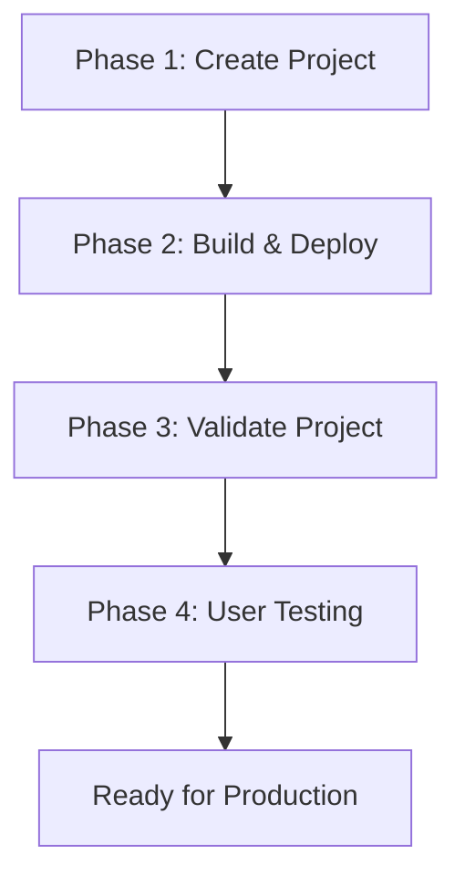

# CORA Project 4-Phase Automation Guide

**Version:** 2.0  
**Last Updated:** December 24, 2025  
**Status:** Complete & Tested  
**Audience:** AI Agents (Cline) and Human Developers

---

## Overview

This guide provides a comprehensive 4-phase workflow for creating, deploying, validating, and testing CORA projects. The process is designed for maximum automation while preserving human control over critical decisions.

**What You'll Build:**
- `{project-name}-infra` - Infrastructure repository (Terraform, AWS, Lambda functions)
- `{project-name}-stack` - Application repository (Next.js, React, CORA modules)
- Complete database schema with 20+ tables
- Identity provider integration (Okta or Clerk)
- Validated, deployment-ready application

**Total Time:** ~30-60 minutes (first time)

---

## Quick Reference: 4-Phase Workflow



| Phase | Purpose | Duration | Automation Level |
|-------|---------|----------|------------------|
| **1. Create Project** | Generate repositories, modules, config | 5 min | 🤖 Fully Automated |
| **2. Build & Deploy** | Build modules, deploy infrastructure, setup database | 15-30 min | 🤖 Fully Automated |
| **3. Validate Project** | Run CORA validation suite | 2-5 min | 🤖 Fully Automated |
| **4. User Testing** | Smoke test application, verify login | 5-10 min | 🧑‍💻 Manual Testing |

---

## Prerequisites

### Required Software

Install these tools before proceeding:

#### 1. yq - YAML Processor
```bash
brew install yq
```
**Why needed:** Parses `setup.config.yaml` to extract credentials.

#### 2. PostgreSQL Client (psql)
```bash
brew install postgresql
```
**Why needed:** Executes SQL scripts to create database tables.

#### 3. Node.js & pnpm
```bash
brew install node  # v18+
npm install -g pnpm
```
**Why needed:** Build and run Next.js application.

#### 4. Python 3 & pip3
```bash
# Verify installation
python3 --version  # Should be 3.9+
pip3 --version

# Install validation dependencies
pip3 install click colorama python-dotenv supabase requests
```
**Why needed:** Build Lambda functions and run validation tools.

#### 5. AWS CLI (Optional - for infrastructure deployment)
```bash
brew install awscli
aws configure  # Set up your AWS credentials
```

#### 6. GitHub CLI (Optional - for repo creation)
```bash
brew install gh
gh auth login
```

---

## Phase 1: Create Project 🤖 (Fully Automated)

### Step 1.1: Prepare Configuration File

Create a configuration file for your project:

```bash
cd cora-dev-toolkit/templates/_project-stack-template
cp setup.config.example.yaml setup.config.YOUR-PROJECT.yaml
```

### Step 1.2: Configure Authentication Provider

Edit `setup.config.YOUR-PROJECT.yaml`:

#### Option A: Okta Configuration
```yaml
# Auth Provider Selection
auth_provider: okta

# Okta Configuration
auth:
  okta:
    domain: "your-tenant.okta.com"
    client_id: "YOUR_OKTA_CLIENT_ID"
    client_secret: "YOUR_OKTA_CLIENT_SECRET"
    issuer: "https://your-tenant.okta.com/oauth2/default"
    jwks_uri: "https://your-tenant.okta.com/oauth2/default/v1/keys"
```

#### Option B: Clerk Configuration
```yaml
# Auth Provider Selection
auth_provider: clerk

# Clerk Configuration
clerk:
  publishable_key: "pk_test_YOUR_KEY"
  secret_key: "sk_test_YOUR_SECRET"
  issuer: "https://your-clerk-domain.clerk.accounts.dev"
```

### Step 1.3: Configure Supabase

```yaml
# Supabase Configuration
supabase:
  url: "https://your-project.supabase.co"
  anon_key: "YOUR_ANON_KEY"
  service_role_key: "YOUR_SERVICE_ROLE_KEY"
  jwt_secret: "YOUR_JWT_SECRET"

  # Direct PostgreSQL connection (for automatic migrations)
  db:
    host: "aws-0-us-east-1.pooler.supabase.com"
    port: 6543
    name: "postgres"
    user: "postgres.your-project-ref"
    password: "YOUR_DB_PASSWORD"
```

### Step 1.4: Run Project Creation Script

```bash
cd ~/code/cora-dev-toolkit

./scripts/create-cora-project.sh YOUR-PROJECT \
  --with-core-modules \
  --output-dir ~/code/YOUR-ORG
```

**What Happens Automatically:**

1. ✅ Creates `{project}-infra` and `{project}-stack` directories
2. ✅ Copies all templates and replaces placeholders
3. ✅ Creates 3 core modules: `module-access`, `module-ai`, `module-mgmt`
4. ✅ Extracts credentials from `setup.config.yaml`
5. ✅ Generates `.env` files for web app
6. ✅ Generates `local-secrets.tfvars` for Terraform
7. ✅ Generates validation `.env` files
8. ✅ Consolidates database schemas from all modules
9. ✅ Generates IDP configuration seed file
10. ✅ **NEW:** Installs validation dependencies (pip3 packages)
11. ✅ **NEW:** Migrates Lambda code to use new table names
12. ✅ **NEW:** Runs initial validation (structure & portability)
13. ✅ Initializes git repositories

### Step 1.5: Verify Project Creation

**Check for success:**
```bash
# Verify both directories exist
ls -la ~/code/YOUR-ORG/YOUR-PROJECT-infra
ls -la ~/code/YOUR-ORG/YOUR-PROJECT-stack

# Verify core modules
ls -la ~/code/YOUR-ORG/YOUR-PROJECT-stack/packages/
# Should see: module-access, module-ai, module-mgmt

# Check validation dependencies installed
pip3 show supabase python-dotenv click colorama requests
# Should show package info
```

**Expected Output:**
```
========================================
  Create CORA Project
========================================

[STEP] Creating YOUR-PROJECT-infra...
[STEP] Creating YOUR-PROJECT-stack...
[STEP] Creating core CORA modules...
[STEP] Installing validation dependencies...
[INFO] ✅ Validation dependencies installed
[STEP] Migrating table names in Lambda code...
[INFO] ✅ Table name migration complete
[STEP] Running initial validation (structure & portability only)...
[INFO] ✅ Initial validation passed
[INFO] Run full validation after deploying

========================================
  Project Created Successfully
========================================
```

---

## Phase 2: Build & Deploy 🤖 (Fully Automated)

### Step 2.1: Reset Database (First Time Only)

**⚠️ WARNING:** Only do this for a new project or if you want a clean slate!

From Supabase Dashboard SQL Editor:
```sql
DROP SCHEMA public CASCADE;
CREATE SCHEMA public;
GRANT ALL ON SCHEMA public TO postgres;
GRANT ALL ON SCHEMA public TO public;
```

### Step 2.2: Install Dependencies

```bash
cd ~/code/YOUR-ORG/YOUR-PROJECT-stack
pnpm install
```

### Step 2.3: Run Deployment Script

The deployment script automates everything:

```bash
cd ~/code/YOUR-ORG/YOUR-PROJECT-infra
./scripts/deploy-all.sh dev
```

**What Happens Automatically:**

1. ✅ **Database Setup**
   - Executes `setup-database.sql` (creates all tables, RLS policies, functions)
   - Executes `seed-idp-config.sql` (configures authentication provider)

2. ✅ **Build CORA Modules**
   - Builds Lambda functions for module-access
   - Builds Lambda functions for module-ai
   - Builds Lambda functions for module-mgmt
   - Creates zip packages with dependencies

3. ✅ **Deploy Lambda Functions**
   - Uploads zip packages to S3
   - Registers modules in database
   - Updates module registry

4. ✅ **Deploy Terraform Infrastructure**
   - Creates API Gateway
   - Deploys Lambda authorizer
   - Configures routes
   - Sets up secrets

5. ✅ **NEW: Run Post-Deployment Validation**
   - Validates database schema
   - Validates code-schema alignment
   - Validates API contracts
   - Generates validation report

**Expected Duration:** 15-30 minutes

### Step 2.4: Verify Deployment

```bash
# Check database tables
psql "$SUPABASE_CONNECTION_STRING" -c "\dt"
# Should see 20+ tables

# Check IDP configuration
psql "$SUPABASE_CONNECTION_STRING" -c "SELECT provider_type, is_active FROM platform_idp_config WHERE is_active = true;"
# Should show: okta | true (or clerk | true)

# Check Lambda functions
cd ~/code/YOUR-ORG/YOUR-PROJECT-infra
terraform output
# Should show API Gateway endpoint, Lambda function ARNs
```

---

## Phase 3: Validate Project 🤖 (Fully Automated)

Validation is automatically run at the end of Phase 2, but you can run it manually anytime.

### Step 3.1: Run Full Validation Suite

```bash
cd ~/code/YOUR-ORG/YOUR-PROJECT-stack/scripts/validation

# Run all validators
python3 cora-validate.py project ../.. --format text
```

### Step 3.2: Understand Validation Results

The validation suite runs 6 validators:

| Validator | What It Checks | Pass Criteria |
|-----------|----------------|---------------|
| **Structure** | Project structure, required files, module.json | All required files exist |
| **Portability** | No hardcoded secrets, URLs, regions | No production secrets in code |
| **Schema** | Database tables match Lambda code expectations | All referenced tables exist |
| **Accessibility** | Section 508 compliance for UI components | ARIA labels, keyboard nav |
| **API Tracer** | API routes match infrastructure | All routes registered |
| **Import** | Import paths are correct | No broken imports |

### Step 3.3: Review Validation Report

**Example Output:**
```
================================================================================
CORA Validation Report
================================================================================

Target: /Users/you/code/sts/YOUR-PROJECT-stack
Type: project
Timestamp: 2025-12-24T13:00:00

Overall Status: ✓ PASSED
Certification: GOLD

Total Errors: 0
Total Warnings: 2

--------------------------------------------------------------------------------
Validator Results
--------------------------------------------------------------------------------

Structure Validator: ✓ PASSED
  Duration: 245ms

Portability Validator: ✓ PASSED
  Duration: 1.2s
  Warnings (2):
    - Documentation URL in comment (acceptable)
    - Example URL in setup.config.example.yaml (acceptable)

Schema Validator: ✓ PASSED
  Duration: 2.8s

Accessibility Validator: ✓ PASSED
  Duration: 1.5s

API Tracer: ✓ PASSED
  Duration: 890ms

Import Validator: ✓ PASSED
  Duration: 1.1s

================================================================================
```

### Step 3.4: Fix Validation Errors (If Any)

If validation fails, you'll get detailed error reports:

```bash
# For detailed error analysis, run validators individually:

# Check schema mismatches
python3 -m schema-validator.cli --path ../.. --output text

# Check hardcoded values
python3 -m portability-validator.cli ../.. --format text

# Check accessibility
python3 -m a11y-validator.cli ../.. --format text
```

**Common Issues:**

1. **Schema Errors:** Table names mismatch between code and database
   - Fix: Run table name migration script (should be done automatically)

2. **Portability Errors:** Production secrets hardcoded
   - Fix: Move secrets to environment variables

3. **Import Errors:** Broken import paths
   - Fix: Update import statements to use correct paths

### Step 3.5: Generate Certification Report

```bash
# Generate markdown report for documentation
python3 cora-validate.py project ../.. \
  --format markdown \
  --output ../../validation-report.md \
  --certify
```

This creates a certification report showing compliance level:
- **Bronze:** Structure passes, no critical errors
- **Silver:** Bronze + portability passes
- **Gold:** All validators pass with no warnings

---

## Phase 4: User Testing 🧑‍💻 (Manual Testing)

After automated validation passes, perform manual smoke testing.

### Step 4.1: Start Development Server

```bash
cd ~/code/YOUR-ORG/YOUR-PROJECT-stack
./scripts/start-dev.sh
```

**Expected Output:**
```
[start-dev] ensuring port 3000 is free...
[start-dev] starting dev server on port 3000...

  ▲ Next.js 14.2.33
  - Local:        http://localhost:3000
  - Environments: .env

 ✓ Ready in 2.2s
```

### Step 4.2: Smoke Test Checklist

Perform these manual tests to verify the application works:

#### 4.2.1 Authentication Test

- [ ] **Open browser:** `http://localhost:3000`
- [ ] **Expected:** Redirect to `/api/auth/signin`
- [ ] **Action:** Click "Sign in with [Okta/Clerk]"
- [ ] **Expected:** Redirect to authentication provider
- [ ] **Action:** Enter credentials and authorize
- [ ] **Expected:** OAuth callback succeeds
- [ ] **Expected:** Redirect back to application
- [ ] **Verify:** User is authenticated (see user menu/avatar)

#### 4.2.2 Profile Creation Test

- [ ] **Check database:** User profile created
  ```sql
  SELECT id, full_name, email, global_role 
  FROM user_profiles 
  WHERE email = 'YOUR_EMAIL';
  ```
- [ ] **Expected:** Profile exists with correct email
- [ ] **Expected:** `global_role` is set (e.g., `platform_user`)

#### 4.2.3 Organization Context Test

- [ ] **Action:** Click organization selector (if first time user)
- [ ] **Expected:** Organization creation dialog appears
- [ ] **Action:** Create new organization
- [ ] **Expected:** Organization created successfully
- [ ] **Verify:** Organization appears in selector
- [ ] **Verify:** User is org owner
  ```sql
  SELECT o.name, om.role 
  FROM orgs o
  JOIN org_members om ON o.id = om.org_id
  JOIN user_profiles p ON om.user_id = p.id
  WHERE p.email = 'YOUR_EMAIL';
  ```

#### 4.2.4 API Gateway Test

- [ ] **Open browser console** (F12 → Network tab)
- [ ] **Action:** Navigate to a page that makes API calls
- [ ] **Expected:** API calls succeed (status 200)
- [ ] **Verify:** API Gateway endpoint is correct
- [ ] **Verify:** Bearer token is included in requests

#### 4.2.5 Module Loading Test

- [ ] **Check:** All modules loaded correctly
  ```sql
  SELECT name, is_enabled, version 
  FROM platform_module_registry 
  ORDER BY name;
  ```
- [ ] **Expected:** 3 core modules present
  - `module-access` (enabled)
  - `module-ai` (enabled)
  - `module-mgmt` (enabled)

#### 4.2.6 Navigation Test

- [ ] **Verify:** Main navigation renders
- [ ] **Verify:** Organization selector works
- [ ] **Verify:** User menu appears with correct name
- [ ] **Verify:** Can navigate between pages
- [ ] **Verify:** No console errors

#### 4.2.7 Sign Out Test

- [ ] **Action:** Click sign out
- [ ] **Expected:** Redirect to sign-in page
- [ ] **Expected:** Cannot access protected pages
- [ ] **Action:** Sign in again
- [ ] **Expected:** Authentication succeeds
- [ ] **Expected:** Session restored

### Step 4.3: Record Test Results

Document your smoke test results:

```markdown
# Smoke Test Results - YOUR-PROJECT

**Date:** 2025-12-24
**Tester:** Your Name
**Environment:** dev
**Browser:** Chrome 120

## Results

| Test | Status | Notes |
|------|--------|-------|
| Authentication | ✅ PASS | Okta login successful |
| Profile Creation | ✅ PASS | Profile created with correct email |
| Org Context | ✅ PASS | Org created and selected |
| API Gateway | ✅ PASS | All API calls succeed |
| Module Loading | ✅ PASS | All 3 core modules loaded |
| Navigation | ✅ PASS | No broken links |
| Sign Out | ✅ PASS | Clean logout |

## Issues Found
- None

## Overall Status
✅ PASSED - Ready for deployment
```

---

## Success Criteria

A CORA project is complete when:

### Phase 1 Success Criteria
- ✅ Both repositories exist with proper structure
- ✅ Core modules scaffolded
- ✅ Configuration files generated
- ✅ Validation dependencies installed
- ✅ Initial validation passes

### Phase 2 Success Criteria
- ✅ Database schema created (20+ tables)
- ✅ IDP configuration seeded
- ✅ Lambda functions built and deployed
- ✅ Terraform infrastructure deployed
- ✅ API Gateway routes registered
- ✅ Post-deployment validation passes

### Phase 3 Success Criteria
- ✅ All 6 validators pass
- ✅ Certification level: Gold (or Silver minimum)
- ✅ No critical errors
- ✅ Acceptable warnings documented

### Phase 4 Success Criteria
- ✅ User can log in successfully
- ✅ Profile auto-created in database
- ✅ Organization context works
- ✅ API calls succeed
- ✅ No console errors
- ✅ Navigation works correctly

**Target Time:** < 1 hour from creation to working application

---

## Troubleshooting

### Phase 1 Issues

**Issue: "yq not found"**
```bash
brew install yq
```

**Issue: "Validation dependencies not installed"**
```bash
cd ~/code/YOUR-ORG/YOUR-PROJECT-stack/scripts/validation
pip3 install supabase python-dotenv click colorama requests
```

**Issue: "Table name migration failed"**
- Manually run: `bash ~/code/cora-dev-toolkit/scripts/migrate-table-names.sh ~/code/YOUR-ORG/YOUR-PROJECT-stack`

### Phase 2 Issues

**Issue: "Database migrations failed"**
```bash
# Run manually
cd ~/code/YOUR-ORG/YOUR-PROJECT-stack
source scripts/validation/.env
psql "$SUPABASE_CONNECTION_STRING" -f scripts/setup-database.sql
psql "$SUPABASE_CONNECTION_STRING" -f scripts/seed-idp-config.sql
```

**Issue: "Lambda build failed - pip not found"**
```bash
# Fix build scripts to use pip3
cd YOUR-PROJECT-stack
find packages -name "build.sh" -exec sed -i '' 's/pip install/pip3 install/g' {} \;
```

**Issue: "Terraform deployment failed"**
```bash
# Check AWS credentials
aws sts get-caller-identity

# Re-run with verbose output
cd YOUR-PROJECT-infra/envs/dev
terraform init
terraform plan -var-file=local-secrets.tfvars
terraform apply -var-file=local-secrets.tfvars
```

### Phase 3 Issues

**Issue: "Schema validator failed"**
- Check database connection in `scripts/validation/.env`
- Verify tables exist: `psql $CONNECTION -c "\dt"`
- Review error details: `python3 -m schema-validator.cli --path ../.. --output text`

**Issue: "Portability validator failed"**
- Move hardcoded secrets to environment variables
- Update `.env.example` with placeholders
- Re-run validator

### Phase 4 Issues

**Issue: "Authentication fails"**
```bash
# Check environment variables
cat apps/web/.env | grep AUTH_PROVIDER
cat apps/web/.env | grep OKTA  # or CLERK

# Clear cache and restart
rm -rf apps/web/.next
pnpm dev
```

**Issue: "API calls fail (404)"**
- Check API Gateway endpoint in `.env`
- Verify routes deployed: `aws apigatewayv2 get-routes --api-id <ID>`
- Check Lambda logs: `aws logs tail /aws/lambda/YOUR-PROJECT-dev-<function> --follow`

**Issue: "Profile not created"**
- Check Lambda logs for profiles function
- Verify RLS policies allow inserts
- Test manually: 
  ```sql
  INSERT INTO user_profiles (user_id, email, full_name) 
  VALUES (auth.uid(), 'test@example.com', 'Test User');
  ```

---

## Quick Reference Commands

```bash
# Phase 1: Create Project
cd ~/code/cora-dev-toolkit
./scripts/create-cora-project.sh PROJECT --with-core-modules --output-dir ~/code/ORG

# Phase 2: Build & Deploy
cd ~/code/ORG/PROJECT-infra
./scripts/deploy-all.sh dev

# Phase 3: Validate
cd ~/code/ORG/PROJECT-stack/scripts/validation
python3 cora-validate.py project ../.. --format text

# Phase 4: Test
cd ~/code/ORG/PROJECT-stack
./scripts/start-dev.sh
open http://localhost:3000
```

---

## Related Documentation

- **CORA Module Definition of Done:** `docs/standards/cora-module-definition-of-done.md`
- **Validation Tools Guide:** `docs/guides/guide_VALIDATION-TOOLS-IMPLEMENTATION.md`
- **Project Structure Standard:** `docs/standards/standard_cora-project-boilerplate.md`
- **Navigation & Roles Standard:** `docs/standards/standard_NAVIGATION-AND-ROLES.md`

---

**Document Version:** 2.0  
**Last Updated:** December 24, 2025  
**Status:** Complete & Tested  
**Supersedes:** `guide_cora-project-setup.md` and `guide_cora-project-creation.md`
