# Architecture Overview

## Introduction

The STS Career Application uses **CORA (Context-Oriented Resource Architecture)**, a modular framework for building AI-powered applications with multi-tenant data isolation, comprehensive security, and rapid development.

CORA is a module-first architecture where:

- **Modules** (`packages/*/`) are self-contained units with DB + Backend + Frontend
- **Apps** (`apps/*/`) are thin composition layers that import from modules
- **Infrastructure** (`sts-career-infra/`) provisions AWS resources using module outputs

## High-Level Architecture

### CORA Architecture Diagram

```
┌─────────────────────────────────────────────────────────────┐
│                     CORA Architecture                       │
└─────────────────────────────────────────────────────────────┘

┌────────────────────────────────────────────────────────────┐
│           Packages (Self-Contained Modules)                │
├────────────────────────────────────────────────────────────┤
│ packages/org-module/              # Foundation module      │
│ ├── db/                           # Multi-tenant schema    │
│ │   ├── schema/                   # SQL files with RLS     │
│ │   └── migrations/               # Schema changes         │
│ ├── backend/                      # Lambda functions       │
│ │   ├── layers/org-common/        # Shared utilities       │
│ │   └── lambdas/                  # 4 Lambda functions     │
│ │       ├── identities-management/# User provisioning      │
│ │       ├── profiles/             # Profile CRUD           │
│ │       ├── orgs/                 # Organization CRUD      │
│ │       └── members/              # Membership management  │
│ ├── frontend/                     # React components       │
│ │   ├── components/               # Sidebar, Dashboard     │
│ │   ├── hooks/                    # useProfile, useOrgs    │
│ │   ├── contexts/                 # UserContext, OrgContext│
│ │   └── index.ts                  # Barrel export          │
│ └── infrastructure/               # Terraform config       │
│     ├── main.tf                   # Lambda + IAM           │
│     └── outputs.tf                # API routes export      │
│                                                             │
│ packages/resume-module/           # Feature module (TBD)   │
│ packages/cert-module/             # Feature module (TBD)   │
│ packages/campaign-module/         # Feature module (TBD)   │
└────────────────────────────────────────────────────────────┘
                          │
                          ▼
┌────────────────────────────────────────────────────────────┐
│              Apps (Composition Layer)                      │
├────────────────────────────────────────────────────────────┤
│ apps/frontend/                                             │
│ ├── app/                          # Next.js routes         │
│ │   ├── layout.tsx                # Imports Sidebar from   │
│ │   │                             # @org-module/frontend   │
│ │   └── page.tsx                  # Imports Dashboard      │
│ └── src/                          # Feature-specific code  │
│                                                             │
│ apps/backend/                                              │
│ └── (minimal or non-existent - modules provide Lambdas)   │
└────────────────────────────────────────────────────────────┘
                          │
                          ▼
┌────────────────────────────────────────────────────────────┐
│          Infrastructure (AWS Resources)                    │
├────────────────────────────────────────────────────────────┤
│ sts-career-infra/terraform/environments/dev/main.tf       │
│ ├── module "org_module" {                                 │
│ │     source = "../../../sts-career-stack/packages/       │
│ │               org-module/infrastructure"                 │
│ │   }                                                      │
│ ├── Dynamically creates API Gateway routes from module    │
│ └── Provisions Lambda functions from module outputs       │
└────────────────────────────────────────────────────────────┘
```

### System Components (Deployment View)

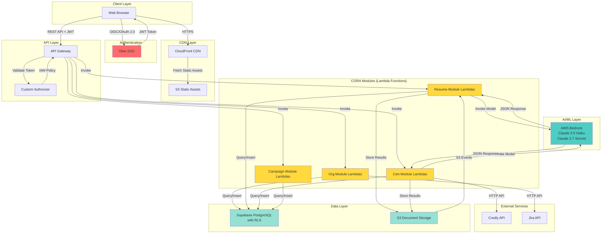

### Architecture Principles

1. **Module-First Development**: Every feature is a self-contained module with database + backend + frontend
2. **Apps as Composition Layers**: `apps/` directories import and compose modules, containing minimal original code
3. **Multi-Tenant by Default**: All data is organization-scoped with Row-Level Security (RLS)
4. **Infrastructure as Module Outputs**: Modules provide Terraform configuration; main infrastructure imports and composes
5. **Serverless-First**: No server management, automatic scaling, pay-per-use
6. **Event-Driven**: Asynchronous processing via S3 events
7. **API-Centric**: RESTful API with centralized authentication
8. **AI-Powered**: Intelligent document extraction via AWS Bedrock

## Module Reusability

CORA modules are designed to be reusable across multiple AI applications:

1. Copy `packages/org-module/` to a new AI app
2. Deploy infrastructure: `terraform apply`
3. Import components: `import { Sidebar } from '@org-module/frontend'`
4. Instant: Authentication, Multi-tenancy, User Management

**Benefits:**

- **Rapid Prototyping**: Pre-built foundation (auth, multi-tenancy, audit)
- **Consistency**: Same patterns across all applications
- **Maintenance**: Fix once, benefit everywhere
- **Marketplace Potential**: Modules could be shared/sold as packages

See [CORA Principles](./cora-principles.md) for detailed architecture philosophy.

## Technology Stack

### Foundation Module (org-module)

- **Database**: PostgreSQL with RLS (via Supabase)
- **Backend**: Python 3.13 Lambda functions
- **Frontend**: React components with TypeScript
- **Auth**: Okta SSO + JWT validation
- **Infrastructure**: Terraform 1.5+

### Feature Modules (Planned)

- **resume-module**: Resume management with AI extraction
- **cert-module**: Certification tracking with Credly integration
- **campaign-module**: Certification campaign management
- **document-module**: Document processing and storage

### Composition Layer (apps/)

- **Frontend**: Next.js 14+ with Material-UI v5+
- **Backend**: Minimal or non-existent (modules provide Lambdas)

### Shared Services

| Layer          | Technology        | Version | Purpose                |
| -------------- | ----------------- | ------- | ---------------------- |
| **Frontend**   | Next.js           | 14+     | React framework        |
|                | Material-UI       | 5+      | UI components          |
|                | TypeScript        | 5+      | Type safety            |
|                | React Hook Form   | -       | Form management        |
| **Backend**    | Python            | 3.13    | Lambda runtime         |
|                | AWS Lambda        | -       | Serverless compute     |
|                | API Gateway       | -       | REST API               |
| **Database**   | PostgreSQL        | 16+     | Relational database    |
|                | Supabase          | -       | Managed PostgreSQL     |
|                | RLS               | -       | Multi-tenant isolation |
| **Storage**    | S3                | -       | Document storage       |
| **AI/ML**      | AWS Bedrock       | -       | AI processing          |
|                | Claude 3.5 Haiku  | -       | Resume extraction      |
|                | Claude 3.7 Sonnet | -       | Certificate extraction |
| **Auth**       | Okta              | -       | SSO/OIDC               |
| **IaC**        | Terraform         | 1.5+    | Infrastructure         |
| **Monitoring** | CloudWatch        | -       | Logs & metrics         |

## Component Architecture

### Frontend Architecture (Module-Based)

```mermaid
graph TB
    subgraph "CORA Modules (packages/*/frontend/)"
        M1[org-module/frontend]
        M2[resume-module/frontend]
        M3[cert-module/frontend]

        M1 --> C1[Sidebar Component]
        M1 --> C2[Dashboard Component]
        M1 --> H1[useProfile Hook]
        M1 --> H2[useOrganizations Hook]
        M1 --> X1[UserContext]
        M1 --> X2[OrgContext]

        M2 --> C3[ResumeList Component]
        M2 --> C4[ResumeEditor Component]
        M2 --> H3[useResumes Hook]

        M3 --> C5[CertList Component]
        M3 --> H4[useCertifications Hook]
    end

    subgraph "Apps (Composition Layer)"
        A[apps/frontend/app/layout.tsx]
        B[apps/frontend/app/page.tsx]

        A -->|import| C1
        A -->|import| X1
        A -->|import| X2
        B -->|import| C2
    end

    style M1 fill:#FFD93D
    style M2 fill:#FFD93D
    style M3 fill:#FFD93D
```

**Key Concept:** Most components live in `packages/*/frontend/`. Apps import and compose them.

### Backend Architecture (Module-Based)

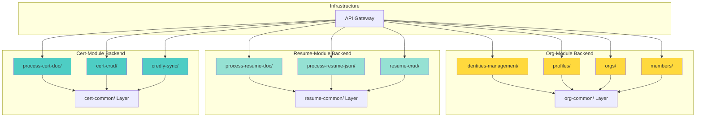

**Key Concept:** Lambda functions are organized by module, each with its own shared layer.

## Data Flow Diagrams

### Resume Upload & Processing Flow

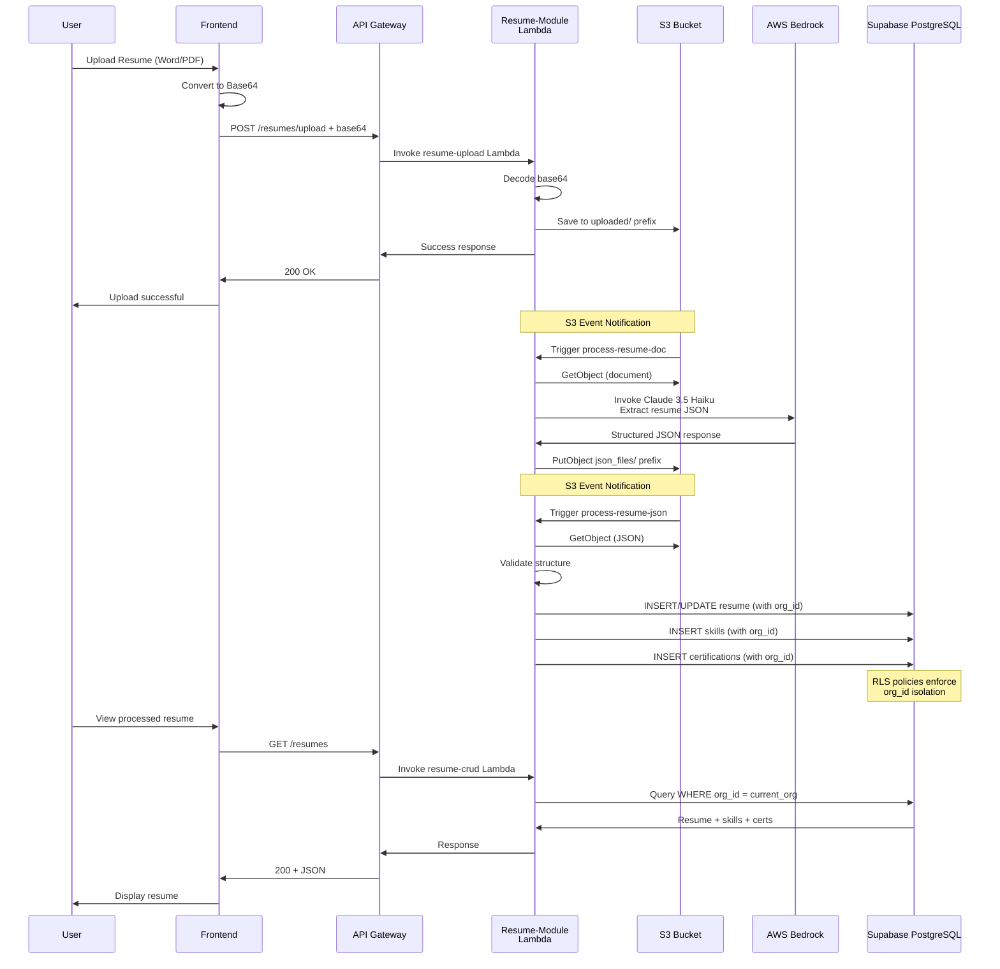

### Multi-Tenant Data Isolation Flow

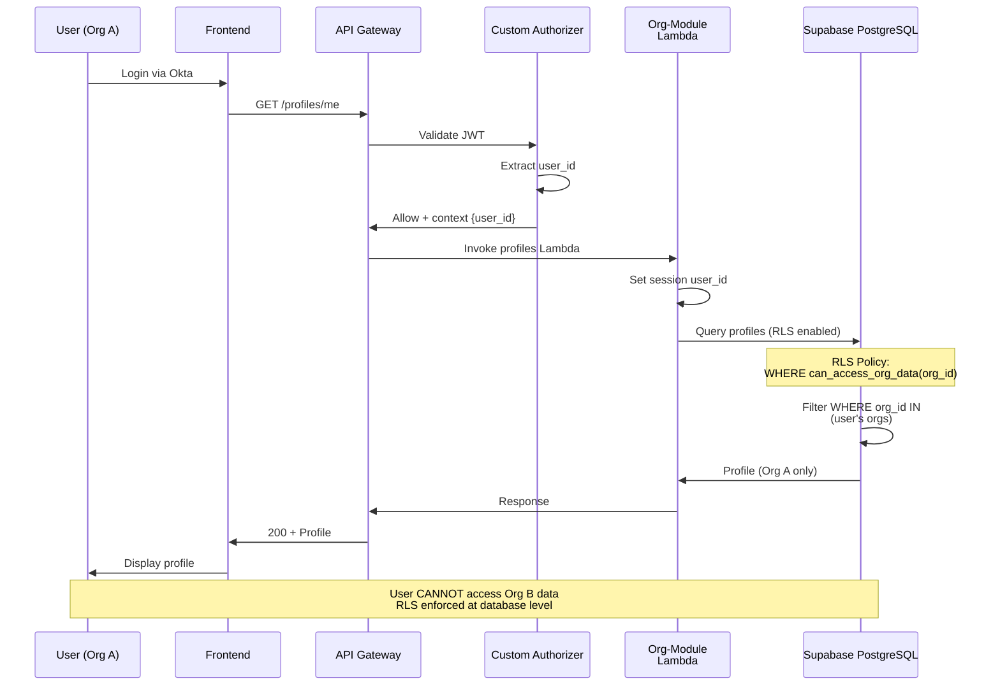

## Security Architecture

### Authentication & Authorization Flow

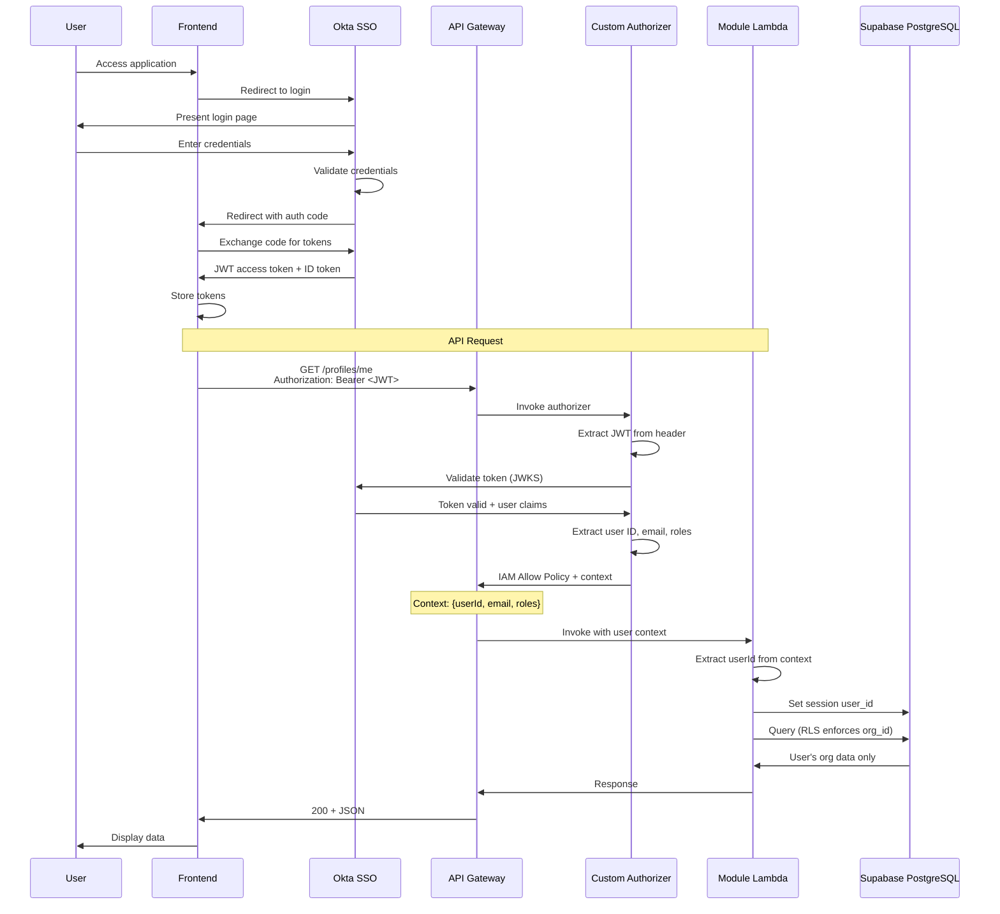

### Security Layers

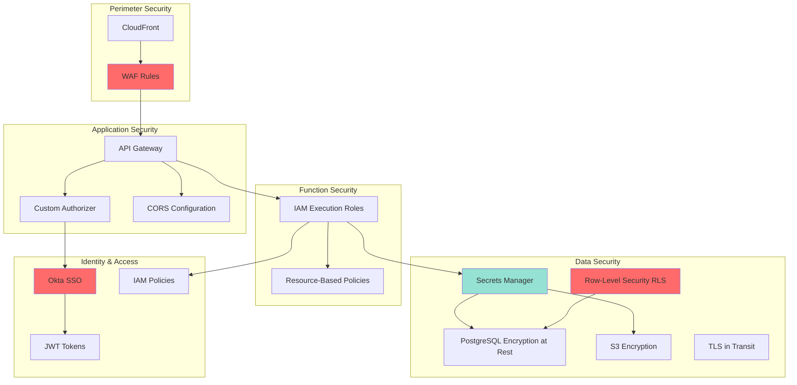

**Security Controls:**

1. **Network Security**:

   - CloudFront HTTPS only
   - WAF rules (SQL injection, XSS, rate limiting)
   - Security groups restricting traffic

2. **Authentication**:

   - Okta SSO (OIDC/OAuth 2.0)
   - JWT token validation
   - Short token TTL with refresh

3. **Authorization**:

   - Custom authorizer validates every request
   - User context propagated to Lambdas
   - **Row-Level Security (RLS)** enforces multi-tenancy at database level
   - Role-based admin access

4. **Data Protection**:

   - PostgreSQL encryption at rest (AES-256)
   - S3 encryption (SSE-S3)
   - TLS 1.2+ in transit
   - Secrets Manager for credentials
   - **RLS policies prevent cross-org data access**

5. **IAM Security**:
   - Least privilege Lambda execution roles
   - Resource-based policies
   - No long-term credentials

## Deployment Architecture

### Environment Structure

```mermaid
graph TB
    subgraph "Environments"
        subgraph "Development (dev)"
            D1[API Gateway dev]
            D2[Module Lambdas dev]
            D3[Supabase dev]
            D4[S3 Bucket dev]
        end

        subgraph "Test (tst)"
            T1[API Gateway tst]
            T2[Module Lambdas tst]
            T3[Supabase tst]
            T4[S3 Bucket tst]
        end

        subgraph "Staging (stg)"
            S1[API Gateway stg]
            S2[Module Lambdas stg]
            S3[Supabase stg]
            S4[S3 Bucket stg]
        end

        subgraph "Production (prd)"
            P1[API Gateway prd]
            P2[Module Lambdas prd]
            P3[Supabase prd]
            P4[S3 Bucket prd]
        end
    end

    subgraph "Shared Services"
        O[Okta SSO]
        B[AWS Bedrock]
        CR[Credly API]
        JR[Jira API]
    end

    D2 --> O
    T2 --> O
    S2 --> O
    P2 --> O

    D2 --> B
    T2 --> B
    S2 --> B
    P2 --> B

    D2 --> CR
    T2 --> CR
    S2 --> CR
    P2 --> CR

    style P1 fill:#FF6B6B
    style P2 fill:#FF6B6B
    style P3 fill:#FF6B6B
    style P4 fill:#FF6B6B
```

### Module Deployment Flow

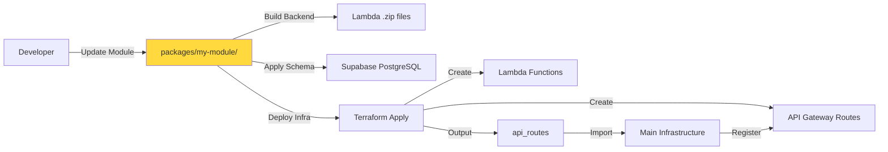

**Key Points:**

- Each module deploys independently
- Main infrastructure imports module outputs
- API routes dynamically created from module definitions
- Database schema applied in dependency order (org-module first)

## Performance Architecture

### Lambda Performance Optimization

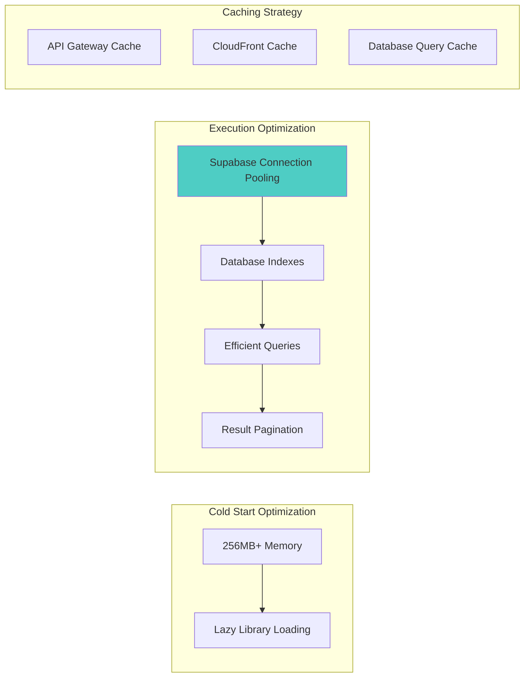

**Performance Targets:**

- **API Response Time**: < 500ms (p95)
- **Document Processing**: < 30s (resume), < 15s (certificate)
- **Cold Start**: < 2s (CRUD), < 5s (processing)
- **Database Queries**: < 100ms (simple), < 500ms (complex)

### Scalability

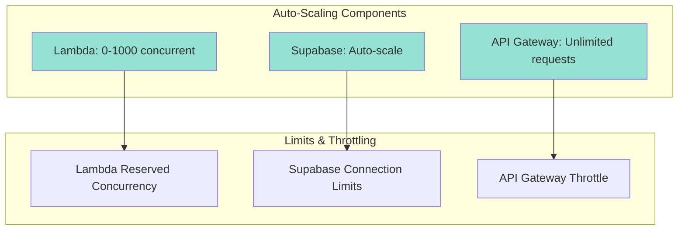

**Scalability Characteristics:**

- **Lambda Functions**: Automatically scale to 1,000 concurrent executions
- **Supabase**: Auto-scales based on load
- **API Gateway**: No hard limit, burst to 5,000 req/s
- **S3**: Unlimited storage, 3,500 PUT/s per prefix

## Disaster Recovery

### Backup Strategy

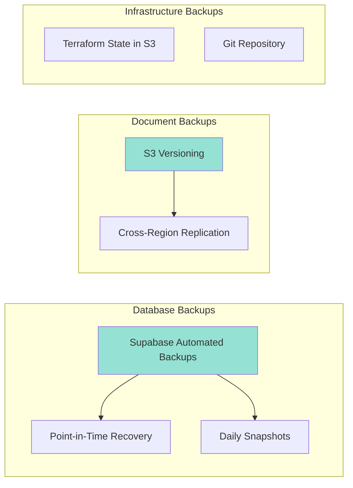

**Recovery Objectives:**

- **RTO (Recovery Time Objective)**: 4 hours
- **RPO (Recovery Point Objective)**: 5 minutes (Supabase PITR)
- **Backup Frequency**: Continuous (Supabase), versioned (S3)

## Monitoring & Observability

### Monitoring Architecture

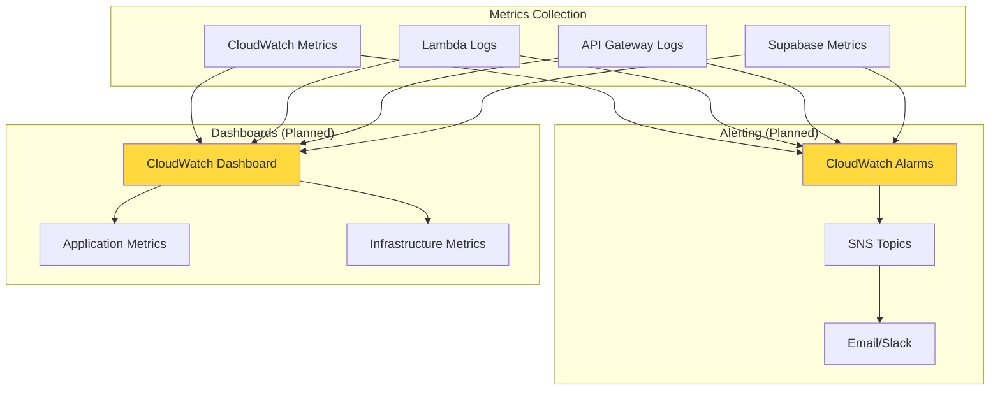

**Key Metrics:**

- Lambda duration, errors, throttles, concurrent executions
- API Gateway 4xx/5xx errors, latency, request count
- Supabase CPU, connections, query performance
- S3 bucket size, request count

## Next Steps

See additional architecture documentation:

- [CORA Principles](./cora-principles.md) - Detailed architecture philosophy
- [Backend Architecture](./backend.md) - Module backend patterns
- [Frontend Architecture](./frontend.md) - Module frontend patterns
- [Database Architecture](./database.md) - Multi-tenant schema design
- [Module Integration Spec](./module-integration-spec.md) - Technical specification
- [Creating Modules Guide](../development/creating-modules.md) - Step-by-step guide
