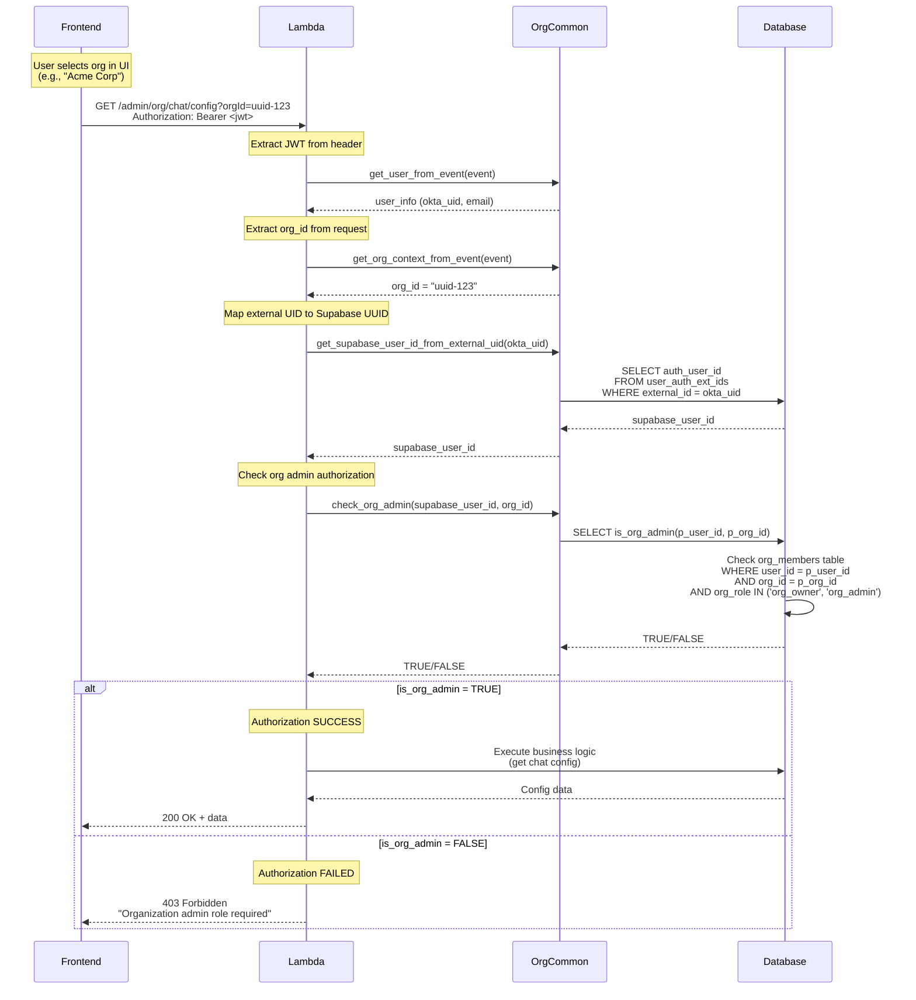

# CORA Standard: Lambda Authorization Patterns

**Status:** Active  
**Version:** 3.0  
**Last Updated:** January 31, 2026  
**Authoritative Source:** [ADR-019: CORA Authorization Standardization](../arch%20decisions/ADR-019-AUTH-STANDARDIZATION.md)  
**Related Standards:** [API Patterns](./standard_API-PATTERNS.md), [CORA Frontend](./standard_CORA-FRONTEND.md)

---

## Overview

This document provides **practical implementation guidance** for Lambda authorization patterns in CORA. For the authoritative specification, see:

- **[ADR-019](../arch%20decisions/ADR-019-AUTH-STANDARDIZATION.md)** - Single source of truth for auth lifecycle
- **[ADR-019a](../arch%20decisions/ADR-019a-AUTH-FRONTEND.md)** - Frontend authorization patterns
- **[ADR-019b](../arch%20decisions/ADR-019b-AUTH-BACKEND.md)** - Backend authorization patterns

This guide focuses on code examples and templates for common scenarios.

## Nomenclature

CORA uses these abbreviations consistently:
- **sys** - System-level (platform-wide)
- **org** - Organization-level
- **ws** - Workspace-level (or module-specific resource)

**Roles:**
- **System roles:** `sys_admin`, `sys_owner` (stored in `sys_role`)
- **Organization roles:** `org_admin`, `org_owner` (stored in `org_members.org_role`)
- **Module roles:** `ws_owner`, `ws_admin`, `ws_user` (stored in module-specific tables)

## The Two-Tier Identity System

CORA uses a **two-tier user identity architecture** that is critical to understand for proper authorization:

```
┌─────────────────────────────────────────────────────────────┐
│                   CORA Identity Architecture                 │
├─────────────────────────────────────────────────────────────┤
│                                                              │
│  Tier 1: External Identity (Okta/Clerk)                     │
│  ├─ JWT Token contains: external_uid (e.g., Okta user ID)   │
│  ├─ Available in: user_info from get_user_from_event()      │
│  └─ Does NOT contain: roles, permissions, profile data      │
│                                                              │
│  Tier 2: Internal Identity (Supabase)                       │
│  ├─ Database stores: user_id (Supabase auth.users ID)       │
│  ├─ user_profiles table contains: sys_role, org roles       │
│  └─ Must query database to get authorization data           │
│                                                              │
└─────────────────────────────────────────────────────────────┘
```

### Key Points

1. **JWT tokens contain ONLY the external identity provider's user ID** (Okta UID, Clerk ID)
2. **Roles and permissions are stored in the DATABASE** (user_profiles table)
3. **You MUST map external UID → Supabase user_id** before querying authorization data
4. **NEVER assume role information is in the JWT** - it's not

---

## Standard Authorization Pattern

### ✅ CORRECT Pattern (Platform Admin Check)

```python
def handle_admin_function(user_info: Dict[str, Any], body: Dict[str, Any]) -> Dict[str, Any]:
    """
    Admin-only endpoint. Only sys_admin and sys_owner can access.
    """
    # Step 1: Extract external UID from JWT
    okta_uid = user_info['user_id']  # This is the Okta user ID
    
    # Step 2: Map to Supabase user_id
    supabase_user_id = common.get_supabase_user_id_from_external_uid(okta_uid)
    
    # Step 3: Query database for user profile
    profile = common.find_one('user_profiles', {'user_id': supabase_user_id})
    
    # Step 4: Check authorization
    if not profile or profile.get('sys_role') not in ['sys_admin', 'sys_owner']:
        raise common.ForbiddenError('Only system administrators can access this resource')
    
    # ... rest of function logic
```

### ❌ INCORRECT Anti-Pattern

```python
def handle_admin_function_WRONG(user_info: Dict[str, Any], body: Dict[str, Any]) -> Dict[str, Any]:
    """
    ❌ WRONG: This will cause 403 errors for valid admins
    """
    # Anti-pattern: Trying to get role from JWT
    user_role = user_info.get('role', '').lower()  # ❌ role is not in JWT!
    if user_role not in ['sys_admin', 'sys_owner']:
        raise common.ForbiddenError('Only system administrators can access this resource')
    
    # This code will ALWAYS fail because 'role' is not in user_info
```

---

## Centralized Router Auth Pattern (PREFERRED for Admin Routes)

### Overview

For Lambda functions handling **admin routes** (`/admin/sys/*`, `/admin/org/*`), the **PREFERRED** pattern is to centralize authorization at the router level. This eliminates code duplication and ensures consistent security enforcement.

### Why Centralized Auth?

**Problems with per-handler auth:**
- ❌ Authorization logic duplicated across 10-20 handler functions
- ❌ Easy to miss auth checks in new handlers
- ❌ Inconsistent error messages
- ❌ Database profile queried multiple times per request
- ❌ Hard to audit security across all handlers

**Benefits of centralized auth:**
- ✅ Authorization checked ONCE at router level
- ✅ Handlers focus on business logic only
- ✅ Single profile query per request
- ✅ Consistent error messages
- ✅ Easy to audit (all auth in one place)
- ✅ Follows DRY principle

### Pattern: Centralized Router Auth

**Reference Implementation:** `module-mgmt/backend/lambdas/lambda-mgmt/lambda_function.py`

```python
"""
Module Admin Lambda - Example of Centralized Router Auth

Routes - System Admin:
- GET /admin/sys/mgmt/modules - List all modules
- PUT /admin/sys/mgmt/modules/{name} - Update module

Routes - Org Admin:
- GET /admin/org/mgmt/modules - List org modules
- GET /admin/org/mgmt/usage - View org usage
"""

import json
import logging
import os
from typing import Any, Dict

import org_common as common

logger = logging.getLogger()
logger.setLevel(os.environ.get('LOG_LEVEL', 'INFO'))

# Define system admin roles as constant
SYS_ADMIN_ROLES = ['sys_owner', 'sys_admin']


def lambda_handler(event: Dict[str, Any], context: object) -> Dict[str, Any]:
    """
    Main Lambda handler with CENTRALIZED authorization.
    
    All admin routes are protected at the router level.
    Individual handlers do NOT need to check authorization.
    """
    try:
        # 1. Extract route information
        http_method = event.get('httpMethod', event.get('requestContext', {}).get('http', {}).get('method', ''))
        path = event.get('path', event.get('rawPath', ''))
        path_parameters = event.get('pathParameters') or {}
        
        logger.info(f"Request: {http_method} {path}")
        
        # 2. Standard CORA auth extraction (ONCE)
        user_info = common.get_user_from_event(event)
        okta_uid = user_info['user_id']
        org_id = user_info.get('org_id')  # Extract for logging/audit
        supabase_user_id = common.get_supabase_user_id_from_okta_uid(okta_uid)
        
        # 3. Single profile query (ONCE)
        profile = common.find_one(
            table='user_profiles',
            filters={'user_id': supabase_user_id}
        )
        
        if not profile:
            logger.warning(f"User profile not found for {supabase_user_id}")
            return common.forbidden_response('User profile not found')
        
        # 4. Role flags computed ONCE
        is_sys_admin = profile.get('sys_role') in SYS_ADMIN_ROLES
        is_org_admin = profile.get('org_role') in ['org_admin', 'org_owner']
        
        # 5. Route-level authorization (ONCE per route type)
        if path.startswith('/admin/sys/'):
            if not is_sys_admin:
                logger.warning(f"Access denied for user {supabase_user_id} - sys admin required")
                return common.forbidden_response('System admin role required')
            logger.info(f"System admin access granted for user {supabase_user_id}")
        
        elif path.startswith('/admin/org/'):
            if not is_org_admin:
                logger.warning(f"Access denied for user {supabase_user_id} - org admin required")
                return common.forbidden_response('Organization admin role required')
            if not org_id:
                logger.warning(f"Org admin missing org_id for {supabase_user_id}")
                return common.forbidden_response('Organization context required')
            logger.info(f"Organization admin access granted for user {supabase_user_id}, org: {org_id}")
        
        # 6. Route dispatcher - handlers receive pre-validated context
        if path == '/admin/sys/mgmt/modules' and http_method == 'GET':
            return handle_list_modules(event)  # No auth params needed!
        
        elif path.endswith('/admin/org/mgmt/usage') and http_method == 'GET':
            return handle_org_module_usage(org_id)  # Pre-validated org_id
        
        # ... more routes
        
        else:
            return common.not_found_response(f'Route not found: {http_method} {path}')
    
    except common.ForbiddenError as e:
        return common.forbidden_response(str(e))
    
    except Exception as e:
        logger.exception(f'Internal error: {str(e)}')\n        return common.internal_error_response('Internal server error')


def handle_list_modules(event: Dict[str, Any]) -> Dict[str, Any]:
    """
    GET /admin/sys/mgmt/modules
    
    List all registered modules.
    
    NOTE: No authorization check needed - already validated at router level!
    """
    # Business logic only - no auth checks!
    query_params = event.get('queryStringParameters') or {}
    module_type = query_params.get('type')
    
    filters = {'deleted_at': None}
    if module_type:
        filters['module_type'] = module_type
    
    modules = common.find_many(
        table='mgmt_cfg_sys_modules',
        filters=filters,
        order='tier,module_name'
    )
    
    return common.success_response({'modules': modules})


def handle_org_module_usage(org_id: str) -> Dict[str, Any]:
    """
    GET /admin/org/mgmt/usage
    
    View module usage statistics for an organization.
    
    NOTE: org_id already validated at router level!
    """
    # Business logic only - no auth checks!
    usage_stats = common.find_many(
        table='mgmt_usage_modules',
        filters={'org_id': org_id}
    )
    
    return common.success_response({'usage': usage_stats})
```

### When to Use Each Pattern

| Pattern | Use Case | Profile Queries | Auth Checks | Best For |
|---------|----------|-----------------|-------------|----------|
| **Centralized Router** | Admin routes (`/admin/*`) | 1 per request | 1 per route type | ✅ PREFERRED |
| **Per-Handler** | Data API routes | 1 per handler | 1 per handler | Resource ownership |

**Examples:**
- ✅ **Use Centralized:** `/admin/sys/mgmt/*`, `/admin/org/mgmt/*` (uniform role requirements)
- ✅ **Use Per-Handler:** `/kb/documents/{id}`, `/ws/{wsId}/members` (resource-specific ownership)

### Migration from Per-Handler to Centralized

If you have a Lambda with per-handler auth checks, migrate to centralized:

**Before (Per-Handler - Duplicated):**
```python
def handle_sys_get_config(user_id: str) -> Dict[str, Any]:
    # Duplicate auth check #1
    profile = common.find_one('user_profiles', {'user_id': user_id})
    if not profile or profile.get('sys_role') not in ['sys_owner', 'sys_admin']:
        raise common.ForbiddenError('sys_admin or sys_owner role required')
    # Business logic...

def handle_sys_update_config(user_id: str, body: Dict) -> Dict[str, Any]:
    # Duplicate auth check #2
    profile = common.find_one('user_profiles', {'user_id': user_id})
    if not profile or profile.get('sys_role') not in ['sys_owner', 'sys_admin']:
        raise common.ForbiddenError('sys_admin or sys_owner role required')
    # Business logic...

# ... repeated 10-20 times across handlers
```

**After (Centralized - DRY):**
```python
def lambda_handler(event, context):
    # Single auth check at router
    profile = common.find_one('user_profiles', {'user_id': supabase_user_id})
    is_sys_admin = profile.get('sys_role') in ['sys_owner', 'sys_admin']
    
    if path.startswith('/admin/sys/'):
        if not is_sys_admin:
            return common.forbidden_response('System admin role required')
    
    # Dispatch to handlers - no auth needed!
    return handle_sys_get_config()  # No user_id param!

def handle_sys_get_config() -> Dict[str, Any]:
    # Business logic only - no auth checks!
    config = common.find_one(...)
    return common.success_response(config)

def handle_sys_update_config(body: Dict) -> Dict[str, Any]:
    # Business logic only - no auth checks!
    updated = common.update_one(...)
    return common.success_response(updated)
```

### Key Takeaways

1. **Admin Lambdas:** Use centralized router auth (module-mgmt pattern)
2. **Data API Lambdas:** Use per-handler auth for resource ownership checks
3. **Single Profile Query:** Query user_profiles ONCE at router level
4. **Handlers Stay Focused:** Business logic only, no auth code duplication
5. **Audit Trail:** All authorization logic in one place for easy review

---

## Organization Context Extraction (ADR-019)

**Critical Requirement:** For organization admin routes (`/admin/org/*`), the Lambda MUST extract `org_id` from the request.

### Why org_id is in the Request, Not JWT

**Important:** The JWT token does NOT contain `org_id` or role information. Here's why:

- **Users can belong to multiple organizations** - A single user may have different roles in different orgs
- **Frontend provides org context** - The UI lets users select which organization they're working in
- **Selected org_id is passed in request** - Via query parameters, path parameters, or request body
- **JWT only contains user identity** - The Okta/IDP token contains external_uid, email, name - NOT org_id or roles
- **Roles are in the database** - `user_profiles` and `org_members` tables store authorization data

### Standard Helper Function: `get_org_context_from_event()`

**Function Signature:**
```python
def get_org_context_from_event(event) -> Optional[str]:
    """
    Extract organization ID from API Gateway event.
    
    Checks in order:
    1. Path parameters (orgId)
    2. Query parameters (orgId)  
    3. Request body (orgId)
    
    Returns:
        org_id (str) or None if not found
    """
```

**Usage in Lambda:**

```python
elif path.startswith('/admin/org/'):\n    # Extract org_id from request (NOT from JWT!)
    org_id = common.get_org_context_from_event(event)
    
    if not org_id:
        return common.bad_request_response('Organization ID required in request')
    
    # Check org admin authorization using ADR-019 standard
    if not common.check_org_admin(supabase_user_id, org_id):
        return common.forbidden_response('Organization admin role required')
```

### X-Org-Id Header Pattern (REQUIRED Fallback)

**CRITICAL**: Organization admin routes MUST read `org_id` from the `X-Org-Id` request header as a fallback when authorizer context extraction fails.

**Why This is Required:**

- **Authorizer context extraction may fail** - `get_org_context_from_event()` may not extract org_id from JWT
- **Frontend hooks explicitly pass org_id** - Org-scoped hooks send `X-Org-Id` header with every request
- **More reliable than authorizer-only** - Explicit header passing is predictable and testable
- **Supports different auth strategies** - Works regardless of how the authorizer is configured

**✅ CORRECT Pattern (Authorizer + Header Fallback):**

```python
elif path.startswith('/admin/org/'):
    # Try authorizer context first
    org_id = common.get_org_context_from_event(event)
    
    # Fallback to X-Org-Id header (sent by frontend hooks)
    if not org_id:
        headers = event.get('headers', {})
        org_id = headers.get('X-Org-Id') or headers.get('x-org-id')
    
    if not org_id:
        return common.bad_request_response('Organization ID (orgId) is required')
    
    # Verify org admin authorization
    if not common.check_org_admin(supabase_user_id, org_id):
        return common.forbidden_response('Organization admin role required')
```

**❌ WRONG Pattern (Authorizer Only):**

```python
elif path.startswith('/admin/org/'):
    # ❌ No fallback - fails if authorizer context doesn't have orgId
    org_id = common.get_org_context_from_event(event)
    if not org_id:
        return common.bad_request_response('Organization ID required')
```

**Why the wrong pattern fails:**
- Authorizer may not have access to JWT claims containing org context
- Different authorization strategies configure context differently
- No fallback means requests will fail unnecessarily

**Frontend Integration:**

Frontend hooks using the org-scoped pattern send `X-Org-Id` header with every request:

```typescript
// Frontend hook sends X-Org-Id header
const response = await fetch(`/admin/org/mgmt/modules`, {
  headers: {
    Authorization: `Bearer ${token}`,
    "X-Org-Id": orgId,  // Lambda reads this as fallback
  },
});
```

**Compliance Rule:** All `/admin/org/*` routes MUST check both authorizer context AND `X-Org-Id` header.

**See:** `docs/standards/01_std_front_AUTH.md` Section 2.3 for the frontend org-scoped hook pattern.

### Complete Org Admin Authorization Flow



### Flow Summary

1. **Frontend passes orgId** - User selects org in UI; frontend passes it in query params, path params, or body
2. **Lambda extracts JWT** - Gets external UID (Okta/IDP user ID) from Authorization header
3. **Lambda extracts org_id** - Uses `get_org_context_from_event(event)` to get org_id from request
4. **Lambda maps user identity** - Converts external UID to Supabase UUID via `user_auth_ext_ids` table
5. **Lambda validates authorization** - Calls `check_org_admin(user_id, org_id)` helper
6. **RPC function checks database** - `is_org_admin(p_user_id, p_org_id)` queries `org_members` table
7. **Route executes** - If user has `org_owner` or `org_admin` role in that org

### ADR-019 Standard Functions

**Python Helpers (org-common):**
```python
# System admin check
common.check_sys_admin(user_id: str) -> bool

# Organization admin check  
common.check_org_admin(user_id: str, org_id: str) -> bool

# Workspace admin check
common.check_ws_admin(user_id: str, ws_id: str) -> bool
```

**Database RPC Functions:**
```sql
-- System admin
is_sys_admin(p_user_id UUID) RETURNS BOOLEAN

-- Organization admin
is_org_admin(p_user_id UUID, p_org_id UUID) RETURNS BOOLEAN

-- Workspace admin
is_ws_admin(p_user_id UUID, p_ws_id UUID) RETURNS BOOLEAN
```

**See:** `docs/arch decisions/ADR-019-AUTH-STANDARDIZATION.md` for complete specification.

---

## Sys vs Org vs Ws Route Patterns

CORA Lambda functions should categorize routes into **sys-level**, **org-level**, and **ws-level** to properly enforce org_id requirements and authorization.

### Route Classification

**Sys Routes (System-Level):**
- **Prefix:** `/ws/sys/...` or global config routes like `/ws/config`
- **org_id:** NOT required
- **Authorization:** `sys_role IN ['sys_admin', 'sys_owner']`
- **Examples:** `/ws/sys/stats`, `/ws/sys/analytics`, `/ws/config`

**Org Routes (Organization-Level):**
- **Prefix:** `/ws/org/...` for org-wide admin operations
- **org_id:** REQUIRED (query param or body)
- **Authorization:** `org_role IN ['org_admin', 'org_owner']` OR sys admin
- **Examples:** `/ws/org/settings`, `/ws/org/analytics`

**Ws Routes (Workspace-Level):**
- **Prefix:** `/ws/{id}/...` or `/ws` (workspace CRUD)
- **org_id:** REQUIRED (query param or body)
- **Authorization:** `ws_role IN ['ws_owner', 'ws_admin']` OR org admin OR sys admin
- **Examples:** `/ws/{id}/members`, `/ws/{id}` (update), `DELETE /ws/{id}`

### Implementation Pattern

```python
# Define route categories
SYS_ROUTES = ['/ws/sys/stats', '/ws/sys/analytics', '/ws/config']

def is_sys_route(path: str) -> bool:
    """Check if route is system-level (no org_id required)."""
    return any(path.startswith(route) for route in SYS_ROUTES)

def lambda_handler(event: Dict[str, Any], context: object) -> Dict[str, Any]:
    """Main Lambda handler with route-aware org_id validation."""
    try:
        # Extract route information
        http_method = event.get('httpMethod', '')
        path = event.get('path', '')
        
        # Standard CORA auth extraction
        user_info = common.get_user_from_event(event)
        okta_uid = user_info['user_id']
        supabase_user_id = common.get_supabase_user_id_from_external_uid(okta_uid)
        
        # Route-aware org_id handling
        org_id = None
        if not is_sys_route(path):
            # Org routes require orgId (camelCase in query params, snake_case internally)
            query_params = event.get('queryStringParameters') or {}
            org_id = query_params.get('orgId')  # Note: camelCase in query params
            
            # For POST/PUT, also check request body (accept both formats)
            if not org_id and http_method in ('POST', 'PUT'):
                try:
                    body = json.loads(event.get('body', '{}'))
                    org_id = body.get('orgId') or body.get('org_id')  # Accept both formats in body
                except json.JSONDecodeError:
                    pass
            
            if not org_id:
                return common.bad_request_response('orgId is required for org routes')
        
        # Route dispatcher
        # ... dispatch to handlers
        
    except Exception as e:
        logger.exception(f'Internal error: {str(e)}')
        return common.internal_error_response('Internal server error')
```

---

## Authorization Patterns by Use Case

### 1. System Admin Authorization (Sys Routes)

**Use Case:** System-wide administrative functions (cross-org stats, global config, etc.)

**Roles Allowed:** `sys_admin`, `sys_owner`

**Route Examples:** `/ws/sys/stats`, `/ws/sys/analytics`, `/ws/config`

```python
def handle_sys_stats(user_info: Dict[str, Any]) -> Dict[str, Any]:
    """GET /ws/sys/stats - System admin only."""
    # Map external UID → Supabase user_id
    okta_uid = user_info['user_id']
    supabase_user_id = common.get_supabase_user_id_from_external_uid(okta_uid)
    
    # Query user profile for sys_role
    profile = common.find_one('user_profiles', {'user_id': supabase_user_id})
    if not profile or profile.get('sys_role') not in ['sys_admin', 'sys_owner']:
        raise common.ForbiddenError('System admin access required')
    
    # ... implementation
```

### 2. Organization Admin Authorization (Org Routes)

**Use Case:** Organization-level administrative functions

**Roles Allowed:** `org_admin`, `org_owner`, `sys_admin`, `sys_owner`

**Route Examples:** `/ws/org/settings`, `/ws/org/analytics`

```python
def handle_org_settings(org_id: str, user_info: Dict[str, Any]) -> Dict[str, Any]:
    """GET /ws/org/settings - Org admin or sys admin."""
    okta_uid = user_info['user_id']
    supabase_user_id = common.get_supabase_user_id_from_external_uid(okta_uid)
    
    # Get user profile
    profile = common.find_one('user_profiles', {'user_id': supabase_user_id})
    if not profile:
        raise common.ForbiddenError('User profile not found')
    
    sys_role = profile.get('sys_role')
    
    # System admins have access to all orgs
    if sys_role in ['sys_admin', 'sys_owner']:
        return  # Authorized
    
    # Check org membership and role
    org_member = common.find_one('org_members', {
        'org_id': org_id,
        'user_id': supabase_user_id
    })
    
    if not org_member or org_member.get('org_role') not in ['org_admin', 'org_owner']:
        raise common.ForbiddenError('Organization admin access required')
    
    # ... implementation
```

### 3. Workspace-Level Authorization (Ws Routes)

**Use Case:** Workspace-specific operations (update, delete, member management)

**Roles Allowed:** `ws_owner`, `ws_admin`, `org_admin`, `org_owner`, `sys_admin`, `sys_owner`

**Route Examples:** `/ws/{id}` (update/delete), `/ws/{id}/members`

```python
def handle_update_workspace(workspace_id: str, org_id: str, user_info: Dict[str, Any], body: Dict[str, Any]) -> Dict[str, Any]:
    """PUT /ws/{id} - Workspace admin/owner, org admin, or sys admin."""
    okta_uid = user_info['user_id']
    supabase_user_id = common.get_supabase_user_id_from_external_uid(okta_uid)
    
    # Get user profile
    profile = common.find_one('user_profiles', {'user_id': supabase_user_id})
    if not profile:
        raise common.ForbiddenError('User profile not found')
    
    sys_role = profile.get('sys_role')
    
    # System admins have access to all workspaces
    if sys_role in ['sys_admin', 'sys_owner']:
        pass  # Authorized
    
    # Check org admin
    elif (
        org_member := common.find_one('org_members', {'org_id': org_id, 'user_id': supabase_user_id})
    ) and org_member.get('org_role') in ['org_admin', 'org_owner']:
        pass  # Authorized
    
    # Check workspace role
    else:
        is_ws_admin = common.rpc(
            function_name='is_ws_admin_or_owner',
            params={'p_ws_id': workspace_id, 'p_user_id': supabase_user_id}
        )
        if not is_ws_admin:
            raise common.ForbiddenError('Workspace admin access required')
    
    # ... implementation
```

---

## Authorization Patterns by Use Case (Legacy Examples)

### 1. System Admin Authorization

**Use Case:** System-wide administrative functions (stats, system config, etc.)

**Roles Allowed:** `sys_admin`, `sys_owner`

```python
def handle_sys_admin_action(user_info: Dict[str, Any]) -> Dict[str, Any]:
    """System admin only."""
    # Map external UID → Supabase user_id
    okta_uid = user_info['user_id']
    supabase_user_id = common.get_supabase_user_id_from_external_uid(okta_uid)
    
    # Query user profile for sys_role
    profile = common.find_one('user_profiles', {'user_id': supabase_user_id})
    if not profile or profile.get('sys_role') not in ['sys_admin', 'sys_owner']:
        raise common.ForbiddenError('System admin access required')
    
    # ... implementation
```

### 2. Organization Admin Authorization

**Use Case:** Organization-level administrative functions

**Roles Allowed:** `org_admin`, `org_owner`, `sys_admin`, `sys_owner`

```python
def handle_org_admin_action(org_id: str, user_info: Dict[str, Any]) -> Dict[str, Any]:
    """Org admin or sys admin."""
    okta_uid = user_info['user_id']
    supabase_user_id = common.get_supabase_user_id_from_external_uid(okta_uid)
    
    # Get user profile
    profile = common.find_one('user_profiles', {'user_id': supabase_user_id})
    if not profile:
        raise common.ForbiddenError('User profile not found')
    
    sys_role = profile.get('sys_role')
    
    # System admins have access to all orgs
    if sys_role in ['sys_admin', 'sys_owner']:
        return  # Authorized
    
    # Check org membership and role
    org_member = common.find_one('org_members', {
        'org_id': org_id,
        'user_id': supabase_user_id
    })
    
    if not org_member or org_member.get('org_role') not in ['org_admin', 'org_owner']:
        raise common.ForbiddenError('Organization admin access required')
    
    # ... implementation
```

### 3. Organization Membership Authorization

**Use Case:** User must be a member of the organization

**Roles Allowed:** Any member of the organization

```python
def handle_org_member_action(org_id: str, user_info: Dict[str, Any]) -> Dict[str, Any]:
    """Any org member can access."""
    okta_uid = user_info['user_id']
    supabase_user_id = common.get_supabase_user_id_from_external_uid(okta_uid)
    
    # Check org membership
    org_member = common.find_one('org_members', {
        'org_id': org_id,
        'user_id': supabase_user_id
    })
    
    if not org_member:
        raise common.ForbiddenError('You are not a member of this organization')
    
    # ... implementation
```

### 4. Resource Owner Authorization

**Use Case:** User must own the specific resource

```python
def handle_resource_update(resource_id: str, user_info: Dict[str, Any], body: Dict[str, Any]) -> Dict[str, Any]:
    """Resource owner only."""
    okta_uid = user_info['user_id']
    supabase_user_id = common.get_supabase_user_id_from_external_uid(okta_uid)
    
    # Get resource
    resource = common.find_one('resources', {'id': resource_id})
    if not resource:
        raise common.NotFoundError('Resource not found')
    
    # Check ownership
    if resource.get('created_by') != supabase_user_id:
        raise common.ForbiddenError('Only the resource owner can update it')
    
    # ... implementation
```

### 5. Module-Specific Role Authorization

**Use Case:** Check module-specific roles (e.g., workspace roles)

```python
def handle_workspace_action(workspace_id: str, user_info: Dict[str, Any]) -> Dict[str, Any]:
    """Workspace owner or admin."""
    okta_uid = user_info['user_id']
    supabase_user_id = common.get_supabase_user_id_from_external_uid(okta_uid)
    
    # Use RPC function for module-specific authorization
    is_authorized = common.rpc(
        function_name='is_ws_admin_or_owner',
        params={'p_ws_id': workspace_id, 'p_user_id': supabase_user_id}
    )
    
    if not is_authorized:
        raise common.ForbiddenError('Workspace admin or owner access required')
    
    # ... implementation
```

---

## Helper Functions

### Standard User ID Mapping

```python
def get_supabase_user_id(user_info: Dict[str, Any]) -> str:
    """
    Standard helper to get Supabase user_id from JWT user_info.
    
    Args:
        user_info: User info from common.get_user_from_event(event)
    
    Returns:
        Supabase user_id (UUID string)
    """
    okta_uid = user_info['user_id']
    return common.get_supabase_user_id_from_external_uid(okta_uid)
```

### Checking System Admin

```python
def is_sys_admin(user_info: Dict[str, Any]) -> bool:
    """
    Check if user is a system administrator.
    
    Args:
        user_info: User info from JWT
    
    Returns:
        True if sys admin, False otherwise
    """
    okta_uid = user_info['user_id']
    supabase_user_id = common.get_supabase_user_id_from_external_uid(okta_uid)
    
    profile = common.find_one('user_profiles', {'user_id': supabase_user_id})
    return profile and profile.get('sys_role') in ['sys_admin', 'sys_owner']
```

---

## Common Mistakes to Avoid

### Mistake 1: Checking Role in JWT

```python
# ❌ WRONG
user_role = user_info.get('role')  # role is not in JWT!
if user_role != 'admin':
    raise ForbiddenError()
```

**Why it fails:** The JWT token from Okta/Clerk does NOT contain role information.

**Fix:** Query the database for the user's profile and check the `sys_role` field.

### Mistake 2: Using Okta UID to Query user_profiles

```python
# ❌ WRONG
okta_uid = user_info['user_id']
profile = common.find_one('user_profiles', {'user_id': okta_uid})  # Wrong ID!
```

**Why it fails:** `user_profiles.user_id` is the Supabase auth.users ID, not the Okta UID.

**Fix:** Map the Okta UID to Supabase user_id first using `get_supabase_user_id_from_external_uid()`.

### Mistake 3: Skipping Authorization Checks

```python
# ❌ WRONG
def handle_admin_function(user_info: Dict[str, Any]) -> Dict[str, Any]:
    # No authorization check!
    return get_all_users()  # Exposed to all authenticated users
```

**Why it fails:** Every authenticated user can access admin functions.

**Fix:** Always check authorization before performing sensitive operations.

### Mistake 4: Using Deprecated Helper Functions

```python
# ❌ WRONG
from local_helpers import get_supabase_user_id_from_okta_uid  # Deprecated!
```

**Why it fails:** Local helper functions may be outdated or inconsistent.

**Fix:** Use standard `common.get_supabase_user_id_from_external_uid()` from org_common.

---

## Lambda Handler Template

Here's a complete template for a Lambda with proper authorization:

```python
"""
Module Name - Lambda Function

This Lambda provides endpoints for [description].

Routes:
- GET /resource - List resources
- POST /resource - Create resource (admin only)
- GET /resource/{id} - Get resource details
- PUT /resource/{id} - Update resource (owner only)
- DELETE /resource/{id} - Delete resource (owner only)
"""

import json
import logging
import os
from typing import Any, Dict

import org_common as common

logger = logging.getLogger()
logger.setLevel(os.environ.get('LOG_LEVEL', 'INFO'))


def lambda_handler(event: Dict[str, Any], context: object) -> Dict[str, Any]:
    """Main Lambda handler with route dispatcher."""
    try:
        # Extract route information
        http_method = event.get('httpMethod', '')
        path = event.get('path', '')
        
        # Standard CORA auth extraction
        user_info = common.get_user_from_event(event)
        okta_uid = user_info['user_id']
        supabase_user_id = common.get_supabase_user_id_from_external_uid(okta_uid)
        
        # Route dispatcher
        if path == '/resource' and http_method == 'GET':
            return handle_list_resources(supabase_user_id, event)
        
        elif path == '/resource' and http_method == 'POST':
            body = json.loads(event.get('body', '{}'))
            return handle_create_resource(supabase_user_id, user_info, body)
        
        # ... more routes
        
        else:
            return common.not_found_response(f'Route not found: {http_method} {path}')
    
    except common.ForbiddenError as e:
        return common.forbidden_response(str(e))
    
    except Exception as e:
        logger.exception(f'Internal error: {str(e)}')
        return common.internal_error_response('Internal server error')


def handle_create_resource(
    user_id: str,
    user_info: Dict[str, Any],
    body: Dict[str, Any]
) -> Dict[str, Any]:
    """
    POST /resource
    
    Create a new resource. Admin only.
    """
    # Authorization: System admin only
    profile = common.find_one('user_profiles', {'user_id': user_id})
    if not profile or profile.get('sys_role') not in ['sys_admin', 'sys_owner']:
        raise common.ForbiddenError('System admin access required')
    
    # Validation
    name = body.get('name')
    if not name:
        raise common.ValidationError('name is required')
    
    # Create resource
    resource = common.insert_one('resources', {
        'name': name,
        'created_by': user_id
    })
    
    return common.success_response({'resource': resource}, status_code=201)
```

---

## Testing Authorization

### Unit Test Example

```python
def test_admin_authorization():
    """Test that non-admins cannot access admin endpoints."""
    # Setup: Create a regular user (not admin)
    user_info = {
        'user_id': 'okta_user_123',
        'email': 'user@example.com'
    }
    
    # Mock the database to return a non-admin profile
    mock_profile = {
        'user_id': 'supabase_user_123',
        'sys_role': 'sys_user'  # Not admin
    }
    
    # Attempt to call admin function
    with pytest.raises(common.ForbiddenError):
        handle_admin_function(user_info)
    
    # Verify the error message
    assert "System admin access required" in str(excinfo.value)
```

---

## Checklist for Lambda Authorization

When implementing a new Lambda function, verify:

- [ ] User ID mapping: External UID → Supabase user_id
- [ ] Database query for user profile (not JWT)
- [ ] Proper role checks based on use case
- [ ] Appropriate error handling (403 for unauthorized)
- [ ] Authorization comments in code
- [ ] Unit tests for authorization logic
- [ ] Integration tests with different user roles
- [ ] Documentation of required roles in docstrings

---

## Summary

**Remember:**

1. **JWT tokens do NOT contain roles** - roles are in the database
2. **Always map external UID to Supabase user_id** before authorization checks
3. **Query user_profiles table** to get the user's `sys_role`
4. **Use standard org_common functions** for consistency
5. **Document required roles** in function docstrings
6. **Test authorization** with different user roles

**The pattern is:**
```
JWT (external_uid) → map → Supabase user_id → query → user_profiles → check sys_role
```

Following these patterns prevents 403 errors and ensures secure, maintainable authorization across all CORA modules.

---

## Related Documents

- [CORA API Patterns](./standard_API-PATTERNS.md) - API design standards
- [CORA Module Development](../guides/guide_CORA-MODULE-DEVELOPMENT-PROCESS.md) - Module development process
- [Module Integration Spec](./standard_module-integration-spec.md) - Module integration requirements
