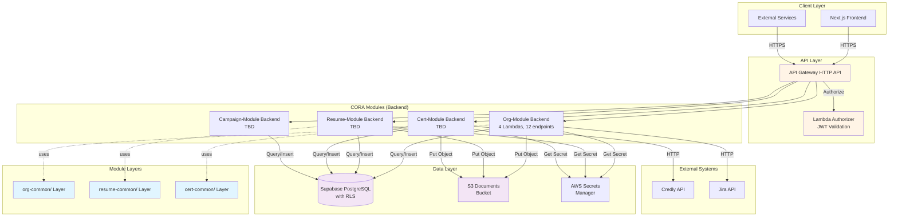
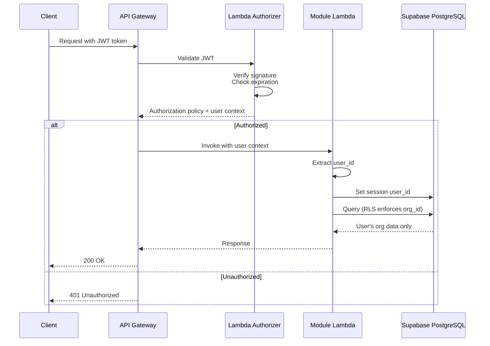

# Backend Architecture

This document describes the backend architecture of the STS Career Platform using **CORA (Context-Oriented Resource Architecture)**, where Lambda functions are provided by self-contained modules rather than a central `apps/backend/` directory.

## Architecture Overview

The backend is built using **AWS Lambda functions** provided by **CORA modules**, exposed through **AWS API Gateway**. The architecture follows a **serverless, module-first pattern** optimized for reusability, scalability, and maintainability.



## Key Architectural Principles

### 1. Module Backend Structure

**Principle**: Lambda functions are provided by **CORA modules**, not a central `apps/backend/` directory.

**Module Backend Structure**:

```
packages/<module-name>/backend/
├── layers/
│   └── <module>-common/
│       └── python/
│           └── <module>_common/
│               ├── __init__.py
│               ├── db.py
│               ├── validators.py
│               └── models.py
└── lambdas/
    ├── <entity>/
    │   ├── lambda_function.py
    │   ├── requirements.txt
    │   └── README.md
    └── ...
```

**Example: Org-Module Backend**

```
packages/org-module/backend/
├── layers/
│   └── org-common/              # Shared utilities
│       └── python/
│           └── org_common/
│               ├── __init__.py
│               ├── db.py        # Supabase client
│               ├── validators.py # Input validation
│               └── responses.py # Standard responses
├── lambdas/
│   ├── identities-management/   # User provisioning
│   │   ├── lambda_function.py
│   │   └── requirements.txt
│   ├── profiles/                # Profile CRUD
│   │   ├── lambda_function.py
│   │   └── requirements.txt
│   ├── orgs/                    # Organization CRUD
│   │   ├── lambda_function.py
│   │   └── requirements.txt
│   └── members/                 # Membership management
│       ├── lambda_function.py
│       └── requirements.txt
└── build.sh                     # Package for deployment
```

**12 API endpoints** provided by 4 Lambda functions.

### 2. Module Integration with Infrastructure

**Principle**: Modules expose Lambda functions via Terraform outputs; main infrastructure dynamically creates API Gateway routes.

**Module Terraform Outputs**:

```hcl
# In packages/org-module/infrastructure/outputs.tf
output "api_routes" {
  value = [
    {
      method      = "GET"
      path        = "/profiles/me"
      integration = aws_lambda_function.profiles.invoke_arn
    },
    {
      method      = "PUT"
      path        = "/profiles/me"
      integration = aws_lambda_function.profiles.invoke_arn
    },
    {
      method      = "GET"
      path        = "/organizations"
      integration = aws_lambda_function.orgs.invoke_arn
    },
    {
      method      = "POST"
      path        = "/organizations"
      integration = aws_lambda_function.orgs.invoke_arn
    },
    # ... 8 more routes
  ]
}

output "lambda_arns" {
  value = {
    identities_management = aws_lambda_function.identities_management.arn
    profiles              = aws_lambda_function.profiles.arn
    orgs                  = aws_lambda_function.orgs.arn
    members               = aws_lambda_function.members.arn
  }
}

output "layer_arn" {
  value = aws_lambda_layer_version.org_common.arn
}
```

**Main Infrastructure Imports Module**:

```hcl
# In sts-career-infra/terraform/environments/dev/main.tf
module "org_module" {
  source = "../../../sts-career-stack/packages/org-module/infrastructure"

  environment         = var.environment
  module_name         = "org-module"
  aws_region          = var.aws_region
  supabase_secret_arn = module.secrets.supabase_secret_arn
  sns_topic_arn       = module.monitoring.sns_topic_arn

  common_tags = {
    Environment = var.environment
    Project     = "sts-career"
    Module      = "org-module"
  }
}

# Dynamically create API Gateway routes from module outputs
resource "aws_apigatewayv2_integration" "org_module" {
  for_each = { for route in module.org_module.api_routes : "${route.method}-${route.path}" => route }

  api_id           = aws_apigatewayv2_api.main.id
  integration_type = "AWS_PROXY"
  integration_uri  = each.value.integration
}

resource "aws_apigatewayv2_route" "org_module" {
  for_each = { for route in module.org_module.api_routes : "${route.method}-${route.path}" => route }

  api_id    = aws_apigatewayv2_api.main.id
  route_key = "${each.value.method} ${each.value.path}"
  target    = "integrations/${aws_apigatewayv2_integration.org_module[each.key].id}"

  authorization_type = "CUSTOM"
  authorizer_id      = aws_apigatewayv2_authorizer.okta.id
}

resource "aws_lambda_permission" "org_module" {
  for_each = module.org_module.lambda_arns

  statement_id  = "AllowAPIGatewayInvoke-${each.key}"
  action        = "lambda:InvokeFunction"
  function_name = each.value
  principal     = "apigateway.amazonaws.com"
  source_arn    = "${aws_apigatewayv2_api.main.execution_arn}/*/*"
}
```

### 3. Multi-Tenant Database Access

**Principle**: All Lambda functions set the session user_id and rely on Row-Level Security (RLS) for data isolation.

**Pattern**:

```python
# In packages/org-module/backend/lambdas/profiles/lambda_function.py
from org_common.db import get_supabase_client

def lambda_handler(event, context):
    # Extract user from JWT (set by authorizer)
    user_id = event['requestContext']['authorizer']['sub']

    # Initialize Supabase client
    supabase = get_supabase_client()

    # Set session user_id (for RLS policies)
    supabase.rpc('set_session_user_id', {'user_id': user_id}).execute()

    # Query profiles - RLS automatically filters by org_id
    profiles = supabase.table('profiles').select('*').execute()

    return {
        'statusCode': 200,
        'body': json.dumps({'success': True, 'data': profiles.data})
    }
```

**RLS Policy (in database)**:

```sql
-- RLS policy uses helper function from org-module
CREATE POLICY "profiles_select_policy"
  ON profiles
  FOR SELECT
  TO authenticated
  USING (can_access_org_data(org_id));
```

### 4. Shared Lambda Layers per Module

**Principle**: Each module has its own Lambda Layer for shared utilities and dependencies.

**Benefits**:

- **Code Reuse**: Common functions shared across module's Lambda functions
- **Smaller Packages**: Lambda functions reference layer instead of bundling
- **Version Control**: Layer versioned with module
- **Isolation**: Modules don't depend on other module layers

**Example Layer Structure**:

```
packages/org-module/backend/layers/org-common/
└── python/
    └── org_common/
        ├── __init__.py
        ├── db.py              # Supabase client initialization
        ├── validators.py      # Input validation (UUID, required fields)
        ├── responses.py       # Standard API responses
        └── auth.py            # JWT parsing, role checks
```

## Org-Module Backend (Reference Implementation)

The **org-module** is the reference implementation of CORA backend architecture. All feature modules follow this pattern.

### Lambda Functions

| Function              | Endpoints | Memory | Timeout | Purpose                  |
| --------------------- | --------- | ------ | ------- | ------------------------ |
| identities-management | 3         | 256 MB | 30s     | User provisioning (Okta) |
| profiles              | 3         | 256 MB | 30s     | Profile CRUD             |
| orgs                  | 3         | 256 MB | 30s     | Organization CRUD        |
| members               | 3         | 256 MB | 30s     | Membership management    |

**Total**: 4 Lambda functions, 12 API endpoints

### API Endpoints

#### Identities Management

| Method | Path               | Description                   |
| ------ | ------------------ | ----------------------------- |
| POST   | `/identities`      | Provision new user            |
| GET    | `/identities/{id}` | Get user identity             |
| DELETE | `/identities/{id}` | Deactivate user (soft delete) |

#### Profiles

| Method | Path           | Description              |
| ------ | -------------- | ------------------------ |
| GET    | `/profiles/me` | Get current user profile |
| PUT    | `/profiles/me` | Update user profile      |
| DELETE | `/profiles/me` | Delete user profile      |

#### Organizations

| Method | Path                  | Description               |
| ------ | --------------------- | ------------------------- |
| GET    | `/organizations`      | List user's organizations |
| POST   | `/organizations`      | Create new organization   |
| PUT    | `/organizations/{id}` | Update organization       |

#### Members

| Method | Path                                   | Description               |
| ------ | -------------------------------------- | ------------------------- |
| GET    | `/organizations/{id}/members`          | List organization members |
| POST   | `/organizations/{id}/members`          | Invite member             |
| DELETE | `/organizations/{id}/members/{userId}` | Remove member             |

### Lambda Layer: org-common

**Location**: `packages/org-module/backend/layers/org-common/python/org_common/`

**Contents**:

```python
# db.py
from supabase import create_client
import os

def get_supabase_client():
    """Initialize Supabase client with credentials from Secrets Manager"""
    supabase_url = os.environ['SUPABASE_URL']
    supabase_key = os.environ['SUPABASE_ANON_KEY']
    return create_client(supabase_url, supabase_key)

# validators.py
import re

def validate_uuid(value):
    """Validate UUID format"""
    uuid_pattern = r'^[0-9a-f]{8}-[0-9a-f]{4}-[0-9a-f]{4}-[0-9a-f]{4}-[0-9a-f]{12}$'
    return bool(re.match(uuid_pattern, str(value).lower()))

def validate_required(data, fields):
    """Validate required fields are present"""
    missing = [f for f in fields if f not in data or data[f] is None]
    if missing:
        raise ValueError(f"Missing required fields: {', '.join(missing)}")
    return True

# responses.py
import json

def success_response(data, status_code=200):
    """Return success response"""
    return {
        'statusCode': status_code,
        'headers': {
            'Content-Type': 'application/json',
            'Access-Control-Allow-Origin': '*'
        },
        'body': json.dumps({'success': True, 'data': data})
    }

def error_response(status_code, message):
    """Return error response"""
    return {
        'statusCode': status_code,
        'headers': {
            'Content-Type': 'application/json',
            'Access-Control-Allow-Origin': '*'
        },
        'body': json.dumps({'success': False, 'error': message})
    }

# auth.py
def extract_user(event):
    """Extract user info from JWT claims"""
    authorizer = event.get('requestContext', {}).get('authorizer', {})
    return {
        'user_id': authorizer.get('sub'),
        'email': authorizer.get('email'),
        'groups': authorizer.get('groups', [])
    }

def is_admin(user):
    """Check if user has admin group"""
    return 'admin' in user.get('groups', [])

def require_admin(user):
    """Raise error if user is not admin"""
    if not is_admin(user):
        raise PermissionError('Admin access required')
```

### Example Lambda Function

**Location**: `packages/org-module/backend/lambdas/profiles/lambda_function.py`

```python
import json
from org_common.db import get_supabase_client
from org_common.validators import validate_required
from org_common.responses import success_response, error_response
from org_common.auth import extract_user

def lambda_handler(event, context):
    """Handle profile API requests"""
    print(json.dumps(event, default=str))

    try:
        # Extract user info
        user = extract_user(event)
        user_id = user['user_id']

        # Initialize Supabase
        supabase = get_supabase_client()

        # Set session user_id for RLS
        supabase.rpc('set_session_user_id', {'user_id': user_id}).execute()

        # Route by method
        http_method = event['httpMethod']

        if http_method == 'GET':
            return handle_get_profile(supabase, user_id)
        elif http_method == 'PUT':
            body = json.loads(event.get('body', '{}'))
            return handle_update_profile(supabase, user_id, body)
        elif http_method == 'DELETE':
            return handle_delete_profile(supabase, user_id)
        else:
            return error_response(405, 'Method not allowed')

    except Exception as e:
        print(f'Error: {str(e)}')
        return error_response(500, 'Internal server error')

def handle_get_profile(supabase, user_id):
    """Get current user's profile"""
    result = supabase.table('profiles').select('*').eq('id', user_id).execute()

    if not result.data:
        return error_response(404, 'Profile not found')

    return success_response(result.data[0])

def handle_update_profile(supabase, user_id, data):
    """Update current user's profile"""
    # Validate required fields
    validate_required(data, ['first_name', 'last_name'])

    # Update profile
    result = supabase.table('profiles').update({
        'first_name': data['first_name'],
        'last_name': data['last_name'],
        'phone': data.get('phone'),
        'updated_at': 'NOW()'
    }).eq('id', user_id).execute()

    if not result.data:
        return error_response(404, 'Profile not found')

    return success_response(result.data[0])

def handle_delete_profile(supabase, user_id):
    """Delete current user's profile (soft delete)"""
    result = supabase.table('profiles').update({
        'deleted_at': 'NOW()'
    }).eq('id', user_id).execute()

    return success_response({'message': 'Profile deleted'})
```

## API Gateway Configuration

### HTTP API vs REST API

The platform uses **API Gateway HTTP API** (not REST API) for:

- **Lower cost**: 71% cheaper than REST API
- **Better performance**: Lower latency
- **JWT authorization**: Native support for Okta JWT tokens
- **CORS**: Built-in CORS configuration

### Route Registration

Routes are dynamically registered from module outputs:

```hcl
# Each module exports api_routes
module "org_module" {
  source = "../../../sts-career-stack/packages/org-module/infrastructure"
  # ... config
}

# Main infrastructure creates routes
resource "aws_apigatewayv2_route" "org_module" {
  for_each = { for route in module.org_module.api_routes : "${route.method}-${route.path}" => route }

  api_id    = aws_apigatewayv2_api.main.id
  route_key = "${each.value.method} ${each.value.path}"
  target    = "integrations/${aws_apigatewayv2_integration.org_module[each.key].id}"

  authorization_type = "CUSTOM"
  authorizer_id      = aws_apigatewayv2_authorizer.okta.id
}
```

### Authentication Flow



**JWT Claims Used**:

- `sub` - User ID (Okta user ID)
- `email` - User email address
- `groups` - User groups (for admin authorization)
- `exp` - Token expiration
- `iss` - Token issuer (Okta)

### CORS Configuration

CORS is configured to allow:

- **Origins**: `https://career.example.com`, `http://localhost:3000`
- **Methods**: GET, POST, PUT, DELETE, OPTIONS
- **Headers**: Authorization, Content-Type
- **Max Age**: 3600 seconds

## Lambda Environment Variables

All Lambda functions are configured with environment variables that provide runtime configuration. These are set via Terraform and accessed in the Lambda code.

### Common Environment Variables

These variables are set for all module Lambda functions:

| Variable            | Description              | Example                                    |
| ------------------- | ------------------------ | ------------------------------------------ |
| `REGION`            | AWS region               | `us-east-1`                                |
| `ENVIRONMENT`       | Environment name         | `dev`, `tst`, `stg`, `prd`                 |
| `SUPABASE_URL`      | Supabase project URL     | `https://xyz.supabase.co`                  |
| `SUPABASE_ANON_KEY` | Supabase anonymous key   | Stored in Secrets Manager (ARN in env var) |
| `LOG_LEVEL`         | CloudWatch logging level | `INFO`, `DEBUG`, `WARNING`, `ERROR`        |

### Module-Specific Environment Variables

#### Org-Module

| Variable         | Description                                | Example            |
| ---------------- | ------------------------------------------ | ------------------ |
| `OKTA_DOMAIN`    | Okta domain for user provisioning          | `yourorg.okta.com` |
| `OKTA_API_TOKEN` | Okta API token (stored in Secrets Manager) | ARN reference      |

### Secrets Management

**Pattern**: Environment variable stores ARN, Lambda retrieves secret at runtime

```python
import os
import boto3
import json

def get_secret(secret_arn):
    """Retrieve secret from AWS Secrets Manager"""
    client = boto3.client('secretsmanager', region_name=os.environ['REGION'])
    response = client.get_secret_value(SecretId=secret_arn)
    return json.loads(response['SecretString'])

# In Lambda handler
def lambda_handler(event, context):
    # Environment variable: SUPABASE_SECRET_ARN
    secret_arn = os.environ['SUPABASE_SECRET_ARN']

    # Retrieve actual secret at runtime
    supabase_config = get_secret(secret_arn)

    # supabase_config contains URL, anon key, service role key
    supabase = create_client(
        supabase_config['url'],
        supabase_config['anon_key']
    )
```

**Best Practices**:

- **DO**: Use environment variables for configuration that changes per environment
- **DO**: Store secrets in Secrets Manager and reference ARNs
- **DO**: Cache retrieved secrets for performance
- **DON'T**: Store secrets directly in environment variables
- **DON'T**: Hardcode environment-specific values

## Database Access Pattern

All Lambda functions use **Supabase client** with **Row-Level Security (RLS)** for data isolation.

### Basic Query

```python
from org_common.db import get_supabase_client

def lambda_handler(event, context):
    user_id = event['requestContext']['authorizer']['sub']

    supabase = get_supabase_client()
    supabase.rpc('set_session_user_id', {'user_id': user_id}).execute()

    # Query - RLS automatically filters by org_id
    profiles = supabase.table('profiles').select('*').execute()

    return success_response(profiles.data)
```

### Insert with Multi-Tenant Isolation

```python
def handle_create_org(supabase, user_id, data):
    """Create new organization"""
    result = supabase.table('org').insert({
        'name': data['name'],
        'description': data.get('description'),
        'owner_id': user_id,
        'created_by': user_id
    }).execute()

    return success_response(result.data[0], status_code=201)
```

### Transactions

Supabase supports transactions via PostgreSQL functions:

```sql
-- In database schema
CREATE OR REPLACE FUNCTION create_org_with_member(
    org_name TEXT,
    org_description TEXT,
    owner_id UUID
) RETURNS org AS $$
DECLARE
    new_org org;
BEGIN
    -- Insert organization
    INSERT INTO org (name, description, owner_id, created_by)
    VALUES (org_name, org_description, owner_id, owner_id)
    RETURNING * INTO new_org;

    -- Insert owner as member
    INSERT INTO org_member (org_id, user_id, role, created_by)
    VALUES (new_org.id, owner_id, 'owner', owner_id);

    RETURN new_org;
END;
$$ LANGUAGE plpgsql;
```

```python
# Call from Lambda
result = supabase.rpc('create_org_with_member', {
    'org_name': data['name'],
    'org_description': data.get('description'),
    'owner_id': user_id
}).execute()
```

## Error Handling Strategy

### Standard Error Responses

All Lambda functions return consistent error responses:

| Status Code | Error Type            | Usage                            |
| ----------- | --------------------- | -------------------------------- |
| 400         | Bad Request           | Invalid input, validation errors |
| 401         | Unauthorized          | Missing or invalid JWT token     |
| 403         | Forbidden             | User lacks required permissions  |
| 404         | Not Found             | Resource doesn't exist           |
| 409         | Conflict              | Duplicate resource               |
| 500         | Internal Server Error | Unexpected errors                |

### Error Logging

All errors are logged to CloudWatch with structured context:

```python
import traceback

try:
    result = process_request(event, user)
    return success_response(result)
except ValueError as e:
    print(f'Validation error: {str(e)}', {'user_email': user['email']})
    return error_response(400, str(e))
except PermissionError as e:
    print(f'Permission denied: {str(e)}', {'user_email': user['email']})
    return error_response(403, str(e))
except Exception as e:
    print(f'Unexpected error: {str(e)}', {
        'user_email': user['email'],
        'traceback': traceback.format_exc()
    })
    return error_response(500, 'Internal server error')
```

## Performance Characteristics

### Cold Start Optimization

- **Lambda Layer**: Shared dependencies reduce function package size
- **Minimal Imports**: Only import what's needed in each handler
- **Connection Pooling**: Supabase client reused across warm starts
- **Provisioned Concurrency**: Not used (cost optimization)

**Typical Cold Start Times**:

- Org-Module Lambdas: ~800ms
- Resume-Module Lambdas: ~900ms (more dependencies)
- Cert-Module Lambdas: ~1000ms (external API clients)

### Memory Allocation

Functions are allocated memory based on complexity:

| Module        | Function              | Memory | Rationale                    |
| ------------- | --------------------- | ------ | ---------------------------- |
| org-module    | identities-management | 256 MB | Standard CRUD operations     |
| org-module    | profiles              | 256 MB | Standard CRUD operations     |
| org-module    | orgs                  | 256 MB | Standard CRUD operations     |
| org-module    | members               | 256 MB | Standard CRUD operations     |
| resume-module | process-resume-doc    | 512 MB | AI processing, file handling |
| cert-module   | credly-sync           | 256 MB | External API calls           |

### Timeout Configuration

All functions use **30-second timeout** except:

- Document processing functions: 60s (AI extraction)
- Bulk operations: 60s (campaign imports)

## Monitoring and Observability

### CloudWatch Logs

Each Lambda function logs to a dedicated log group:

```
/aws/lambda/{environment}-{module}-{function}
/aws/lambda/dev-org-module-profiles
/aws/lambda/dev-org-module-orgs
/aws/lambda/dev-org-module-members
```

### CloudWatch Metrics

Standard Lambda metrics tracked:

- **Invocations**: Total function invocations
- **Duration**: Execution time (p50, p99, max)
- **Errors**: Error count and rate
- **Throttles**: Throttle count
- **Concurrent Executions**: Active instances

### CloudWatch Alarms

Each function has alarms for:

- Error rate > 5%
- Duration > 25 seconds (for 30s timeout functions)
- Throttles > 0

### CloudWatch Insights Queries

Common queries for troubleshooting:

```
# Find errors in last hour
fields @timestamp, message, user_email, error
| filter level = "ERROR"
| sort @timestamp desc
| limit 100

# Find slow requests
fields @timestamp, message, user_email, duration
| filter duration > 5000
| sort duration desc
| limit 50

# Count requests by endpoint
fields endpoint
| stats count() by endpoint
```

## Security Considerations

### IAM Roles

Each Lambda function has a dedicated IAM role with minimal permissions:

- **Supabase Access**: Via anon key (RLS enforces isolation)
- **Secrets Manager**: `secretsmanager:GetSecretValue` (specific secrets only)
- **S3**: `s3:PutObject`, `s3:GetObject` (specific buckets only)
- **CloudWatch Logs**: `logs:CreateLogGroup`, `logs:CreateLogStream`, `logs:PutLogEvents`

### Secrets Management

Sensitive credentials stored in AWS Secrets Manager:

- **Supabase credentials**: `career-{env}-supabase-credentials`
- **Okta API token**: `career-{env}-okta-api-token`
- **Credly API key**: `career-{env}-credly-api-key`

### Input Validation

All user inputs are validated:

- **Schema validation** for request bodies
- **UUID validation** for IDs
- **Required field checks**
- **Type validation** (string, number, boolean)

### Row-Level Security (RLS)

**Critical**: All data access is protected by RLS policies at the database level.

- Lambda sets `session.user_id`
- RLS policies use helper functions to check org membership
- Users CANNOT access other organizations' data
- Enforced at PostgreSQL level (not application level)

## Cost Optimization

### Module-Based Cost Allocation

Costs can be tracked per module using CloudWatch metrics and Lambda tags:

| Module        | Monthly Lambda Cost (dev) | Invocations |
| ------------- | ------------------------- | ----------- |
| org-module    | ~$3                       | ~10,000     |
| resume-module | ~$5                       | ~5,000      |
| cert-module   | ~$4                       | ~3,000      |

### Estimated Monthly Costs (dev environment)

- **Lambda**: ~$12 (low traffic in dev)
- **API Gateway**: ~$3 (HTTP API pricing)
- **Supabase**: Free tier or ~$25/month (paid tier)
- **CloudWatch Logs**: ~$5
- **Secrets Manager**: ~$2
- **Total**: ~$47/month

Production costs scale with traffic but benefit from Lambda's pay-per-use model.

## Module Development Workflow

### Creating a New Module Backend

1. **Copy Module Template**:

   ```bash
   cd sts-career-stack/packages/
   cp -r _module-template/ my-module/
   ```

2. **Create Lambda Layer**:

   ```bash
   cd my-module/backend/layers/my-module-common/python/
   mkdir my_module_common
   # Create __init__.py, db.py, validators.py, responses.py
   ```

3. **Create Lambda Functions**:

   ```bash
   cd my-module/backend/lambdas/
   mkdir my-entity
   # Create lambda_function.py, requirements.txt
   ```

4. **Write Terraform Configuration**:

   ```hcl
   # my-module/infrastructure/main.tf
   # Define Lambda functions, layer, IAM roles
   # Export api_routes output
   ```

5. **Build and Deploy**:

   ```bash
   cd my-module/backend
   ./build.sh
   cd ../../infrastructure
   terraform init
   terraform apply
   ```

6. **Integrate with Main Infrastructure**:

   ```hcl
   # In sts-career-infra/terraform/environments/dev/main.tf
   module "my_module" {
     source = "../../../sts-career-stack/packages/my-module/infrastructure"
     # ... variables
   }

   # Create API Gateway routes from module outputs
   # (see Module Integration section above)
   ```

See [Creating Modules Guide](../development/creating-modules.md) for detailed step-by-step instructions.

## Related Documentation

- **[CORA Principles](./cora-principles.md)** - Architecture philosophy
- **[Creating Modules Guide](../development/creating-modules.md)** - Step-by-step guide
- **[Module Integration Spec](./module-integration-spec.md)** - Technical specification
- **[Frontend Architecture](./frontend.md)** - Module frontend patterns
- **[Database Architecture](./database.md)** - Multi-tenant schema design
- **[API Documentation](../api/)** - API reference by module

---

**Last Updated**: November 4, 2025
