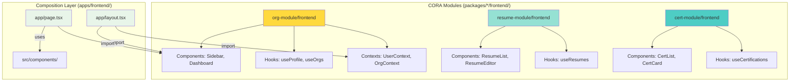

# Frontend Architecture

This document describes the frontend architecture of the STS Career Platform using **CORA (Context-Oriented Resource Architecture)**, where React components are provided by self-contained modules and `apps/frontend/` serves as a composition layer.

---

## ⚠️ CRITICAL: Authentication Pattern

**ALL CORA modules MUST use the NextAuth factory pattern for API clients and hooks.**

### Required Reading

- **[MODULE-NEXTAUTH-PATTERN.md](../development/MODULE-NEXTAUTH-PATTERN.md)** - Complete implementation guide
- **[ADR-004: NextAuth API Client Pattern](./ADR-004-NEXTAUTH-API-CLIENT-PATTERN.md)** - Architecture decision record
- **[MODULE-DEVELOPMENT-CHECKLIST.md](../development/MODULE-DEVELOPMENT-CHECKLIST.md)** - Verification checklist

### Quick Reference

```typescript
// ✅ CORRECT: API Client - Factory function ONLY
import type { AuthenticatedClient } from "@sts-career/api-client";

export function createModuleClient(client: AuthenticatedClient) {
  return {
    getData: () => client.get("/module/data"),
    createItem: (data) => client.post("/module/data", data),
  };
}

// ✅ CORRECT: Hook - Accepts client parameter
export function useModuleData(client: AuthenticatedClient | null) {
  const [data, setData] = useState([]);

  useEffect(() => {
    if (!client) return;

    const api = createModuleClient(client);
    api.getData().then(setData);
  }, [client]);

  return { data };
}

// ✅ CORRECT: Page - Uses NextAuth session
("use client");
import { useSession } from "next-auth/react";
import { createAuthenticatedClient } from "@sts-career/api-client";

export default function Page() {
  const { data: session } = useSession();

  const client = session?.accessToken
    ? createAuthenticatedClient(session.accessToken)
    : null;

  const { data } = useModuleData(client);
  // ...
}
```

### Anti-Patterns (NEVER DO THIS)

❌ **Direct API exports**: `export const api = { getData: async () => {...} }`  
❌ **localStorage tokens**: `localStorage.getItem("access_token")`  
❌ **Hooks without client parameter**: `export function useData() { /* no client param */ }`  
❌ **Direct Okta**: `const { authState } = useOktaAuth()`

**All code examples below follow this pattern. Legacy patterns have been removed.**

---

## Architecture Overview

The frontend follows a **module-first pattern** where most UI code lives in `packages/*/frontend/` directories, and `apps/frontend/` imports and composes these module components.



## Module Frontend Architecture

Frontend code is primarily provided by **CORA modules**, with `apps/frontend/` serving as a composition layer.

### Module Frontend Structure

```
packages/<module-name>/frontend/
├── components/              # React components
│   ├── <Component>.tsx
│   └── index.ts
├── hooks/                   # React hooks
│   ├── use<Entity>.ts
│   └── index.ts
├── contexts/                # React contexts
│   ├── <Entity>Context.tsx
│   └── index.ts
├── lib/                     # Utility functions
│   ├── api.ts
│   └── utils.ts
├── types/                   # TypeScript types
│   └── index.ts
└── index.ts                 # Barrel export
```

### Example: Org-Module Frontend

```
packages/org-module/frontend/
├── components/
│   ├── layout/
│   │   ├── Sidebar.tsx              # Main navigation sidebar
│   │   ├── Dashboard.tsx            # Dashboard component
│   │   └── SidebarUserMenu.tsx      # User menu dropdown
│   ├── onboarding/
│   │   └── CreateOrganization.tsx   # Org creation wizard
│   ├── profile/
│   │   └── ProfileCard.tsx          # User profile card
│   └── org/
│       ├── OrgSelector.tsx          # Org switcher dropdown
│       └── OrgMembersList.tsx       # Members list table
├── contexts/
│   ├── UserContext.tsx              # Current user state
│   └── OrgContext.tsx               # Current org state
├── hooks/
│   ├── useProfile.ts                # Fetch/update user profile
│   ├── useOrganizations.ts          # Fetch user's orgs
│   └── useCurrentOrg.ts             # Get/set current org
├── lib/
│   ├── api.ts                       # API client for org-module endpoints
│   └── utils.ts                     # Utility functions
├── types/
│   └── index.ts                     # TypeScript types (User, Org, Profile, etc.)
└── index.ts                         # Export all public APIs
```

## Composition Layer (apps/frontend)

The `apps/frontend/` directory imports and composes modules:

### File Structure

```
apps/frontend/
├── app/                             # Next.js App Router
│   ├── layout.tsx                   # Root layout (imports Sidebar)
│   ├── page.tsx                     # Home page (imports Dashboard)
│   ├── profile/
│   │   └── page.tsx                 # Profile page
│   ├── organizations/
│   │   └── page.tsx                 # Orgs page
│   └── resumes/
│       └── page.tsx                 # Resumes page (future)
├── src/
│   ├── components/                  # App-specific components
│   │   └── FeatureSpecificComponent.tsx
│   └── lib/
│       └── api-client.ts            # Authenticated API client factory
├── public/                          # Static assets
├── package.json
├── next.config.mjs
└── tsconfig.json
```

### Root Layout Example

**apps/frontend/app/layout.tsx:**

```typescript
import { Sidebar, UserProvider, OrgProvider } from "@org-module/frontend";
import "./globals.css";

export default function RootLayout({
  children,
}: {
  children: React.ReactNode;
}) {
  return (
    <html lang="en">
      <body>
        <UserProvider>
          <OrgProvider>
            <div className="flex h-screen">
              <Sidebar />
              <main className="flex-1 overflow-y-auto">{children}</main>
            </div>
          </OrgProvider>
        </UserProvider>
      </body>
    </html>
  );
}
```

### Page Example

**apps/frontend/app/page.tsx:**

```typescript
import { Dashboard } from "@org-module/frontend";

export default function HomePage() {
  return <Dashboard />;
}
```

**apps/frontend/app/profile/page.tsx:**

```typescript
import { ProfileCard, useProfile } from "@org-module/frontend";

export default function ProfilePage() {
  const { profile, loading, error, updateProfile } = useProfile();

  if (loading) return <div>Loading...</div>;
  if (error) return <div>Error: {error}</div>;

  return (
    <div className="container mx-auto p-6">
      <h1 className="text-2xl font-bold mb-4">My Profile</h1>
      <ProfileCard profile={profile} onUpdate={updateProfile} />
    </div>
  );
}
```

**Key Principle:** Apps should have minimal code. Most functionality comes from modules.

## Component Guidelines

### Module Components (packages/\*/frontend/components/)

Module components are designed to be **reusable across multiple applications**.

**Characteristics:**

- ✅ **Reusable**: Work in any CORA app
- ✅ **Self-contained**: No dependencies outside the module
- ✅ **Typed**: Full TypeScript with exported types
- ✅ **Tested**: Jest + React Testing Library
- ✅ **Documented**: Props documented in JSDoc

**Example:**

```typescript
// packages/org-module/frontend/components/org/OrgSelector.tsx

import React from "react";
import { useOrganizations, useCurrentOrg } from "../../hooks";
import { Organization } from "../../types";

export interface OrgSelectorProps {
  /** Callback when organization is changed */
  onOrgChange?: (org: Organization) => void;
  /** Custom className */
  className?: string;
}

/**
 * Organization selector dropdown
 *
 * Displays user's organizations and allows switching between them.
 * Current org is stored in OrgContext.
 */
export function OrgSelector({ onOrgChange, className }: OrgSelectorProps) {
  const { organizations, loading } = useOrganizations();
  const { currentOrg, setCurrentOrg } = useCurrentOrg();

  const handleChange = (orgId: string) => {
    const org = organizations.find((o) => o.id === orgId);
    if (org) {
      setCurrentOrg(org);
      onOrgChange?.(org);
    }
  };

  if (loading) return <div>Loading...</div>;

  return (
    <select
      value={currentOrg?.id || ""}
      onChange={(e) => handleChange(e.target.value)}
      className={className}
    >
      {organizations.map((org) => (
        <option key={org.id} value={org.id}>
          {org.name}
        </option>
      ))}
    </select>
  );
}
```

### App Components (apps/frontend/src/components/)

App components are **feature-specific** and combine multiple modules.

**Characteristics:**

- ✅ **Feature-specific**: Combine multiple modules
- ✅ **App-specific styling**: Tailwind or custom CSS
- ✅ **Composition**: Import from modules, add business logic

**Example:**

```typescript
// apps/frontend/src/components/CompleteDashboard.tsx

import { Dashboard } from "@org-module/frontend";
import { ResumeList } from "@resume-module/frontend";
import { CertList } from "@cert-module/frontend";

export function CompleteDashboard() {
  return (
    <div className="grid grid-cols-3 gap-6">
      <div className="col-span-2">
        <Dashboard />
      </div>
      <div className="col-span-1 space-y-6">
        <div>
          <h2 className="text-lg font-semibold mb-2">Recent Resumes</h2>
          <ResumeList limit={5} />
        </div>
        <div>
          <h2 className="text-lg font-semibold mb-2">Certifications</h2>
          <CertList limit={5} />
        </div>
      </div>
    </div>
  );
}
```

## React Hooks Pattern (NextAuth Integration)

**IMPORTANT:** All hooks MUST accept `client: AuthenticatedClient | null` as a parameter. See [MODULE-NEXTAUTH-PATTERN.md](../development/MODULE-NEXTAUTH-PATTERN.md) for complete details.

### Hook Structure (Client Parameter Required)

```typescript
// packages/org-module/frontend/hooks/useProfile.ts
import { useState, useEffect, useCallback } from "react";
import type { AuthenticatedClient } from "@sts-career/api-client";
import { createOrgModuleClient } from "../lib/api";
import { Profile } from "../types";

// ✅ CORRECT: Hook accepts client as parameter
export function useProfile(client: AuthenticatedClient | null) {
  const [profile, setProfile] = useState<Profile | null>(null);
  const [loading, setLoading] = useState(true);
  const [error, setError] = useState<string | null>(null);

  const fetchProfile = useCallback(async () => {
    // Handle null client (unauthenticated)
    if (!client) {
      setLoading(false);
      return;
    }

    setLoading(true);
    setError(null);
    try {
      const api = createOrgModuleClient(client);
      const data = await api.getProfile();
      setProfile(data);
    } catch (err) {
      setError(err instanceof Error ? err.message : "Failed to fetch profile");
    } finally {
      setLoading(false);
    }
  }, [client]);

  useEffect(() => {
    fetchProfile();
  }, [fetchProfile]);

  const updateProfile = useCallback(
    async (data: Partial<Profile>) => {
      if (!client) {
        throw new Error("Not authenticated");
      }

      try {
        const api = createOrgModuleClient(client);
        const updated = await api.updateProfile(data);
        setProfile(updated);
      } catch (err) {
        setError(
          err instanceof Error ? err.message : "Failed to update profile"
        );
        throw err;
      }
    },
    [client]
  );

  return {
    profile,
    loading,
    error,
    refetch: fetchProfile,
    updateProfile,
  };
}

// ❌ WRONG: Hook without client parameter
// export function useProfile() {
//   const { data: session } = useSession(); // Don't do this in hooks
//   // ...
// }
```

### Using Hooks in Components (Pages)

```typescript
// ✅ CORRECT: Page creates client and passes to hook
"use client";

import { useSession } from "next-auth/react";
import { createAuthenticatedClient } from "@sts-career/api-client";
import { useProfile } from "@org-module/frontend";

export default function ProfilePage() {
  const { data: session } = useSession();

  // Create client from session
  const client = session?.accessToken
    ? createAuthenticatedClient(session.accessToken)
    : null;

  // Pass client to hook
  const { profile, loading, error, updateProfile } = useProfile(client);

  if (!session) return <div>Please log in</div>;
  if (loading) return <div>Loading...</div>;
  if (error) return <div>Error: {error}</div>;

  return (
    <div>
      <h1>
        {profile?.first_name} {profile?.last_name}
      </h1>
      <button onClick={() => updateProfile({ first_name: "John" })}>
        Update Name
      </button>
    </div>
  );
}
```

### Using Hooks in Nested Components (via Context)

For deeply nested components, use React Context to avoid prop drilling:

```typescript
// contexts/UserContext.tsx
import { createContext, useContext, ReactNode } from "react";
import { useSession } from "next-auth/react";
import { createAuthenticatedClient } from "@sts-career/api-client";
import { useProfile } from "../hooks/useProfile";

interface UserContextValue {
  profile: Profile | null;
  loading: boolean;
  error: string | null;
  updateProfile: (data: Partial<Profile>) => Promise<void>;
}

const UserContext = createContext<UserContextValue | undefined>(undefined);

export function UserProvider({ children }: { children: ReactNode }) {
  const { data: session } = useSession();

  const client = session?.accessToken
    ? createAuthenticatedClient(session.accessToken)
    : null;

  // Pass client to hook
  const { profile, loading, error, updateProfile } = useProfile(client);

  return (
    <UserContext.Provider value={{ profile, loading, error, updateProfile }}>
      {children}
    </UserContext.Provider>
  );
}

export function useUser() {
  const context = useContext(UserContext);
  if (!context) {
    throw new Error("useUser must be used within UserProvider");
  }
  return context;
}
```

### Key Hook Requirements

1. **Client Parameter**: All data-fetching hooks MUST accept `client: AuthenticatedClient | null`
2. **Null Handling**: Hooks MUST handle `client === null` gracefully
3. **Factory Usage**: Create API client inside hook using factory function
4. **Error Handling**: Catch and expose errors to consuming components
5. **Loading States**: Provide loading state for async operations

## React Context Pattern

Modules provide context providers for global state.

### Context Structure

```typescript
// packages/org-module/frontend/contexts/UserContext.tsx

import React, { createContext, useContext, ReactNode } from "react";
import { useProfile } from "../hooks/useProfile";
import { Profile } from "../types";

interface UserContextValue {
  profile: Profile | null;
  loading: boolean;
  error: string | null;
  refetch: () => void;
  updateProfile: (data: Partial<Profile>) => Promise<void>;
}

const UserContext = createContext<UserContextValue | undefined>(undefined);

export function UserProvider({ children }: { children: ReactNode }) {
  const { profile, loading, error, refetch, updateProfile } = useProfile();

  return (
    <UserContext.Provider
      value={{ profile, loading, error, refetch, updateProfile }}
    >
      {children}
    </UserContext.Provider>
  );
}

export function useUser() {
  const context = useContext(UserContext);
  if (context === undefined) {
    throw new Error("useUser must be used within a UserProvider");
  }
  return context;
}
```

### Using Context

```typescript
// In apps/frontend/app/layout.tsx
import { UserProvider, OrgProvider } from "@org-module/frontend";

export default function RootLayout({ children }) {
  return (
    <UserProvider>
      <OrgProvider>{children}</OrgProvider>
    </UserProvider>
  );
}

// In any component
import { useUser } from "@org-module/frontend";

export function MyComponent() {
  const { profile } = useUser();
  return <div>Hello, {profile?.first_name}!</div>;
}
```

## API Client Pattern (NextAuth Factory Pattern)

**IMPORTANT:** All modules MUST use the NextAuth factory pattern. See [MODULE-NEXTAUTH-PATTERN.md](../development/MODULE-NEXTAUTH-PATTERN.md) for complete details.

### Module API Client (Factory Function ONLY)

```typescript
// packages/org-module/frontend/lib/api.ts
import type { AuthenticatedClient } from "@sts-career/api-client";
import { Profile, Organization, OrgMember } from "../types";

export interface OrgModuleApiClient {
  // Profile endpoints
  getProfile: () => Promise<Profile>;
  updateProfile: (data: Partial<Profile>) => Promise<Profile>;

  // Organization endpoints
  listOrganizations: () => Promise<Organization[]>;
  getOrganization: (id: string) => Promise<Organization>;
  createOrganization: (data: {
    name: string;
    description?: string;
  }) => Promise<Organization>;
  updateOrganization: (
    id: string,
    data: Partial<Organization>
  ) => Promise<Organization>;

  // Member endpoints
  listMembers: (orgId: string) => Promise<OrgMember[]>;
  inviteMember: (
    orgId: string,
    email: string,
    role: string
  ) => Promise<OrgMember>;
  removeMember: (orgId: string, userId: string) => Promise<void>;
}

// ✅ CORRECT: Export ONLY factory function, never direct API objects
export function createOrgModuleClient(
  client: AuthenticatedClient
): OrgModuleApiClient {
  return {
    getProfile: () => client.get("/profiles/me"),

    updateProfile: (data) => client.put("/profiles/me", data),

    listOrganizations: () => client.get("/organizations"),

    getOrganization: (id) => client.get(`/organizations/${id}`),

    createOrganization: (data) => client.post("/organizations", data),

    updateOrganization: (id, data) => client.put(`/organizations/${id}`, data),

    listMembers: (orgId) => client.get(`/organizations/${orgId}/members`),

    inviteMember: (orgId, email, role) =>
      client.post(`/organizations/${orgId}/members`, { email, role }),

    removeMember: (orgId, userId) =>
      client.delete(`/organizations/${orgId}/members/${userId}`),
  };
}

// ❌ WRONG: Never export direct API objects
// export const orgApi = {
//   getProfile: async () => { /* ... */ }
// };
```

### Authenticated Client (Shared Package)

The `@sts-career/api-client` package provides the authenticated client factory:

```typescript
// packages/api-client/src/index.ts
export interface AuthenticatedClient {
  get<T = any>(path: string): Promise<T>;
  post<T = any>(path: string, data: any): Promise<T>;
  put<T = any>(path: string, data: any): Promise<T>;
  delete<T = any>(path: string): Promise<T>;
}

export function createAuthenticatedClient(
  accessToken: string
): AuthenticatedClient {
  const baseURL = process.env.NEXT_PUBLIC_API_URL;

  async function request<T>(
    path: string,
    options: RequestInit = {}
  ): Promise<T> {
    const response = await fetch(`${baseURL}${path}`, {
      ...options,
      headers: {
        Authorization: `Bearer ${accessToken}`,
        "Content-Type": "application/json",
        ...options.headers,
      },
    });

    if (!response.ok) {
      throw new Error(`HTTP ${response.status}: ${response.statusText}`);
    }

    const data = await response.json();

    // Handle standardized API response format
    if (data.success === false) {
      throw new Error(data.error || "API request failed");
    }

    return data.success ? data.data : data;
  }

  return {
    get: <T = any>(path: string) => request<T>(path, { method: "GET" }),
    post: <T = any>(path: string, data: any) =>
      request<T>(path, { method: "POST", body: JSON.stringify(data) }),
    put: <T = any>(path: string, data: any) =>
      request<T>(path, { method: "PUT", body: JSON.stringify(data) }),
    delete: <T = any>(path: string) => request<T>(path, { method: "DELETE" }),
  };
}
```

### Key Requirements

1. **API Client**: Export ONLY factory functions, never direct API objects
2. **Factory Signature**: Must accept `AuthenticatedClient` as parameter
3. **Type Safety**: Use TypeScript interfaces for all API methods
4. **Error Handling**: Let errors bubble up to hook/component level
5. **No Token Access**: Factory receives client, not token

## TypeScript Types

Modules export TypeScript types for all entities.

### Type Definitions

```typescript
// packages/org-module/frontend/types/index.ts

export interface Profile {
  id: string;
  email: string;
  first_name: string;
  last_name: string;
  phone?: string;
  avatar_url?: string;
  created_at: string;
  updated_at: string;
}

export interface Organization {
  id: string;
  name: string;
  description?: string;
  owner_id: string;
  created_at: string;
  updated_at: string;
}

export interface OrgMember {
  id: string;
  org_id: string;
  user_id: string;
  role: "owner" | "admin" | "member";
  joined_at: string;
  user?: Profile;
}

export interface User {
  id: string;
  email: string;
  profile?: Profile;
  organizations?: Organization[];
}
```

### Using Types

```typescript
import { Profile, Organization } from "@org-module/frontend";

interface MyComponentProps {
  profile: Profile;
  organization: Organization;
}

export function MyComponent({ profile, organization }: MyComponentProps) {
  // TypeScript provides autocomplete and type checking
  return (
    <div>
      <h1>
        {profile.first_name} {profile.last_name}
      </h1>
      <p>{organization.name}</p>
    </div>
  );
}
```

## Platform Admin Card Registry Pattern

**IMPORTANT:** Modules that provide **platform-level administrative features** should export an admin card configuration. This allows the module to contribute to the `/admin` dashboard without modifying core admin code.

### When to Use Admin Cards

Use admin cards for features that:

- Only accessible to `super_admin` users (or other global admin roles)
- Affect the entire platform (not individual organizations)
- Should be discoverable through the central admin dashboard

**Examples:**

- AI provider management (platform-wide)
- Platform-level AI configuration
- Global system settings
- Platform analytics and monitoring

**Do NOT use admin cards for:**

- Organization-level features (use regular navigation instead)
- User-facing features (use navigation links)

### Creating an Admin Card

**1. Create adminCard.tsx:**

```typescript
// packages/your-module/frontend/adminCard.tsx
import { AdminCardConfig } from "@sts-career/shared-types";
import YourIcon from "@mui/icons-material/YourIcon";

export const yourModuleAdminCard: AdminCardConfig = {
  id: "your-feature",
  title: "Your Feature",
  description: "Platform-level administration for this feature",
  icon: <YourIcon sx={{ fontSize: 48 }} />,
  href: "/admin/your-feature",
  color: "primary.main", // or "secondary.main", "warning.main", etc.
  superAdminOnly: true,
  order: 50, // Display order convention below
};
```

**Display Order Convention:**

- **0-9**: Reserved for critical platform features
- **10-19**: Organization management and core admin features
- **20-29**: AI/ML platform features
- **30-39**: Performance and monitoring
- **40-49**: Content and media management
- **50-99**: Additional platform services
- **100+**: Experimental or temporary features

**2. Export from module index:**

```typescript
// packages/your-module/frontend/index.ts

// ... other exports ...

// Platform Admin Configuration (if applicable)
export { yourModuleAdminCard } from "./adminCard";
```

**3. Create the admin page:**

```typescript
// apps/web/app/admin/your-feature/page.tsx
"use client";

import { useEffect } from "react";
import { Box, Typography } from "@mui/material";
import { useRouter } from "next/navigation";
import { useUserStore } from "@/store/userStore";
import { YourModuleComponent } from "@sts-career/your-module";

export default function YourFeaturePage() {
  const router = useRouter();
  const { profile } = useUserStore();

  // Check super admin access
  useEffect(() => {
    if (profile && profile.global_role !== "super_admin") {
      router.push("/admin");
    }
  }, [profile, router]);

  if (!profile || profile.global_role !== "super_admin") {
    return null;
  }

  return (
    <Box sx={{ p: 4 }}>
      <Box sx={{ mb: 4 }}>
        <Typography variant="h4" gutterBottom>
          Your Feature Management
        </Typography>
        <Typography variant="body1" color="text.secondary">
          Platform-level administration description
        </Typography>
      </Box>
      <YourModuleComponent />
    </Box>
  );
}
```

**4. Register in admin dashboard:**

```typescript
// apps/web/app/admin/page.tsx
import { yourModuleAdminCard } from "@sts-career/your-module";

const moduleAdminCards: AdminCardConfig[] = [
  yourModuleAdminCard,
  // ... other module cards
];
```

See **[Admin Card Registry Pattern](../../pm-app-stack/docs/architecture/admin-card-registry-pattern.md)** for complete documentation.

## Barrel Exports

Each module exports all public APIs via `index.ts`.

### Module Barrel Export

```typescript
// packages/org-module/frontend/index.ts

// Components
export { Sidebar } from "./components/layout/Sidebar";
export { Dashboard } from "./components/layout/Dashboard";
export { SidebarUserMenu } from "./components/layout/SidebarUserMenu";
export { CreateOrganization } from "./components/onboarding/CreateOrganization";
export { ProfileCard } from "./components/profile/ProfileCard";
export { OrgSelector } from "./components/org/OrgSelector";
export { OrgMembersList } from "./components/org/OrgMembersList";

// Hooks
export { useProfile } from "./hooks/useProfile";
export { useOrganizations } from "./hooks/useOrganizations";
export { useCurrentOrg } from "./hooks/useCurrentOrg";

// Contexts
export { UserProvider, useUser } from "./contexts/UserContext";
export { OrgProvider, useOrg } from "./contexts/OrgContext";

// Types
export type { Profile, Organization, OrgMember, User } from "./types";

// API Client
export { createOrgModuleClient } from "./lib/api";
export type { OrgModuleApiClient } from "./lib/api";

// Platform Admin Configuration (OPTIONAL - only if module has platform admin features)
// export { orgModuleAdminCard } from "./adminCard";
```

### Import from Module

```typescript
// Clean imports in apps/frontend/
import {
  Sidebar,
  Dashboard,
  UserProvider,
  OrgProvider,
  useProfile,
  useOrganizations,
  Profile,
  Organization,
} from "@org-module/frontend";
```

## Styling Strategy

### Module Components

Module components use **minimal styling** and accept `className` props for customization.

```typescript
export interface SidebarProps {
  className?: string;
}

export function Sidebar({ className }: SidebarProps) {
  return (
    <aside className={`bg-gray-800 text-white w-64 ${className || ""}`}>
      {/* Sidebar content */}
    </aside>
  );
}
```

### App-Level Styling

Apps apply **Tailwind CSS** or custom styles:

```typescript
import { Sidebar } from "@org-module/frontend";

export default function Layout({ children }) {
  return (
    <div className="flex h-screen">
      <Sidebar className="border-r border-gray-700" />
      <main className="flex-1 bg-gray-50">{children}</main>
    </div>
  );
}
```

## Testing Strategy

### Component Tests

```typescript
// packages/org-module/frontend/__tests__/components/OrgSelector.test.tsx

import { render, screen, fireEvent } from "@testing-library/react";
import { OrgSelector } from "../components/org/OrgSelector";
import { useOrganizations, useCurrentOrg } from "../hooks";

jest.mock("../hooks");

describe("OrgSelector", () => {
  it("renders organizations", () => {
    (useOrganizations as jest.Mock).mockReturnValue({
      organizations: [
        { id: "1", name: "Org 1" },
        { id: "2", name: "Org 2" },
      ],
      loading: false,
    });
    (useCurrentOrg as jest.Mock).mockReturnValue({
      currentOrg: { id: "1", name: "Org 1" },
      setCurrentOrg: jest.fn(),
    });

    render(<OrgSelector />);

    expect(screen.getByText("Org 1")).toBeInTheDocument();
    expect(screen.getByText("Org 2")).toBeInTheDocument();
  });

  it("calls onOrgChange when org is selected", () => {
    const onOrgChange = jest.fn();
    const setCurrentOrg = jest.fn();

    (useOrganizations as jest.Mock).mockReturnValue({
      organizations: [
        { id: "1", name: "Org 1" },
        { id: "2", name: "Org 2" },
      ],
      loading: false,
    });
    (useCurrentOrg as jest.Mock).mockReturnValue({
      currentOrg: { id: "1", name: "Org 1" },
      setCurrentOrg,
    });

    render(<OrgSelector onOrgChange={onOrgChange} />);

    const select = screen.getByRole("combobox");
    fireEvent.change(select, { target: { value: "2" } });

    expect(setCurrentOrg).toHaveBeenCalledWith({ id: "2", name: "Org 2" });
    expect(onOrgChange).toHaveBeenCalledWith({ id: "2", name: "Org 2" });
  });
});
```

### Hook Tests

```typescript
// packages/org-module/frontend/__tests__/hooks/useProfile.test.ts

import { renderHook, waitFor } from "@testing-library/react";
import { useProfile } from "../hooks/useProfile";
import { useSession } from "next-auth/react";

jest.mock("next-auth/react");

describe("useProfile", () => {
  it("fetches profile on mount", async () => {
    (useSession as jest.Mock).mockReturnValue({
      data: { accessToken: "fake-token" },
    });

    global.fetch = jest.fn().mockResolvedValue({
      json: async () => ({
        success: true,
        data: { id: "1", first_name: "John" },
      }),
    });

    const { result } = renderHook(() => useProfile());

    expect(result.current.loading).toBe(true);

    await waitFor(() => {
      expect(result.current.loading).toBe(false);
    });

    expect(result.current.profile).toEqual({ id: "1", first_name: "John" });
  });
});
```

## Performance Optimization

### Code Splitting

Modules are automatically code-split by Next.js:

```typescript
// Lazy load heavy components
import dynamic from "next/dynamic";

const HeavyComponent = dynamic(
  () => import("@org-module/frontend").then((mod) => mod.HeavyComponent),
  {
    loading: () => <div>Loading...</div>,
  }
);
```

### Memoization

Use React.memo for expensive components:

```typescript
import React, { memo } from "react";

export const ExpensiveComponent = memo(({ data }: { data: any }) => {
  // Expensive rendering logic
  return <div>{/* ... */}</div>;
});
```

### Data Caching

Use SWR or React Query for data caching (future):

```typescript
import useSWR from "swr";

export function useProfile() {
  const { data, error, mutate } = useSWR("/profiles/me", fetcher);

  return {
    profile: data,
    loading: !error && !data,
    error,
    refetch: mutate,
  };
}
```

## Module Development Workflow

### Creating a New Module Frontend

1. **Create Directory Structure**:

   ```bash
   cd packages/my-module/frontend
   mkdir -p components hooks contexts lib types __tests__
   ```

2. **Define TypeScript Types**:

   ```typescript
   // types/index.ts
   export interface MyEntity {
     id: string;
     name: string;
     // ... fields
   }
   ```

3. **Create API Client**:

   ```typescript
   // lib/api.ts
   export interface MyModuleApiClient {
     listEntities: () => Promise<MyEntity[]>;
     // ... methods
   }

   export function createMyModuleClient(client: any): MyModuleApiClient {
     // ... implementation
   }
   ```

4. **Create Hooks**:

   ```typescript
   // hooks/useEntities.ts
   export function useEntities() {
     // ... implementation
   }
   ```

5. **Create Components**:

   ```typescript
   // components/EntityList.tsx
   export function EntityList() {
     // ... implementation
   }
   ```

6. **Create Barrel Export**:

   ```typescript
   // index.ts
   export { EntityList } from "./components/EntityList";
   export { useEntities } from "./hooks/useEntities";
   export type { MyEntity } from "./types";
   ```

7. **Write Tests**:

   ```typescript
   // __tests__/components/EntityList.test.tsx
   // ... tests
   ```

8. **Use in App**:

   ```typescript
   // In apps/frontend/app/my-feature/page.tsx
   import { EntityList } from "@my-module/frontend";

   export default function MyFeaturePage() {
     return <EntityList />;
   }
   ```

See [Creating Modules Guide](../development/creating-modules.md) for complete step-by-step instructions.

## Technology Stack

| Category       | Technology                   | Purpose                 |
| -------------- | ---------------------------- | ----------------------- |
| **Framework**  | Next.js 14+ (App Router)     | React framework         |
| **UI Library** | Material-UI v5+              | Component library       |
| **Styling**    | Tailwind CSS                 | Utility-first CSS       |
| **Language**   | TypeScript 5+                | Type safety             |
| **State**      | React Context + Hooks        | Global state management |
| **Forms**      | React Hook Form              | Form validation         |
| **Testing**    | Jest + React Testing Library | Unit/integration tests  |
| **Auth**       | NextAuth.js                  | Authentication (Okta)   |

## Related Documentation

- **[CORA Principles](./cora-principles.md)** - Architecture philosophy
- **[Creating Modules Guide](../development/creating-modules.md)** - Step-by-step guide
- **[Backend Architecture](./backend.md)** - Module backend patterns
- **[Module Integration Spec](./module-integration-spec.md)** - Technical specification
- **[API Documentation](../api/)** - API reference by module

---

**Last Updated**: November 4, 2025
